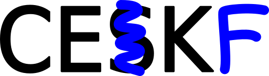
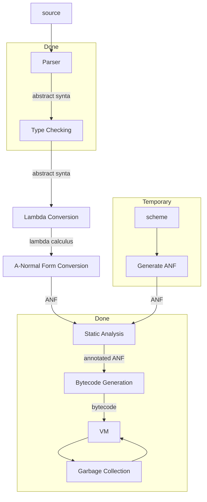

# CEKF

Low level, hopefully fast C implementation of a CEK machine with an additional "F"
failure continuation supporting amb.

This is heavily based on a blog post by Matt Might [Writing an
interpreter, CESK-style](https://matt.might.net/articles/cesk-machines/).

Currently there is an A-Normal syntax tree with constructors, the
CEKF machine itself which can evaluate those trees, a basic mark & sweep
garbage collector, and a static analyser to compute variable locations
allowing fast indexed run-time environments. See
[lexical addressing](docs/LEXICAL_ADDRESSING.md) for the idea there.

I plan to follow up with a lexer/parser (probably Bison/Flex but maybe
a hand-written Pratt parser), then a type checker (Hindley Milner),
and finally a converter to generate the A-Normal form structures from
the syntax tree generated by the parser.

I've made a start on the grammar [here](docs/grammar.md).

I'm hoping that I can reproduce [the F♮ language I once implemented
in Python](https://github.com/billhails/PyScheme), but as a standalone
binary with reasonable performance. It's not a stack-based VM so it'll
never be super fast but it should be ok.

> UPDATE - I've replaced the tree-walking state machine with a bytecode
> interpreter, the steps are pretty much the same as below but the
> bytecode representation is much faster to execute. CEKF has also
> sprouted a stack to support the bytecode interpreter, so I guess it's
> now technically a CEKFS machine? Anyway see [V2](docs/V2.md) for
> details of that.

If you want to stick around, maybe start by reading [the math](#the-math)
and comparing that with its implementation in [`step.c`](src/step.c), or
start at [`main.c`](src/main.c) where you can see it currently constructs
some expressions manually, then gives them to the machine to evaluate.

### An aside on `amb`
I should probably give at least a brief explaination of `amb` here, for
those who don't know what it is, since it's somewhat the point of this
little project. `amb` is short for "ambivalent" in the sense of "having
more than one value", and is a way of doing non-deterministic programming.

If you have a continuation passing style interpreter, then all control
flow, both call and return, is always "forwards" by calling a function
(call) or calling a continuation (return). It then becomes possible to
thread an additional "failure" continuation as a sort of hidden argument
through all those calls.

Mostly that additional continuation goes completely unnoticed, except
in two specific cases:

1. When `amb` is invoked with two (unevaluated) arguments, it arranges
   to have it's first argument evaluated, and additionally installs a new
   failure continuation that will, if invoked, restore the state of the
   machine to the point just after `amb` was invoked, but with the second
   argument to `amb` ready to be evaluated instead.
2. When `back` is invoked, it restores the most recent state installed by
   `amb`, "backtracking" to the decision point and allowing the alternative
   to be produced.

For all the details see [SICP pp.
412-437](https://mitp-content-server.mit.edu/books/content/sectbyfn/books_pres_0/6515/sicp.zip/full-text/book/book-Z-H-28.html#%_sec_4.3).

What makes a CEK machine such an easy way to implement `amb` is that
the failure continuation is just an additional register, nothing else
in the CEK machine needs to change, apart from two additional cases in
the $step$ function: one to deal with `amb` and one to deal with `back`.

## Progress

## The Math

This machine is based on the CEK machine: Control, Environment and
Kontinuation, but you'll also see mention of a CESK machine, which
includes an additional S for "Store" register which allows mutation. I
actually used Matt Might's CESK machine as a starting point because it
better showed how to handle multiple data types and primitive functions. I
reduced that to a CEK machine as a preliminary.

CEKF is my idea, though I'd be surprised if no-one else has thought of it.
CEKF stands for Control, Environment, Kontinuation and Failure. It adds a
"Fail" register, a backtracking continuation allowing trivial support for
`amb`.

The rest of this document closely follows Matt Might's blog post,
slightly amended to describe a CEKF machine.

### Expressions `Exp` to be Evaluated

Our grammar is still in A-Normal form. It omits the `set!`, and adds
`amb` and `back` to `cexp`:

Atomic expressions `aexp` always terminate and never cause an error:

$$
\begin{array}{rcl}
\mathtt{lam} &::=& \mathtt{(lambda\\ (var_1\dots var_n)\\ exp)}
\\
\\
\mathtt{aexp} &::=& \mathtt{lam}
\\
      &|&  \mathtt{var}
\\
      &|&  \mathtt{\\#t}\\;  |\\;  \mathtt{\\#f}
\\
      &|&  \mathtt{integer}
\\
      &|&  \mathtt{(prim\\ aexp_1\ aexp_2)}
\end{array}
$$

Complex expressions `cexp` might not terminate and might cause an error:

$$
\begin{array}{rcl}
\mathtt{cexp} &::=& \mathtt{(aexp_0\\ aexp_1\dots aexp_n)}
\\
      &|&  \mathtt{(if\\ aexp\\ exp\\ exp)}
\\
      &|&  \mathtt{(call/cc\\ aexp)}
\\
      &|&  \mathtt{(letrec\\ ((var_1\\ aexp_1)\dots(var_n\\ aexp_n))\\ exp)}
\\
      &|&  \mathtt{(amb\\ exp\\ exp)}
\\
      &|&  \mathtt{(back)}
\end{array}
$$

Expressions `exp` are atomic, complex , `let` bound, or the terminating
`DONE`.

$$
\begin{array}{rcl}
\mathtt{exp} &::=& \mathtt{aexp}
\\
     &|&  \mathtt{cexp}
\\
     &|&  \mathtt{(let\\ ((var\\ exp))\\ exp)}
\\
     &|&  \mathtt{DONE}
\\
\end{array}
$$

Primitives are built-in:

$$
\mathtt{prim}\\ ::=\\   \mathtt{+}\\;  |\\;  \mathtt{-}\\;  |\\;  \mathtt{*}\\;  |\\;  \mathtt{=}
$$

### CEKF State

We reduce the CESK state machine from four registers to three by removing
$Store$, then expand it back to four by adding $Fail$:

$$
\varsigma \in \Sigma = \mathtt{Exp} \times Env \times Kont \times Fail
$$

So we'll use $\Sigma$ to denote the set (type) of CEKF states, which
are tuples of four registers: $\mathtt{Exp}$, $Env$, $Kont$ and $Fail$.
$\varsigma$ is the symbol we'll use for individual elements of this set
(states).

> Pay close attention to the typesetting here, there are effectively two
domains, the expressions being evaluated and the rest of the machine. To
distinguish, the types of $\mathtt{Exp}$ are set in fixed width.

### Environments

Environments directly map variables to values:

$$
\rho \in Env = \mathtt{var} \rightharpoonup Value
$$

Again you can read this as: $Env$ is the type (set of all environments),
$\rho$ is an element of that set (a specific environment) and Environments
are functions that take a variable and return a value.

### Values

Values are the same as CESK:

$$
val \in Value ::= \mathbf{void}
\\;|\\;
z
\\;|\\;
\mathbf{\\#t}
\\;|\\;
\mathbf{\\#f}
\\;|\\;
\mathbf{clo}(\mathtt{lam}, \rho)
\\;|\\;
\mathbf{cont}(\kappa)
$$

$\mathbf{void}$ is the `NULL` equivalent, $z$ is an integer,
$\mathbf{\\#t}$ and $\mathbf{\\#f}$ are booleans, $\mathbf{clo}$ is
a closure of a lambda over an environment, and $\mathbf{cont}$ is a
continuation expressed as a value. $\mathbf{cont}$ is part of $Value$
because we support `call/cc`.

### Continuations

$$
\kappa \in Kont ::= \mathbf{letk}(\mathtt{var}, \mathtt{body}, \rho, \kappa) \\;|\\; \mathbf{halt}
$$

e.g. when evaluating `exp` in `(let ((var exp)) body)` the continuation
of that evaluation is as in the `letk` above. It turns out that when
evaluating ANF the only construct that requires a new continuation is
when evaluating the `exp` part of such a `let` (because in ANF all other
complex expressions are in tail position), hence the name $\mathbf{letk}$.

### Failure Continuations

$$
f \in Fail ::= \mathbf{backtrack}(\mathtt{exp}, \rho, \kappa, f)\\;|\\;\mathbf{end}
$$

$\mathbf{end}$ is the failure continuation's equivalent to
$\mathbf{halt}$. $\mathtt{exp}$ is the (unevaluated) second `exp` of the
`amb`, $\rho$, $\kappa$ and $f$ are the values current when the `amb`
was first evaluated.

## `aexp` evaluation

`aexp` are evaluated with an auxiliary function $\mathcal{A}$:

$$
\mathcal{A} : \mathtt{aexp} \times Env \rightharpoonup Value
$$

Variables get looked up in the environment:

$$
\mathcal{A} (\mathtt{var}, \rho) = \rho(\mathtt{var})
$$

Constants evaluate to their value equivalents:

$$
\begin{align}
\mathcal{A}(\mathtt{integer}, \rho) &= z
\\
\mathcal{A}( \mathtt{\\#t}, \rho) &=  \mathbf{\\#t}
\\
\mathcal{A}( \mathtt{\\#f}, \rho) &=  \mathbf{\\#f}
\end{align}
$$

Lambdas become closures:

$$
\mathcal{A}(\mathtt{lam}, \rho) = \mathbf{clo}(\mathtt{lam}, \rho)
$$

Primitive expressions are evaluated recursively:

$$
\mathcal{A}(\mathtt{(prim\ aexp_1\ aexp_2)}, \rho) =
  \mathcal{O}(\mathtt{prim})(\mathcal{A}(\mathtt{aexp_1}, \rho),
    \mathcal{A}(\mathtt{aexp_2}, \rho))
$$

where

$$
\mathcal{O} : \mathtt{prim} \rightharpoonup ((Value \times Value) \rightharpoonup Value)
$$

maps a primitive to its corresponding operation.

## The `step` function

`step` goes from one state to the next.

$$
step: \Sigma \rightharpoonup \Sigma
$$

### `step` for function calls

For ~~procedure~~ function calls, `step` first evaluates the function,
then the arguments, then it applies the function:

$$
step(\mathtt{(aexp_0\ aexp_1\dots aexp_n)}, \rho, \kappa, f) = applyproc(proc,\langle val_1,\dots val_n\rangle, \kappa, f)
$$

where

$$
\begin{align}
proc &= \mathcal{A}(\mathtt{aexp_0}, \rho)
\\
val_i &= \mathcal{A}(\mathtt{aexp_i}, \rho)
\end{align}
$$

and

$$
applyproc : Value \times Value^* \times Kont \times Fail \rightharpoonup \Sigma
$$

$applyproc$ (defined later) doesn't need an Env ($\rho$)
because it uses the one in the procedure produced by
$\mathcal{A}(\mathtt{lam},\rho)=\mathbf{clo}(\mathtt{lam},\rho)$.

### Return

When the expression under evaluation is an `aexp`, that means we need
to return it to the continuation:

$$
step(\mathtt{aexp}, \rho, \kappa, f) = applykont(\kappa, val, f)
$$

where

$$
val = \mathcal{A}(\mathtt{aexp}, \rho)
$$

and

$$
applykont: Kont \times Value \times Fail \rightharpoonup \Sigma
$$

is defined below.

### Conditionals

$$
step(\mathtt{(if\ aexp\ e_{true}\ e_{false})},\rho,\kappa, f) = \left\\{
\begin{array}{ll}
(\mathtt{e_{false}},\rho,\kappa, f) & \mathcal{A}(\mathtt{aexp},\rho) = \\#f
\\
(\mathtt{e_{true}},\rho,\kappa, f) & \textup{otherwise}
\end{array}
\right.
$$

We might want to come back and revise this once we have stricter types.

### Let

Evaluating `let` forces the creation of a continuation

$$
step(\mathtt{(let\ (var\ exp)\ body)},\rho,\kappa, f) = (\mathtt{exp}, \rho, \kappa', f)
$$

where

$$
\kappa' = \mathbf{letk}(\mathtt{var}, \mathtt{body}, \rho, \kappa)
$$

### Recursion

In CESK, `letrec` is done by extending the environment to point at
fresh store locations, then evaluating the expressions in the extended
environment, then assigning the values in the store.

Even then this only works if the computed values are closures, they
can't actually *use* the values before they are assigned.

I'm thinking that in CEKF, for `letrec` only, we allow assignment into
the Env (treating it like a store) because we're not bound by functional
constraints if we're eventually implementing in C. We couldn't write
this in Haskell though.

$$
step(\mathtt{(letrec\ ((var_1\ aexp_1)\dots(var_n\ aexp_n))\ body)}, \rho, \kappa, f) = (\mathtt{body}, \rho', \kappa, f)
$$

where:

$$
\rho' = \rho[\mathtt{var_i} \Rightarrow \mathbf{void}]
$$

but subsequently mutated with pseudomath:

$$
\rho'[\mathtt{var_i}] \Leftarrow \mathcal{A}(\mathtt{aexp_i}, \rho')
$$

### First class continuations

`call/cc` takes a function as argument and invokes it with the current
continuation (dressed up to look like a $Value$) as its only argument:

$$
step(\mathtt{(call/cc\ aexp)}, \rho, \kappa, f) = applyproc(\mathcal{A}(\mathtt{aexp}, \rho), \langle \mathbf{cont}(\kappa) \rangle, \kappa, f)
$$

### Amb

`amb` arranges the next state such that its first argument will be
evaluated, and additionally installs a new Fail continuation that,
if backtracked to, will resume computation from the same state, except
evaluating the second argument.

$$
step(\mathtt{(amb\ exp_1\ exp_2)}, \rho, \kappa, f) = (\mathtt{exp_1}, \rho, \kappa, \mathbf{backtrack}(\mathtt{exp_2}, \rho, \kappa, f))
$$

### Back

`back` invokes the failure continuation, restoring the state captured by
`amb`.

$$
\begin{align}
step(\mathtt{(back)}, \rho, \kappa, \mathbf{backtrack}(\mathtt{exp}, \rho', \kappa', f)) &= (\mathtt{exp}, \rho', \kappa', f)
\\
step(\mathtt{(back)}, \rho, \kappa, \mathbf{end}) &= (\mathtt{DONE}, \rho, \kappa, \mathbf{end})
\end{align}
$$

The `DONE` Exp signals termination.

### DONE

$$
step(\mathtt{DONE}, \rho, \kappa, f) = \varnothing
$$

terminates the machine, effectively it's undefined for $step$ to be
given this argument.

### Applying procedures

$$
applyproc : Value \times Value^* \times Kont \times Fail \rightharpoonup \Sigma
$$

$$
applyproc( \mathbf{clo} (\mathtt{(lambda\ (var_1\dots var_n)\ body)}, \rho),\langle val_1\dots val_n\rangle, \kappa, f) =
(\mathtt{body}, \rho', \kappa, f)
$$

where

$$
\rho' = \rho[\mathtt{var_i} \Rightarrow val_i]
$$

Found an issue with the blog post here, it omits to mention the
additional case

$$
applyproc( \mathbf{cont}(\kappa'), \langle val \rangle, \kappa, f) = applykont(\kappa', val, f)
$$

### Applying continuations

$$
applykont : Kont \times Value \times Fail \rightharpoonup \Sigma
$$

$$
\begin{align}
applykont(\mathbf{letk}(\mathtt{var}, \mathtt{body}, \rho, \kappa), val, f) &= (\mathtt{body}, \rho', \kappa, f)
\\
applykont(\mathbf{halt}, val, f) &= (\mathtt{DONE}, [], \mathbf{halt}, f)
\end{align}
$$

where

$$
\rho' = \rho[\mathtt{var} \Rightarrow val]
$$

Q. Should $applykont$ get $f$ from its arguments or should we put it in
the $\mathbf{letk}$? 
A. probably best to get it from its arguments, then we will backtrack
through `call/cc`.

Note again that `DONE` terminates the machine. Also note that the final
value $val$ is lost on return to the $\mathbf{halt}$ continuation.

> In my implementation I have a fifth hidden register for the sole
  putpose of preserving the final value in this situation.

## Running the machine

### inject

We need an $inject$ function that takes an expression and creates an
initial state:

$$
inject : \mathtt{Exp} \rightharpoonup \Sigma
$$

specifically

$$
inject(\mathtt{Exp}) = (\mathtt{Exp}, [], \mathbf{halt}, \mathbf{end})
$$

where $[]$ is an initial empty environment.

### run

The $run$ function repeatedly invokes the $step$ function until `DONE`:

$$
run : \Sigma \rightharpoonup Value
$$

which is just:

$$
run(\mathtt{Exp}, \rho, \kappa, f) = \left\\{
\begin{array}{ll}
\mathbf{void} & \mathtt{Exp} = \mathtt{DONE}
\\
run(step(\mathtt{Exp}, \rho, \kappa, f)) & \textup{otherwise}
\end{array}
\right.
$$

Putting it all together:

$$
run(inject(\mathtt{Exp})) \rightharpoonup Value
$$
