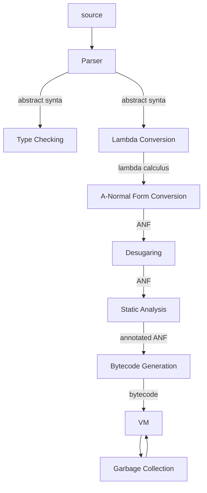

# CEKF

Low level, hopefully fast C implementation of a CEK machine with an
additional "F" failure continuation supporting amb.

This is heavily based on a blog post by Matt Might [Writing an
interpreter, CESK-style](https://matt.might.net/articles/cesk-machines/),
but using a bytecode interpreter rather than a tree-walking interpreter,
and utilising a hybrid stack/closure/continuation implementation where
variables local to a function are directly accessible on the stack, and
closures and continuations are snapshots of stack frames. It additionally
makes use of fast lexical addressing (an implementation of
[De Bruijn Indexing](https://en.wikipedia.org/wiki/De_Bruijn_index)) for
added efficiency gains. It also sports an implementation of Hindley-Milner
Algorithm W for strict implicit type checking.

I'm hoping that I can reproduce [the F♮ language I once implemented
in Python](https://github.com/billhails/PyScheme), but as a standalone
binary with reasonable performance.

If you want to stick around, maybe start by reading [the wiki]([wiki](https://github.com/billhails/CEKF/wiki)), then maybe [the math](docs/MATH.md)
and comparing that with its implementation in [`step.c`](src/step.c), or
start at [`main.c`](src/main.c) where you can see it currently constructs
some expressions manually, then gives them to the machine to evaluate.

### An aside on `amb`

I should probably give at least a brief explaination of `amb` here, for
those who don't know what it is, since it's somewhat the point of this
little project. `amb` is short for "ambivalent" in the sense of "having
more than one value", and is a way of doing non-deterministic programming.

If you have a continuation passing style interpreter, then all control
flow, both call and return, is always "forwards" by calling a function
(call) or calling a continuation (return). It then becomes possible to
thread an additional "failure" continuation as a sort of hidden argument
through all those calls.

Mostly that additional continuation goes completely unnoticed, except
in two specific cases:

1. When `amb` is invoked with two (unevaluated) arguments, it arranges
   to have it's first argument evaluated, and additionally installs a new
   failure continuation that will, if invoked, restore the state of the
   machine to the point just after `amb` was invoked, but with the second
   argument to `amb` ready to be evaluated instead.
2. When `back` is invoked, it restores the most recent state installed by
   `amb`, "backtracking" to the decision point and allowing the alternative
   to be produced.

For all the details see [SICP pp.
412-437](https://mitp-content-server.mit.edu/books/content/sectbyfn/books_pres_0/6515/sicp.zip/full-text/book/book-Z-H-28.html#%_sec_4.3).

What makes a CEK machine such an easy way to implement `amb` is that
the failure continuation is just an additional register, nothing else
in the CEK machine needs to change, apart from two additional cases in
the $step$ function: one to deal with `amb` and one to deal with `back`.

## Progress

All stages basically complete, but it needs a lot of testing now.

The desugaring step is probably best done before ANF conversion, then ANF conversion has less to do, but
for the purposes of testing I have a Python script that directly generates the C structures from
a Scheme input which is already in ANF, so the desugaring for that is done on the ANF structures.

## CEKF Formal Description

A formal mathematical description of the CEKF machine can be found [here](docs/MATH.md).

## Bytecode

The description of the machine linked above assumes it is evaluating a tree of
lambda expressions. That makes the concepts somewhat clearer so I've left
it as originally written. However the actual implementation uses a bytecode
interpreter instead. Translation from lambda expressions to bytecode turns
out to be not that difficult, see [docs/V2](docs/V2.md) for details of that.

## Lexical Addressing

A lexical analysis stage annotates variables with their locations for faster
run-time lookup. See [docs/LEXICAL_ADDRESSING](docs/LEXICAL_ADDRESSING.md).

## Type Inferencing

My previous attempt at implicit type-checking borrowed a pre-built
implementation of Algorithm W written in Python. This time around I've
gone with my own implementation, which required quite a lot of research.
I've made notes on that process in [docs/TYPES](docs/TYPES.md).

## Arbitrary size integers

Rather than forcing a requirement on an external library like
[libgmp](https://gmplib.org/) in the early stages, I've instead
opted to incorporate a much smaller, public domain implementation
from [983](https://github.com/983/bigint), only slightly amended to
play nice with the CEKF memory management and garbage collection.
