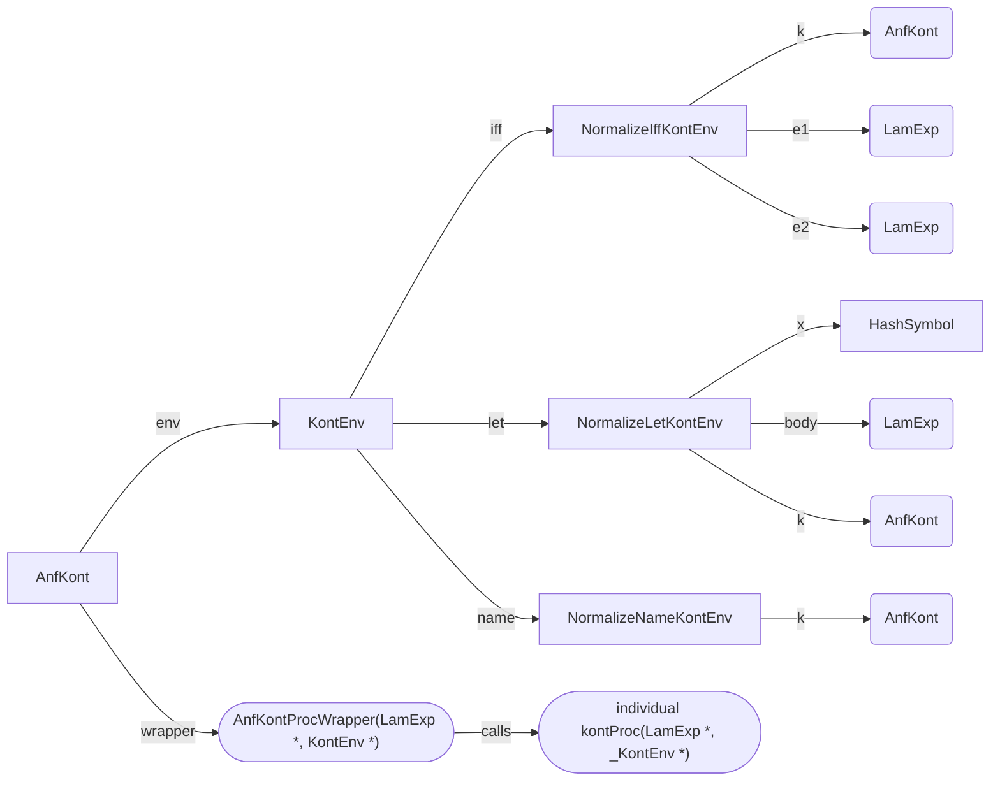

# ANF Continuation Scaffolding Generator

**Status**: Specification Draft  
**Goal**: Generate boilerplate for continuation-passing style ANF normalization  
**Scope**: Environment structs, wrapper functions, and construction macros only - continuation bodies remain manual

## Problem Statement

The ANF rewrite (see ANF-REWRITE.md) requires ~70 continuation functions, each with ~15 lines of boilerplate:

```c
// Manual boilerplate (repeated 70+ times)
static LamExp *normalizeLetKont(LamData *anfval, LamMap *map) {
    // Extract free variables from hash table
    HashSymbol *x = getLamMap_Symbol(map, TOK_X());
    LamData *body = getLamMap_Data(map, TOK_BODY());
    AnfKont *k = getLamMap_Kont(map, TOK_K());
    
    // Actual continuation logic
    LamExp *anfbody = normalize(body, k);
    int save = PROTECT(anfbody);
    LamData *let = makeLamData_Let(x, getLamData_Exp(anfval), getLamData_Exp(anfbody));
    UNPROTECT(save);
    return let;
}

static LamData *normalizeLet(LamLet *let, AnfKont *k) {
    // Setup continuation environment
    LamMap *map = newLamMap();
    int save = PROTECT(map);
    setLamMap_Symbol(map, TOK_X(), let->var);
    setLamMap_Data(map, TOK_BODY(), let->body);
    setLamMap_Kont(map, TOK_K(), k);
    AnfKont *k2 = newAnfKont(normalizeLetKont, map);
    PROTECT(k2);
    
    // Actual normalize logic
    LamData *val = newLamData_Exp(let->val);
    PROTECT(val);
    LamData *result = normalize(val, k2);
    UNPROTECT(save);
    return result;
}
```

**Boilerplate per continuation**: ~10 lines  
**Total savings**: ~700 lines across all continuations

**Note**: This proposal completely replaces the `LamMap` hash table approach from ANF-REWRITE.md with typed environment structs. Benefits:
- Type safety: Compiler catches field mismatches
- Performance: Direct field access vs hash lookup
- Clarity: Struct definition shows exactly what continuation needs
- Size: Fixed-size structs vs dynamic hash tables

## Proposed Solution

### YAML Specification File

Create `src/anf_continuations.yaml`:

```yaml
config:
    name: anf_kont
    description: Continuation specifications for ANF normalization

continuations:
    normalizeLetKont:
        key: let
        brief: "Continuation for let-expression normalization"
        context: |
            (`(let ((,x ,val)) ,body)
                (normalize val
                    [λ (anfval)
                        `(let ((,x ,anfval))
                                ,(normalize body k))]))
        free_vars:
            x: HashSymbol
            body: LamExp
            k: AnfKont
        param:
            anfval: LamExp
      
    normalizeIffKont:
        key: iff
        brief: "Continuation for if-expression normalization"
        context: |
            (`(if ,e0 ,e1 ,e2)
                (normalize-name e0
                    [λ (anfE0)
                        (k `(if ,anfE0
                                ,(normalize-term e1)
                                ,(normalize-term e2)))]))
        free_vars:
            k: AnfKont
            e1: LamExp
            e2: LamExp
        param:
            anfE0: LamExp
      
    normalizeCallInnerKont:
        key: callInner
        brief: "Inner continuation for function application"
        context: |
            (`(,Fn . ,Ms)
                (normalize-name Fn
                    [λ (t)
                        (normalize-names Ms
                            [λ (ts) (k `(,t . ,ts))])]))
        free_vars:
            t: LamExp
            k: AnfKont
        param:
            ts: LamExp
      
  # ... ~70 total continuations

external:
    LamExp:
        data:
            cname: "struct LamExp *"
            printFn: printLamData
            markFn: markLamData
            valued: true

primitives: !include primitives.yaml
```

### Code Generation


Environment structs are generated using the **existing code generation system** by programmatically adding them to the Catalog:

```python
# In tools/generate/kontinuations.py
def populate_catalog(catalog, kont_specs):
    """Add continuation environment structs to catalog"""
    
    # Validate keys are unique
    keys = [spec['key'] for spec in kont_specs.values()]
    if len(keys) != len(set(keys)):
        raise Exception("Duplicate keys found in continuation specs")
    
    # Add each env struct as a SimpleStruct
    for kont_name, spec in kont_specs.items():
        struct_name = f"{kont_name}Env"
        struct = SimpleStruct(
            name=struct_name,
            brief=spec['brief'],
            data=spec['free_vars']  # x: HashSymbol, body: LamExp, etc.
        )
        catalog.add(struct)
    
    # Add discriminated union of all envs using short keys
    # Maps: key -> struct_name (e.g., "iff" -> "NormalizeIffKontEnv")
    union_data = {spec['key']: f"{kont_name}Env" 
                  for kont_name, spec in kont_specs.items()}
    union = DiscriminatedUnion(
        name="KontEnv",
        brief="Continuation environments for ANF conversion",
        data=union_data
    )
    catalog.add(union)

    # Add the top-level AnfKont
    anf_kont = SimpleStruct(
        name="AnfKont",
        brief="Structure representing a continuation used by ANF transformations",
        data={
            wrapper: 'AnfKontProcWrapper',
            env: 'KontEnv'
        }
    )
    catalog.add(anf_kont)
```

### Generated Output

#### Normal Structs and unions, support code

Generated output (approximate, implicitly includes extra GC and PI headers but we don't need to worry about it, generated by the existing catalog system, included only for reference).

This gets generated to `anf_kont.c` and `anf_kont.h`.

```c
// Individual environment structs (with Header for GC)
typedef struct NormalizeLetKontEnv {
    HashSymbol *x;
    LamExp *body;
    AnfKont *k;
} NormalizeLetKontEnv;

typedef struct NormalizeIffKontEnv {
    AnfKont *k;
    LamExp *e1;
    LamExp *e2;
} NormalizeIffKontEnv;

// Discriminated union of all envs (using short keys)
typedef struct KontEnv {
    KontEnvType type;
    union {
        NormalizeLetKontEnv *let;
        NormalizeIffKontEnv *iff;
        NormalizeCallInnerKontEnv *callInner;
        // ... one variant per continuation (using key names)
    } val;
} KontEnv;

typedef struct AnfKont {
    AnfKontProcWrapper wrapper;
    KontEnv *env;
}
```

**Benefits**: 
- Leverages existing code generation (new, copy, mark, free all automatic)
- Type-safe field access
- GC integration automatic via Header
- Public accessor functions (newKontEnv_Let, getKontEnv_Let, etc.) generated automatically


#### Static Implementation Code (generated/anf_kont_impl.inc)

**Design Decision**: All continuation-specific code (declarations, wrappers, constructors) goes in a separate `.inc` file that is included only by `anf_normalize_2.c`. Everything in this file is declared `static` for maximum encapsulation. This file does not contain any structure declarations. Those are all already dealt with.

```c
// generated/anf_kont_impl.inc
// Include this ONLY in anf_normalize_2.c
// All declarations and implementations are static

// User implementation declarations (to be implemented in anf_normalize_2.c)
static LamExp* normalizeLetKont(LamExp *, NormalizeLetKontEnv *);
static LamExp* normalizeIffKont(LamExp *, NormalizeIffKontEnv *);
static LamExp* normalizeCallInnerKontEnv(LamExp *, NormalizeCallInnerKontEnv *);
// ... one static declaration per continuation

// Wrapper implementations (bridge AnfKontProcWrapper to typed env)
static LamExp* normalizeLetKontWrapper(LamExp *anfval, KontEnv *env) {
    return normalizeLetKont(anfval, getKontEnv_Let(env));
}

static LamExp* normalizeIffKontWrapper(LamExp *iff, KontEnv *env) {
    return normalizeIffKont(iff, getKont_Iff(env));
}
// ... one wrapper per continuation

// Constructor implementations (build continuation closures)
static AnfKont* makeKont_normalizeLet(HashSymbol *x, LamExp *body, AnfKont *k) {
    KontEnv *env = makeKontEnv_Let(x, body, k);
    int save = PROTECT(env);
    AnfKont *kont = newAnfKont(normalizeLetKontWrapper, env);
    UNPROTECT(save);
    return kont;
}

static AnfKont* makeKont_normalizeIff(AnfKont *k, LamExp *e1, LamExp *e2) {
    KontEnv *env = makeKontEnv_Iff(k, e1, e2);
    int save = PROTECT(env);
    AnfKont *kont = newAnfKont(normalizeIffKontWrapper, env);
    UNPROTECT(save);
    return kont;
}
// ... one constructor per continuation
```

#### Manual User Implementation of the ANF Algorithm

Note that rather than overwriting the existing implementation we are creating a new `anf_normalize_2.c` as a fresh file that is allowed to be broken.
```c
#include "anf_kont.h"           // Public API: env structs, KontEnv union
#include "anf_kont_impl.inc"    // Static: declarations, wrappers, constructors

// Reference implementation:
//
// (`(if ,e0 ,e1 ,e2)
//     (normalize-name e0
//         [λ (anfE0)
//            (k `(if ,anfE0
//                    ,(normalize-term e1)
//                    ,(normalize-term e2)))]))
//
// User implements the continuation bodies
static LamExp* normalizeIffKont(LamExp *anfE0, NormalizeIffKontEnv *env) {
    LamExp *e1 = normalizeTerm(env->e1);            int save = PROTECT(e1);
    LamExp *e2 = normalizeTerm(env->e2);            PROTECT(e2);
    LamExp *iff = makeLamExp_Iff(anfE0, e1, e2);    PROTECT(iff);
    LamExp *res = INVOKE(env->k, iff);              UNPROTECT(save);
    return res;
}
// and normalization functions
static LamExp* normalizeIff(LamExp *exp, AnfKont *k) {
    LamIff *iff = getLamExp_Iff(exp);
    AnfKont *k2 = makeKont_normalizeiff(k, iff->e1, iff->e2);    int save = PROTECT(k2);
    LamExp *res = normalizeName(iff->e0, k2);                    UNPROTECT(save);
    return res;
}

// normalize dispatcher:
static LamExp *normalize(LamExp *exp, AnfKont *k) {
    switch (exp->type) {
        case LAMEXP_TYPE_LET:
            return normalizeLet(exp, k);
        case LAMEXP_TYPE_IFF:
            return normalizeIff(exp, k);
        // ...
        default:
            cant_happen("unrecognized lamexp type %s", lamExpTypeName(exp->type));
    }
}

// Single public interface function
LamExp* anfNormalize(LamExp *exp) {
    LamExp *data = newLamData_Exp(exp);      int save = PROTECT(exp);
    LamExp *result = normalize_term(exp);    UNPROTECT(save);
    return getLamData_Exp(result);
}
```

It would be nice if we could generate the `normalize` dispatcher but we would have to iterate over `LamExp` which is not in the catalog (except as an external) when we are generating continuations and continuations do not map one to one with `LamExp`.

#### Other Details

```c
// AnfKontProcWrapper signature
typedef LamExp *(*AnfKontProcWrapper)(LamExp *, KontEnv *);

// INVOKE macro
static inline LamExp *INVOKE(AnfKont *k, LamExp *arg) {
    return k->proc(arg, k->env);  // Calls wrapper, which calls specific continuation with specific env
}
```

**Benefits**: 
- ✅ **Complete encapsulation**: All ~70 continuation functions are static
- ✅ **Type safety**: Compiler enforces signatures via static declarations
- ✅ **Single public interface**: Only `anfNormalize()` is public
- ✅ **Clean separation**: Standard codegen in .h/.c, special codegen in .inc
- ✅ **No namespace pollution**: Zero continuation functions visible externally

#### C. Diagram of the Structure



Referring to the diagram, `AnfKont` contains a generic (union) `KontEnv` and a generic (wrapper) procedure `AnfKontProcWrapper` (generic in the sense that they all have the same signature). The wrapper selects the specific union varient and calls a specific continuation proc with it, along with it's argument `LamExp`. Everything is generated, except for the individual kont proc.

Generation of all of the structures should be handled by existing catalog code, All the new continuation generator code has to do is ensure the `KontEnv` and its components are installed in the catalog, and generate the wrapper procedures.

## Build Integration

### Makefile Changes

```makefile
# Generate continuation environment structs (standard codegen)
generated/anf_kont.h: src/anf_continuations.yaml tools/generate.py
	$(PYTHON) tools/generate.py $< h > $@

generated/anf_kont.c: src/anf_continuations.yaml tools/generate.py
	$(PYTHON) tools/generate.py $< c > $@

generated/anf_kont_objtypes.h: src/anf_continuations.yaml tools/generate.py
	$(PYTHON) tools/generate.py $< objtypes_h > $@

# Generate continuation implementation scaffolding (new codegen)
generated/anf_kont_impl.inc: src/anf_continuations.yaml tools/generate.py
	$(PYTHON) tools/generate.py $< kont_impl_inc > $@

# Dependencies
obj/anf_kont.o: generated/anf_kont.h generated/anf_kont_objtypes.h
obj/anf_normalize_2.o: generated/anf_kont.h generated/anf_kont_impl.inc
```

**Note**: `anf_kont.c` is generated and compiled normally. `anf_kont_impl.inc` is included by `anf_normalize_2.c`.

### Generator Extension

Add `tools/generate/kontinuations.py`:
```python
class KontinuationGenerator:
    def populate_catalog(self, catalog, kont_specs):
        """Add env structs and KontEnv union to existing catalog
        
        Uses SimpleStruct and DiscriminatedUnion to add types to catalog.
        The catalog will then generate standard h/c/objtypes files.
        """
        
    def generate_kont_impl_inc(self, kont_specs):
        """Generate implementation include file with all static code
        
        Returns string containing:
        - Static user function declarations
        - Static wrapper implementations  
        - Static constructor implementations
        - Static normalize_term entry point
        
        Everything is static - no public functions exposed.
        """
```

**Key Design Points**:
- Standard types use existing Catalog → generates h/c/objtypes normally
- Special implementation uses new generator → generates .inc with all static
- `.inc` file keeps ~70 continuation functions completely private
- Single public `anfNormalize()` function is manually written

## Success Criteria

1. **Code reduction**: 15 lines → 8 lines per continuation call site (~50% reduction)
2. **Type safety**: Compiler catches env field mismatches
3. **Debuggability**: Can step through continuation construction and invocation
4. **Maintainability**: Adding new continuation = adding YAML entry and writing manual impl.
5. **Performance**: No measurable overhead vs manual hash table approach

## External Type Dependencies

### Investigation: Referencing Lambda-Generated Types

**Question**: Continuation environment structs contain fields of types generated from `lambda.yaml` (specifically `LamExp*`). How does the code generator know these are GC-managed types that need marking?

**Answer**: Use the `external` section, already supported by the YAML code generation system.

**Example from `anf.yaml`**:
```yaml
external:
    TcType:
            brief: external type from the type-checker
        data:
            cname: "struct TcType *"
            printFn: printTcType
            markFn: markTcType
            valued: true
```

**For continuations, add to `anf_continuations.yaml`**:
```yaml
external:
    LamExp:
        meta:
            brief: Lambda expressions to be normalized
        data:
            cname: "struct LamExp *"
            printFn: printLamData
            markFn: markLamData
            valued: true
```

**Result**: When generating `markNormalizeLetKontEnv()`, the generator will:
1. See field `body: LamExp*` in free_vars
2. Look up `LamExp` in external types
3. Find `markFn: markLamData`
4. Generate: `markLamData(env->body);`

**Note on Union Accessors**: The spec uses the auto-generated `getKontEnv_Let()` accessor function instead of direct field access (`kontEnv->val.let`). This provides type safety - the getter will throw an error at runtime if the wrong variant is accessed, catching bugs earlier.

**Verdict**: ✅ **Easy and already supported**. The external type system in the YAML generator handles exactly this use case. Just need to add the external declarations.

**Implementation Note**: The `cname` field allows the generator to emit proper forward declarations and casts if needed. The `printFn` enables debug pretty-printing. The `valued` flag indicates these are pointer types that can be NULL-checked before marking.

## Next Steps

1. ~~Resolve open questions (Q1-Q6 above)~~ ✅ **All resolved**
2. Add `external` declaration for `LamExp` to `anf_continuations.yaml`
3. Create minimal `anf_continuations.yaml` with 3-4 continuations (already done in tools/)
4. Implement `KontinuationGenerator` class
5. Generate code and validate compilation
6. Port 3-4 manual continuations to use scaffolding
7. Measure code reduction and validate correctness
8. Extend to all ~70 continuations
