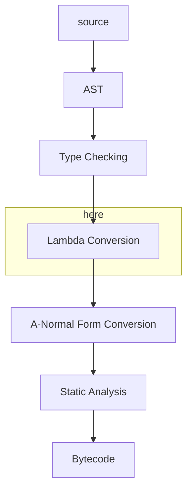

# Match Construct

Notes for later.

At some point we're going to need to compile the code generated by the parser to lambda form,
do type checking,
then hand it off to A-Normal conversion and finally have the static analysis and bytecode
generation.



One situation that will need to be optimised during the lambda conversion stage
is switching on the value of arguments in a composite function.

The *type* of argument will already have been validated by the type checker, but the values
will form a kind of run-time type enumeration.

consider this example

```
typedef Colour { Red | Green | Blue }

fn colourToString {
  (Red)   { "red" }
  (Green) { "green" }
  {Blue)  { "blue" }
}
```

A bunch of nested `if` statements is an option, but something closer to a `case` statement
would be more optimal. I'm thinking of introducing a new construct:

```scheme
(match <expr> (<value> <expr>)
              (<value> <expr>)
              ...)
```

I'm thinking of making this specifically for matching enumerations, where the number of
possibilities is known in advance, so this could be compiled to bytecode as a dispatch table:

```
| aexp | MATCH | num ! addr(exp1) | ... | addr(expn) | exp1 ... | ... | expn |
```

If we require all composite functions to be exhaustive then we don't need the `num`, but
I've left it in for now.
