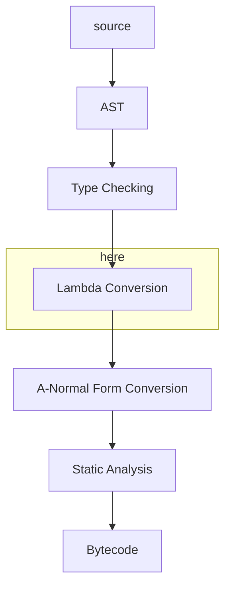

# Match Construct

Notes for later.

At some point we're going to need to compile the code generated by the parser to lambda form,
do type checking,
then hand it off to A-Normal conversion and finally have the static analysis and bytecode
generation.



One situation that will need to be optimised during the lambda conversion stage
is switching on the value of arguments in a composite function.

The *type* of argument will already have been validated by the type checker, but the values
will form a kind of run-time type enumeration.

consider this example

```fn
typedef Colour { Red | Green | Blue }

fn colourToString {
  (Red)   { "red" }
  (Green) { "green" }
  {Blue)  { "blue" }
}
```

A bunch of nested `if` statements is an option, but something closer to a `case` statement
would be more optimal. I'm thinking of introducing a new construct:

```scheme
(match <expr> (<value> <expr>)
              (<value> <expr>)
              ...)
```

I'm thinking of making this specifically for matching enumerations, where the number of
possibilities is known in advance, so this could be compiled to bytecode as a dispatch table:

```text
| aexp | MATCH | num-cases | addr(exp1) | ... | addr(expn) | exp1 ... | ... | expn |
```

`aexp` is constrained (by the type checker) to be an integer within the range of the enum.
If we require all composite functions to be exhaustive then we don't need the `num-cases`, but
I've left it in for now.

## Generating match statements

how about

```fn
fn factorial {
    (0) { 1 }
    (n) { n * factorial(n - 1) }
}
```

or

```fn
fn fib {
    (0) { 0 }
    (1) { 1 }
    (n) ( fib(n - 1) + fib(n - 2) }
}
```

or worse

```fn
fn yourGuess {
   (264487592) { true }
   (_) { false }
}
```

So we'll still need if/else for literals.

```scheme
(lambda (n)
  (if (= n 264487592)
    #t
    #f))
```

Let's try a few more examples:

```fn
typedef list(#t) { pair(#t, list(#t)) | null }

fn map {
    (f, null) { null }
    (f, pair(h, t)) { pair(f(h), map(f, t)) }
}
```

this is more tricky, generated code might need cons'd arguments, or probably typed arguments:

```scheme
(map
  (lambda (f val)
    (match (get-type val) ((0 (make-type 0))
                           (1 (make-type 1 (f (first val)) (map f (second val)))))))
```

where `0` and `1` correspond to `null` and `pair` appropriately. It would be more efficient
if we could just flatten the arguments and pass them directly on the stack, but this is a start.

the ancilliary definitions would be something like

```scheme
(define get-type car)
(define make-type list)
(define first cadr)
(define second caddr)
```

however since this is bytecode we'll be generating, the more support we can build into the vm,
the faster it will be.

We might think about implementing arrays in the target language, initially for this single purpose,
to avoid having to use cons for everything. the array would have a length field and an array of
values.

## Cond

`match` is long-since implemented as described above, and is as fast as expected, however as
explained it cannot apply to non-exhaustive pattern matches like the Fibonacci function, and
in those situations we fall back to a chain of if-then-else's as discussed.

Situations like the Fibonacci function are very common (and `fib(40)` is a benchmark :grin:)
so it would be better to have a special construct to deal with those, which I'll call `cond` because
it has a lot of similarities with the lisp `cond` of old.

There's no surface grammar for it, it's generated by the TPMC and looks as follows:

```scheme
(cond <value>
      (<index> <expression>)
      (<index> <expression>)
      ...
      (default <expression>))
```

When converted to ANF, the `<value>` must be an Aexp, `<index>` values must be literal integers,
and `<expression>` values are Exps.

Conversion to bytecode is then fairly trivial:

```text
| aexp | COND | num-cases | <index1> | addr(exp1) | ... | <indexn> | addr(expn) | ..expdef.. | ..exp1.. | ... | ..expn.. |
```

`expdef` is the default expression, it requires no index or address.

The virtual machine, on seeing a `COND` instruction, pops the result of the Aexp off the stack and
reads the following number of cases.
it then walks the tuples of `| <indexi> | <addri> |` looking for a matching index. If it finds one it
jumps to the addr, otherwise it runs naturally in to the default. Obviously each expr must end with a JMP
instruction to go to the end of the entire COND construct.

This should be significanly faster than a nest of ifs, which has to read and perform separate
operations for each condition.

## Update

`cond` is now implemented and the `fib(40)` benchmark has gone from around 40s
to 28s, 1.4 times faster.
