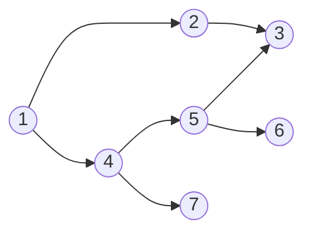
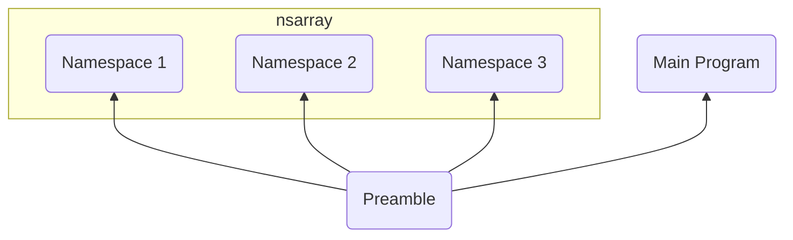

# Namespaces

From an early stage I'd planned to support environments as first-class
entities. This is a very tempting idea because of all of the behaviour
you would get for free, almost bootstrapping ourselves an oop system out
of nothing. However there would be some difficult problems to solve with
that feature, off the top of my head I can think of two:

1. Typechecking - The type of an environment would be the type environment
   produced while checking, not a problem, but any function using such an
   environment would have to somehow explicitly declare its type if it was
   allowed as argument to a function.
2. Lexical addressing - Two environments with the same type would almost
   certainly not have their values at the same locations, so lexical
   addressing of access to one would fail when applied to another.

Given those, and probably other obstacles, I'm going to try for the much
more limited but hopefully practical approach of namespaces.

## Syntax

```fn
import "path/to/myname.fn" as myname;
```

Will import and declare a namespace called `myname`.  Repeated imports
of the same file should not create repeated compilation units.  The path
will be relative to the file doing the import.

```fn
myname.expr
```

The lhs of the operator is constrained to be the name of
a namespace, but the rhs can be any expression to be evaluated
in the context of that namespace.

## Semantics

* Namespaces are not first class. They are static labels referring to
  compilation units.
* Namespaces can nest.
* All namespaces are constructed at compile-time.
* The structure of namespace files is costrained to a set of letrec
  bindings.
* Recusive nesting of namespaces will be an error at least initially,
  there may be solutions with backfilling later.

An important point to note about the dot operator `namespace.expr`. This
is *not* just variable lookup, it is the evaluation of the `expr` in
the context of the namespace. If the expression happens to be a simple
variable then it is equivalent to variable lookup, but care must be
taken not to fall into the trap of treating it as such. The appropriate
action on seeing a dot operator should always be:

1. push the namespace.
2. process the rhs in that context.
3. pop the namespace.

## Implementation

### Design and Documentation

You're looking at it :grin:.

### Version Control

This is quite a big piece of work, so I plan to create sub-branches off
of a co-ordinating `namespaces` branch to keep some sort of control, and
(this time) using tags to allow easier recovery.


Also, because of the scope, I think it makes sense to get an end to end
implementation of import working alone, before attacking the dot operator.

### Parsing

Some initial clean-up required, I'll remove all reference to `env` syntax.

The parser is already re-entrant, it should therefore be possible to
create a new parser for the file (if not already loaded), parse it in
a namespace context, and return a resulting structure to the parent
parser. However any subsequent import of the same file should return a
reference to the previous import, distinguished from the import itself
to avoid re-compilation. I'll need to start the re-entrant parser in a
different state though.

We'll also need to separate out the parsing of the preamble. We can treat it
as a namespace for this purpose, but not install it as one.

**UPDATE** Parsing of `import` is done, so it's worth documenting what
happens at the moment.

The preamble is parsed separately, and a nest is constructed using the
preamble as the definitions section and the body of the file as a second
nest expression. This will alow us to more easily inject the namespaces
between the preamble and the body later.

On encountering an `import` statement, the parser creates a child parser
for that file which parses it into a completely independant AST and
stores that in an array. The parent parser then just returns the index of
the AST in that array.  The inode and device id of the file are stored
alongside the AST so another import of the same file will just retrieve the
existing AST.  The parent parser then creates a letrec binding from the
symbol (after the `as`) to the indirect reference to the namespace's AST
(e.g. the index into the array).

The parser allows nested imports (namespaces importing namespaces) but
detects and disallows recursive (looping) imports.

This is potentially not foolproof, i.e. if the namespace was previously
imported then recursively imported it might not get detected, may need
to maintain a DAG to validate. Pretty sure recusive imports would always
be detected but need to be sure.

### Lambda Conversion

Mostly straightforward, will require a new lambda construct or two.

```fn
import "dict.fn" as dict;

fn foo {
    (dict.leaf) { ... }
}
```

### Type Chacking

As mentioned, the type of a namespace is the type-environment constructed
while checking it. This is done so that the type-checker can use the
lhs of a dot expression to retrieve the type environment appropriate
for type-checking the rhs.

### ANF Conversion

Hopefully no issues here, the ANF conversion currently needs an overhaul,
so if there are issues this may be the time to do it.

### Desugaring

There shouldn't be any new constructs to desugar specifically.

### Lexical Analysis

We'll need to swap in the context for each namespace before lexical analysis,
the context is basically the preamble plus the namespaces themselves.

### Bytecode

Thinking ahead, it might be better to plan the bytecode first and work
backwards, so here's a first attempt.


#### Bytecode Generation

* First off we'll need to parse the standard preamble separately, resulting
  in the first purple block of bytecodes.
* Next a new bytecode `BYTECODE_NS_START` introduces the namespaces. it is
  followed by an integer holding the number of namespaces to be expected.
* Then each namespace is compiled to a sequence of lambdas etc.,
  and each compiled namespace is terminated by another new bytecode
  `BYTECODE_NS_END`.
* After each `BYTECODE_NS_END` we write the number of stack slots the
  namespace will consume, and the number of namespaces minus the number of
  the namespace (zero indexed) resulting in the offset of the namespace
  from the top of stack (after the lambdas are popped).
* After the last namespace, we write a new `BYTECODE_NS_FINISH` followed
  by the number of namespaces.

##### Requirements of Bytecode Generation

We'll need a few new ANF constructs to describe the structure of the
code to be generated. The entire body will be broken into three sections:

1. The Prelude
2. The Namespaces
3. The Body

Each individual namespace will in turn require its own wrapper.

The only other thing will be some sort of `CexpDot` with a lhs
namespace symbol and a rhs expression.

#### Bytecode Execution

* The preamble execution is unchanged: skip over each lambda storing and
  pushing a closure with it's entry point address.
* On seeing `BYTECODE_NS_START`. read the following number and allocate that
  many stack slots.
* Subsequent lambdas etc, are processed normally, each getting
  pushed onto the stack, after the namespace slots.
* When a `BYTECODE_NS_END` is encountered:
  * Read the number of slots to pop and the namespace stack position.
  * Before popping anything, create a new Value type NAMESPACE with a
    copy of the current stack.
  * Then put that into the stack at the designated location (stack top
    minus number of slots to pop minus namespace stack position).
  * Lastly pop the namespace internals off of the stack.
* When `BYTECODE_NS_FINISH` is encountered, read the number of namespaces.
  * For each namespace slot:
    * copy the entire block of completed namespace slots over the same
      locations in the namespace's snapshot.
* The body is then executed in the normal way.

#### Bytecode for Namespace Access

We can't treat the `.` operator like a normal postfix, because the rhs
will be an expression that expects to be evaluated in the context of
the lhs, an'd we haven't run in to the `.` bytecode yet. Consider a
normal apply:

```text
| ..argn.. | ... | ..arg1.. | ..fn-expr.. | APPLY |
```

If that `fn-expr` is namespace-prefixed, any postfix operation will only
be encountered after it, just before the `APPLY`. So if the namespace
itself is treated as a normal VAR or LVAR then we'd need to follow
it with an op that installs the namespace as the new current context,
and after the `fn-expr` another op that restores the previous context:

```text
| ..argn.. | ... | ..arg1.. | (L)VAR | NS_INSTALL | ..fn-expr.. | NS_UNINSTALL | APPLY |
                            |                                                  |
                            |------written by the code generating the dot------|
```

We should figure out if this `NS_UNINSTALL` can be accomplished with an
existing continuation operation like `RETURN` rather than adding yet
another bytecode. `NS_INSTALL` will probably need the address of the
instruction following the `RETURN` if we do that, it may be more
efficient to have the additional `NS_RETURN` instruction instead.

So how would that be executed?


* `args` first the args are evaluated and pushed (1) - (3)
* `(L)VAR` then the namespace is evaluated (looked up) and pushed (4)
* `NS_INSTALL` then the namespace at TOS is installed (5):
  * pop the namespace
  * snapshot the stack to a new continuation (K).
  * replace the stack with the one in the namespace.
* `fn-expr` then the `fn-expr` is evaluated, leaving the result on the top of the stack (6)
* `NS_UNINSTALL` then the previous continuation is restored (7):
  * the value at TOS is popped and stashed
  * the stack is restored
  * the popped result is pushed back
* `APPLY` finally the closure at the TOS is applied to its arguments (8).

### Lexical Analysis

I can't think of any specific downstream requirements that the
bytecode generation places on the lexical analysis phase, other
than correctly locating the variables in the context of a namespace.
We do however need to be precise about how that is to be achieved.

Specifically the presence of namespaces on the stack may need to be
taken into account when calculating the locations of data after them.

#### Analysis of the preamble

Currently the preamble + body is analysed as a letrec, and there is only
one parse done.

As we are splitting up the parse, the result of analysing the preamble
will be a `CTEnv` that gets used as the base for analysing each namespace,
but to avoid pollution we may need to replicate it for each parse.

#### Analysis within each namespace

Need to check that hash tables support deep copy - hash tables only
support shallow copy,they don't clone their references. This might be a
problem but then again there are some recursive loops that pass through
hash tables, envs containing closures etc. May have problems here.

Remember `CTEnv` has an `isLocal` flag to distinguish lets and letrecs
from true closures. Probably doesn't matter as the envs used to check
namespaces will be clones of the top-level preamble env (plus namespace
slots).

#### Analysis of the body

Analysis of the body will be unchanged except for the special case
of namespace lookup.

#### Analysis of namespace lookup

The `CTEnv` resulting from the namespace analysis will be the preamble
env, with the namespace slots populated by the CTEnvs of each namespace.
so namespace lookup will find the correct env for the lhs and annotate
the rhs in that context.

Worth thinking about what we get from the parser at this stage, see
above.  The `import <string> as <name>` statement results in `<name>`
being bound to an indirect reference to the AST of the namespace. By the
time we reach the point of lexical analysis this will be an equivalent
(still indirect) reference to the ANF form of the AST, so it should be
a simple lookup to find the AST.

### Desugaring

Apart from accepting and traversing the new constructs, there is nothing
new to explicitly desugar here.

### ANF Conversion

Again this is purely static analysis and traversal, separate namespaces
can be dealt with individually. One little wrinkle though, it should be
possible to treat namespace access to an AExp as an AExp and namespace
access to a CExp as a CExp. After all the namespace lookup is just a var.

### Type Checking

First the preamble is type checked. As with Lexical Analysis, a TcEnv
will result and (copies of?) that are used to typecheck each namespace.
The results are new TcEnv structs that are associated with each namespace
slot. Another potential pitfall here, the order in which they are checked
may be significant, in which case we may need that same DAG mentioned
above to order the checker so that enclosed namespaces are checked before
enclosing ones.

Finally the body can be checked in the resulting context.

#### Print Compilation

Done as part of type checking, any typedef in a namespace will have a
generated print function alongside it.  Then the compilation of a print
expression referring to types inside the namespace could namespace-qualify
the calls to the print functions.

### Lambda Conversion

I'm thinking the output of this stage should be a single struct,
representing the entire program, something like:

```yaml
LamProg:
  preamble: LamExp                # typedefs/letrec
  namespaces: LamNameSpaceArray   # keep the array structure for easy lookup
  body: LamExp                    # body as before
```

The current top-level for lambda conversion is `lamConvertNest` which
we keep pretty much unchanged, if a bit simplified, but can delegate
to `static` as we don't need public access. The new top-level will be
`lamConvertProg` and it would be good to have that return something as
close to the current as possible. So what is returned by `lamConverNest`
is like:

```scheme
(typedefs (...)
   (letrec (...) ;; includes print functions
      <body>))
```

where the typedefs and the letrec are from the preamble. I guess all we
need is another level:

```scheme
(typedefs (...)
   (letrec (...)
      [namespaces]
      <body>))
```

However individual namespaces must also be parsed, and they are structured
like typedefs, but there is no actual body. I'm thinking a special token
like `env` could be used to both provide a body and direct processors
to return the environment at this point:

```scheme
(typedefs (...)
   (letrec (...)
      env))
```

Apart from the additions above, the other bit is the dot operator,
maybe just a binary op, though it's lhs could be constrained to being
a symbol if we have a separate type for it.

#### TypeDefs

typedefs should be able to reference namespace qualified types
(i.e. `list(random.junk)`).

#### TPMC

The language must support namespace qualified type constructors in patterns.

Assuming we have a new type for "qualified var", like in

```fn
fn foo {
   (ns.c1) { ... }
   (ns.c2) { ... }
}
```

where `c1` abd `c2` are values of a type defined by `ns`, then it
comes down to what is currently `makeVarPattern` in `tpmc_logic.c`.

All that does is look for the type constructor in the environment,
if it finds it, it's a constructor, otherwise it's a variable.

It would be best if that lookup process could be extended
to deal with the qualifier internally, as the process will always be
the same. However the current lookup just returns `NULL` if the
constructor doesn't exist, wheras if it's namespace-qualified, it
already knows it should exist and so can throw an error if it can't
find it. So lookup would locate the namespace (error if not found)
then recurse on that with the rhs of the qualification.

#### Constructor Inlining

namespace-qualified constructors should be inlined too.

The same application of lookup should apply here too.

### DAG

A little thought on that DAG I mentioned a few times.

Consider this scenario:



The circles represent namespaces, the arrows indicate imports.

It turns out the DAG is not necessary because of the order that these
imports will be stored in the namespaces array.

A namespace is only recorded after it has been completely parsed, by
which time any of its imports will have been recorded ahead of it. In
the example above the parse order is:

```text
1
+-2
| +-3
|   RECORD 3
| RECORD 2
+-4
  +-5
  | +-3
  | | (already recorded 3)
  | +-6
  |   RECORD 6
  | RECORD 5
  +-7
    RECORD 7
  RECORD 4
RECORD 1
```

so the namespaces are stored in the following order

```text
3
2
6
5
7
4
1
```

which satisfies the requirement that namespaces will be analysed before
anything that refers to them.

## Phase 2

`import` of normal values and access to them via the dot operator is
now apparently working.

Phase 2 is to extend this to allow access to typedefs. specifically the
type constructors.  We'll leave use of imported type constructors in
patterns to phase 4, and phase 3 should cover the print compiler.

The lambda conversion stage should detect these uses and inline the
constructors as it does for local ones, but currently it seems to
be treating them as normal variables and passing them through. The
typechecker is happy, and the code gets all the way to annotation
(lexical analysis) before the error is detected).

One option is to defer the inlining until after type checking, and
since the type constructor will see the constructors themselves
rather than the inlined `construct` operations. It should treat
them as normal functions. But that means it will allow them to be
curried. We might be on to a winner here if we go with that and
detect curried applications of constructors in the inlining
phase, we can convert those into anonymous closures. so after:

```fn
typedef dict(#k, #v) { leaf | tree(dict(#k, #v), #k, #v, dict(#k, #v)) }
```

on seeing:

```fn
tree(leaf, 1, "hello", leaf)
```

the constructor is directly inlined, but on seeing:

```fn
tree(leaf, 1)
```

the result is:

```fn
fn(a, b, c, d) { tree(a, b, c, d) }(leaf, 1)
```

or the lambda equivalent. Again the final constructor is inlined in the
body of the anonymous function.

The big problem here is that TPMC has already run at this stage, but
it may be ok, since these functions only have one branch.

## Phase 3

basic type importing is done, though I suspect it has issues, anyway

```fn
let
    import "maybe.fn" as m
in
    print(m.some(1))
```

works and prints `#[1, 1]`

The issue is that it merely removes the namespace context from the
types and compares them in one global env, so if two imports happen to
define types with the same names they will appear superficially to be the
same types. We'll clear this up as part of phase 3, print compilation,
as the print compiler also needs access to the namespace information.

There are two competing approaches:

1. Wrap namespaced types in new `TcLookup` constructs that contain
the namespace context.
2. Tag user-defined types with the integer namespace index (-1 for global)
   and include that tag in unification comparisons etc.

Option 1 seems more correct, but more problematic, because if typechecking
i.e.  `m.some(1)` The type would be i.e. `(lookup m ((#t) -> maybe(#t)))`
and `analyzeApply` would attempt to unify that with `(number -> #u)`
which will fail, and even if it could be made to work the type of `#u`
should unify with `(lookup m maybe(number))` not just `maybe(number)`.

Option 2 should just work for unification, provided the extra id is
included in the comparison. How would print compilation use it?

```fn
print(m.some(1))
```

The type of the argument to `print` would come out something like
`maybe:0(1)` where `0` is the namespace id. The print compiler
could use this id to find the namespace in which to lookup the
`print$maybe` function.

## Phase 4

Use of scoped types in pattern matching.

# Postscript

Now that namespaces are implemented this is a review of their
implementation, and their shortcomings. Those shortcomings are crying
out for an additional `import` operation, and hopefully the namespace
implementation can be re-used.

## Shortcomings

* Operators defined in a namespace are not visible outside of it.
* Aliases defined in a namespace are not visible outside of it.
* Functions and types defined in a namespace *have* to be accessed
  via the lookup operator (`.`) on the namespace id.

## Intent of an `import` command

I'm hoping I can get an `import <string>;` declaration to do 2 things:

1. make the environment of the import the base environment for the
   rest of the file.
2. use the resulting extended parser (with potentially extra operators)
   to parse the rest of the file.

## Description of the Current Implementation

### Lambda conversion etc

Namespaces are detected (recursively) during parsing of the main file.
When a namespace is found, the referenced file is statted with `stat`
and the resulting device id and inode (unix) numbers used to produce a
unique identifier. If the namespace is deduced to be previously unseen,
it is parsed and the result placed in a namespace array, otherwise the
existing namespace is re-used.  The symbol of the `link` declaration is
associated with the index of the namespace in that array.

Namespaces are parsed as if they were a `let` declaration with no
associated `in`. During lambda conversion they are converted to a true
nest, where the `in` section is a single `env` directive (not available
to the surface language) which instructs subsequent processing stages
to return the current environment after processing the `let` declarations.

The workhorse of lambda conversion in `lambda_conversion.c` is the static
`lamConvert` procedure. When called from the top level it takes an AST
of definitions, an array of namespaces, an AST of expressions and an
environment. In the top level case the definitions are the preamble,
the ns array is all the namespaces and the expressions are the main
program. When called recursively on a namespace, the definitions are
the body of the namespace, the nsarray is null and the expressions are
the single `env` directive mentioned earlier.  When called recursively
on a normal nest, the definitions are the nest definitions, the nsarray
is null and the expressions are the nest expressions.

| Argument        | Top          | Namespace       | Nest              |
|-----------------|--------------|-----------------|-------------------|
| **definitions** | preamble     | ns declarations | nest declarations |
| **nsarray**     | namespaces   | NULL            | NULL              |
| **expressions** | main program | "env"           | nest expressions  |
| **env**         | empty        | preamble env    | parent env        |

This means it can use the environment constructed from parsing the
preamble as context for each of the namespaces and for the main file:



Notice there is no nesting of namespaces even if they were recursively
linked. This is as it should be, each namespace assumes only the preamble
as a base environment.

During subsequent processing steps (type checking, bytecode generation
etc.) the components are processed in the same order: preamble then
namespaces then main program. The order of namespaces in the
array *is* significant, each must be processed before it is referred
to. Luckily the parser, by parsing namespaces while parsing the file
that links them, guarantees this property because namespaces are added
to the ns array immediately after they are parsed.

### Parsing

Because of the extensibility of the parser with user-defined operators,
the parser uses a similar environmental model to the other processing
steps. A new parser "environment" is pushed on entry to a new scope
and popped on exit. In order to capture the parser environment
constructed while parsing a namespace, the parser will need to know
that it is parsing a namespace and where to put the value. Since the
parser is returning AST elements it can't simply return the environment.
Maybe it can poke it into the AST as a new expression type?

## Problems

A single import is only slightly problematic, the bigger problem is
multiple imports, name conflict resolution etc. A simple but inefficient
solution would be to inline the contents of a namespace at the point it
is imported. This is particularily inefficient for large and commonly
used libraries like `listutils` and really isn't an option.

But if we can't merely duplicate, how can we arrange environments so
that one import does not disturb another? Each namespace must be
able to safely assume only the preamble as a basis.

## Trial and Error

First attempt, thinking out loud.

Exporting operators may be easier than exporting environments, so let's
tackle that first.

Currently the parser delegates actually parsing a `link` directive
(parsing the linked file that is) to a `parseLink` procedure.  `parseLink`
handles the detection of duplicate files and protection against recursive
includes, and finally delegates to `prattParseLink` to do the actual
parsing.

`prattParseLink` unwinds its argument parser to the parser that was used
to parse the preamble, then extends that with a new child set up with
a lexer to parse the linked file. When done it discards the parser and
returns the AstDefinitions from the file.

It should be possible to meld the parser returned with the parser being
used to parse the file doing the import, incorporating additional tries
and parser records. Because of the way the parser "hoists" parser records
only the top-level parser need be inspected, and the tries are similarily
functional data structures.

Hmm, of course this only works when we first parse the file, we're going
to have to keep an additional ParseMNamespaceArray of parsers for when
we're seeing the same file a second time.

So initial steps are ok, there's now a PrattParsers array type and a
parserStack of that congruent with the fileIdStack of namespaces and
the parser captures each parser instance used to parse a namespace in
that array.
