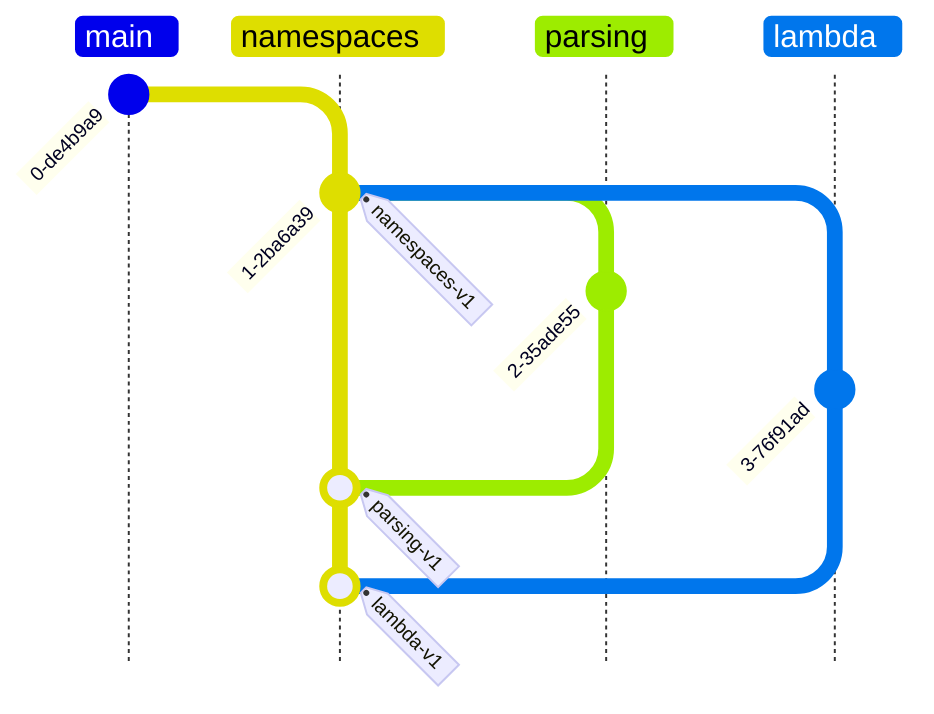
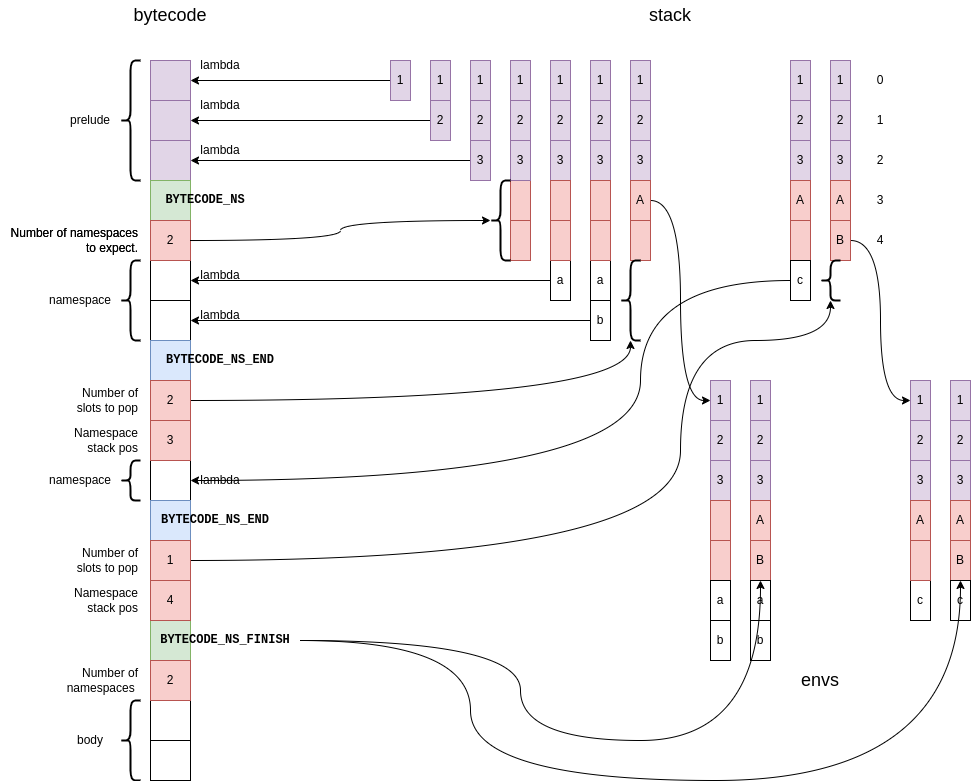
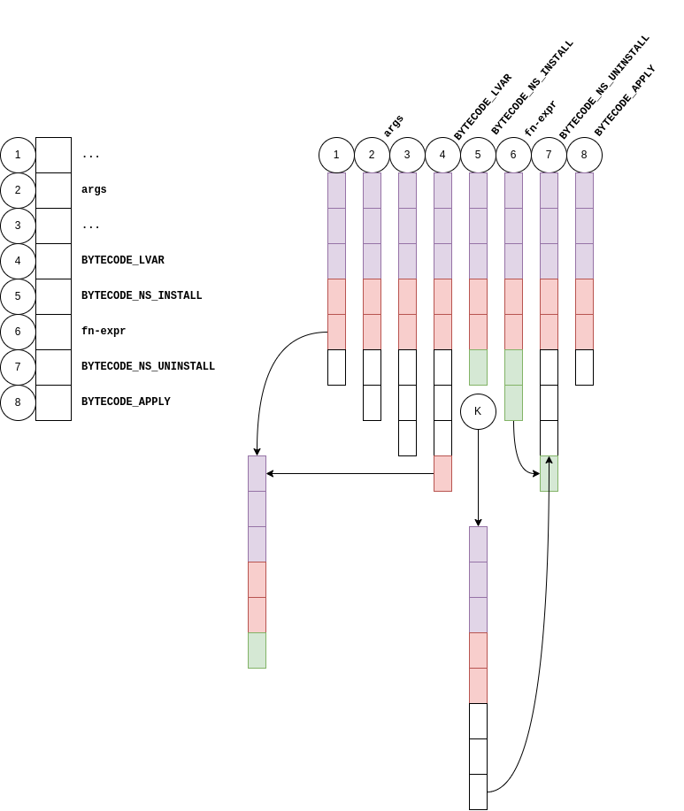
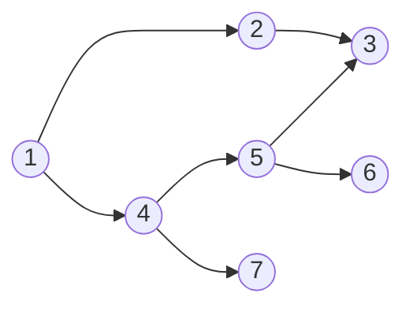

# Namespaces

From an early stage I'd planned to support environments as first-class
entities. This is a very tempting idea because of all of the behaviour
you would get for free, almost bootstrapping ourselves an oop system out
of nothing. However there would be some difficult problems to solve with
that feature, off the top of my head I can think of two:

1. Typechecking - The type of an environment would be the type environment
   produced while checking, not a problem, but any function using such an
   environment would have to somehow explicitly declare its type.
2. Lexical addressing - Two environments with the same type would almost
   certainly not have their values at the same locations, so lexical
   addressing of access outside of one would fail when applied to another.

Given those, and probably other obstacles, I'm going to try for the much
more limited but hopefully practical approach of namespaces.

## Syntax

```
import "path/to/myname.fn" as myname;
```

Will import and declare a namespace called `myname`.  Repeated imports
of the same file should not create repeated compilation units.  The path
will be relative to the file doing the import.

```
export typedef foo ...
export fn bar ...
export baz = ...
```

Within the namespace file, marks certain entities as being part of the
namespace's interface. any entities not so marked will not be visible
outside of the namespace.

```
myname.foo
```

Outside of the namespace allows access to exported entities.

## Semantics

* Namespaces are not first class. They are static labels referring to
  compilation units.
* Namespaces can nest.
* (later) Namespaces should be able to export other namespaces, or at
  least export values imported from other namespaces.
* All namespaces are constructed at compile-time.
* The structure of namespace files is costrained to a set of letrec
  bindings.
* Recusive nesting of namespaces will be an error at least initially,
  there may be solutions with backfilling later.

## Implementation

In general we'll need a new concept of namespace, distinct from types
and variables, so a "namespace for namespaces" used for lookup on the
lhs of the `.` operator.

### Design and Documentation

You're looking at it :grin:.

### Version Control

This is quite a big piece of work, so I plan to create sub-branches off
of a co-ordinating `namespaces` branch to keep some sort of control, and
(this time) using tags to allow easier recovery.



### Parsing

Some initial clean-up required, I'll remove all reference to `env` syntax.

The parser is already re-entrant, it should therefore be possible to
create a new parser for the file (if not already loaded), parse it in
a namespace context, and return a resulting structure to the parent
parser. However any subsequent import of the same file should return a
reference to the previous import, distinguished from the import itself
to avoid re-compilation. I'll need to start the re-entrant parser in a
different state though.

We'll also need to separate out the parsing of the preamble. We can treat it
as a namespace for this purpose, but not install it as one.

**UPDATE** Parsing of `import` and `export` is now done, so it's worth
documenting what happens at the moment.

The preamble is parsed separately, and a nest is constructed using the
preamble as the definitions section and the body of the file as a second
nest expression. This will alow us to more easily inject the namespaces
between the preamble and the body later.

On encountering an `import` statement, the parser creates a child parser
for that file which parses it into a completely independant AST and
stores that in an array. The parent parser then just returns the index of
the AST in that array.  The inode and device id of the file are stored
alongside the AST so another import of the same file will just retrieve the
existing AST.  The parent parser then creates a letrec binding from the
symbol (after the `as`) to the indirect reference to the namespace's AST
(e.g. the index into the array).

On encountering an `export` statement, the parser just creates an
`ASTDefinition` as any other, but the `ASTDefinition` type has been
extended to contain a boolean `exported` flag which the parser sets
`true` for those exported declarations only.

The parser allows nested imports (namespaces importing namespaces) but
detects and disallows recursive imports.

This is potentially not foolproof, i.e. if the namespace was previously
imported then recursively imported it might not get detected, may need
to maintain a DAG to validate. Pretty sure recusive imports would always
be detected but need to be sure.

Other things needing looking at. 
* the parser allows syntactically the `export` of values from any letrec,
  we should make that an error semantically if the export is not at the
  top-level of a namespace. That can be done during lambda conversion.
* the parser allows `export` of namespace declarations. As a first attempt
  it might be easier to disallow that too.

### Lambda Conversion

Mostly straightforward, will require a new lambda construct or two,
tagging of exported values etc. Typedefs exported by a namespace should
be available to pattern matching:

```
import "dict.fn" as dict;

fn foo {
    (dict.leaf) { ... }
}
```

and to the print compiler, ideally the print compiler would provide
namespace prefixes to the output, but that may prove impractical.

### Type Chacking

As mentioned, the type of a namespace is the type-environment constructed
while checking it, however that type environment needs to be pruned of
any private entities before it is used outside of the namespace.

### ANF Conversion

Hopefully no issues here, the ANF conversion currently needs an overhaul,
so if there are issues this may be the ime to do it.

### Desugaring

There shouldn't be any new constructs to desugar specifically.

### Lexical Analysis

We'll need to swap in the context for each namespace before lexical analysis,
the context is basically the preamble plus the namespaces themselves.

### Bytecode

Thinking ahead, it might be better to plan the bytecode first and work
backwards, so here's a first attempt.



#### Bytecode Generation

* First off we'll need to parse the standard preamble separately, resulting
  in the first purple block of bytecodes.
* Next a new bytecode `BYTECODE_NS` introduces the namespaces. it is
  followed by an integer holding the number of namespaces to be expected.
* Then each namespace is compiled to a sequence of lambdas etc.,
  and each compiled namespace is terminated by another new bytecode
  `BYTECODE_NS_END`.
* After each `BYTECODE_NS_END` we write the number of stack slots the
  namespace will consume, and the number of the namespace (zero indexed)
  added to the number of slots consumed by the preamble, resulting in the
  stack position of the namespace.
* After the last namespace, we write a new `BYTECODE_NS_FINISH` followed
  by the number of namespaces.

##### Requirements of Bytecode Generation

We'll need a few new ANF constructs to describe the structure of the
code to be generated. The entire body will be broken into three sections:

1. The Prelude
2. The Namespaces
3. The Body

Each individual namespace will in turn require its own wrapper.

The only other thing will be some sort of `CexpDot` with a lhs
namespace symbol and a rhs expression.

#### Bytecode Execution

* The preamble execution is unchanged: skip over each lambda storing and
  pushing a closure with it's entry point address.
* On seeing `BYTECODE_NS`. read the following number and allocate that
  many stack slots.
* Subsequent lambdas etc, are processed normally, each getting
  pushed onto the stack, after the namespace slots.
* When a `BYTECODE_NS_END` is encountered:
  * Read the number of slots to pop and the namespace stack position.
  * Before popping anything, create a new Value type NAMESPACE with a
    copy of the current stack.
  * Then put that into the stack at the designated location.
  * Lastly pop the namespace internals off of the stack.
* When `BYTECODE_NS_FINISH` is encountered, read the number of namespaces.
  * For each namespace slot:
    * copy the entire block of completed namespace slots over the same
      locations in the namespace's snapshot.
* The body is then executed in the normal way.

#### Bytecode for Namespace Access

We can't treat the `.` operator like a normal postfix, because the rhs
will be an expression that expects to be evaluated in the context of
the lhs, an'd we haven't run in to the `.` bytecode yet. Consider a
normal apply:

```
| ..argn.. | ... | ..arg1.. | ..fn-expr.. | APPLY |
```

If that `fn-expr` is namespace-prefixed, any postfix operation will only
be encountered after it, just before the `APPLY`. So if the namespace
itself is treated as a normal VAR or LVAR then we'd need to follow
it with an op that installs the namespace as the new current context,
and after the `fn-expr` another op that restores the previous context:

```
| ..argn.. | ... | ..arg1.. | (L)VAR | NS_INSTALL | ..fn-expr.. | NS_UNINSTALL | APPLY |
                            |                                                  |
                            |------written by the code generating the dot------|
```

We should figure out if this `NS_UNINSTALL` can be accomplished with an
existing continuation operation like `RETURN` rather than adding yet
another bytecode. `NS_INSTALL` will probably need the address of the
instruction following the `RETURN` if we do that, it may be more
efficient to have the additional `NS_RETURN` instruction instead.

So how would that be executed?



* `args` first the args are evaluated and pushed (1) - (3)
* `(L)VAR` then the namespace is evaluated (looked up) and pushed (4)
* `NS_INSTALL` then the namespace at TOS is installed (5):
  * pop the namespace
  * snapshot the stack to a new continuation (K).
  * replace the stack with the one in the namespace.
* `fn-expr` then the `fn-expr` is evaluated, leaving the result on the top of the stack (6)
* `NS_UNINSTALL` then the previous continuation is restored (7):
  * the value at TOS is popped and stashed
  * the stack is restored
  * the popped result is pushed back
* `APPLY` finally the closure at the TOS is applied to its arguments (8).

### Lexical Analysis

I can't think of any specific downstream requirements that the
bytecode generation places on the lexical analysis phase, other
than correctly locating the variables in the context of a namespace.
We do however need to be precise about how that is to be achieved.

#### Analysis of the preamble

Currently the preamble + body is analysed as a letrec, and there is only
one parse done.

As we are splitting up the parse, the result of analysing the preamble
will be a `CTEnv` that gets used as the base for analysing each namespace,
but to avoid pollution we may need to replicate it for each parse.

#### Analysis within each namespace

Need to check that hash tables support deep copy - hash tables only
support shallow copy,they don't clone their references. This might be a
problem but then again there are some recursive loops that pass through
hash tables, envs containing closures etc. May have problems here.

Remember `CTEnv` has an `isLocal` flag to distinguish lets and letrecs
from true closures. Probably doesn't matter as the envs used to check
namespaces will be clones of the top-level preamble env (plus namespace
slots).

#### Analysis of the body

Analysis of the body will be unchanged except for the special case
of namespace lookup.

#### Analysis of namespace lookup

The `CTEnv` resulting from the namespace analysis will be the preamble
env, with the namespace slots populated by the CTEnvs of each namespace.
so namespace lookup will find the correct env for the lhs and annotate the
rhs in that context.

Worth thinking about what we get from the parser at this stage, see
above.  The `import <string> as <name>` statement results in `<name>`
being bound to an indirect reference to the AST of the namespace. By the
time we reach the point of lexical analysis this will be an equivalent
(still indirect) reference to the ANF form of the AST, so it should be
a simple lookup to find the AST.

Lexical analysis can disregard any export status, in fact that can be
discarded by anf conversion as type checking will have detected illegal
access.

### Desugaring

Apart from accepting and traversing the new constructs, there is nothing
new to explicitly desugar here.

### ANF Conversion

Again this is purely static analysis and traversal, separate namespaces
can be dealt with individually. One little wrinkle though, it should be
possible to treat namespace access to an AExp as an AExp and namespace
access to a CExp as a CExp. After all the namespace lookup is just a var.

### Type Checking

First the preamble is type checked. As with Lexical Analysis, a TcEnv
will result and (copies of?) that are used to typecheck each namespace.
The results are new TcEnv structs that are associated with each namespace
slot. Another potential pitfall here, the order in which they are checked
may be significant, in which case we may need that same DAG mentioned
above to order the checker so that enclosed namespaces are checked before
enclosing ones. Such generated environments are pruned before subsequent
use so that only exported symbols remain.

Finally the body can be checked in the resulting context.

#### Print Compilation

Done as part of type checking, any typedef in a namespace will have
a generated print function alongside it, and these could be exported
even if the types themselves are not. then the compilation of a print
expression referring to types inside the namespace could namespace-qualify
the calls to the print functions.

Actually, it might be an idea to requre that any exported function in
a namespace that returns a type defined in that namespace would cause
a type-check error if the type is not also exported.  Then the lambda
conversion need only export print functions for exported types.

### Lambda Conversion

I'm thinking the output of this stage should be a single struct,
representing the entire program, something like:

```yaml
LamProg:
  preamble: LamExp                # typedefs/letrec extended with exported flags
  namespaces: LamNameSpaceArray   # keep the array structure for easy lookup
  dag: LamDAG                     # to control the order of namespace analysis
  body: LamExp                    # body as before
```

Apart from the additions above, the only other bit is the dot operator,
maybe just a binary op, though it's lhs could be constrained to being
a symbol if we have a separate type for it.

#### TypeDefs

typedefs should be able to reference namespace qualified types
(i.e. `list(random.junk)`).

#### TPMC

The language must support namespace qualified type constructors in patterns.

Assuming we have a new type for "qualified var", like in

```
fn foo {
   (ns.c1) { ... }
   (ns.c2) { ... }
}
```

where `c1` abd `c2` are values of a type exported by `ns`, then it
comes down to what is currently `makeVarPattern` in `tpmc_logic.c`.

All that does is look for the type constructor in the environment,
if it finds it, it's a constructor, otherwise it's a variable.

It would be best if that lookup process could be extended
to deal with the qualifier internally, as the process will always be
the same. However the current lookup just returns `NULL` if the
constructor doesn't exist, wheras if it's namespace-qualified, it
already knows it should exist and so can throw an error if it can't
find it. So lookup would locate the namespace (error if not found)
then recurse on that with the rhs of the qualification.

Since type-checking hasn't been done yet, the lookup will need to
check the `exported` status of any symbol it finds.

#### Constructor Inlining

namespace-qualified constructors should be inlined too.

The same application of lookup should apply here too.

### DAG

A little thought on that DAG I mentioned a few times.

Consider this scenario:



The circles represent namespaces, the arrows indicate imports.

It turns out the DAG is not necessary because of the order that these
imports will be stored in the namespaces array.

A namespace is only recorded after it has been completely parsed, by
which time any of its imports will have been recorded ahead of it. In
the example above the parse order is:

```
1
+-2
| +-3
|   RECORD 3
| RECORD 2
+-4
  +-5
  | +-3
  | | (already recorded 3)
  | +-6
  |   RECORD 6
  | RECORD 5
  +-7
    RECORD 7
  RECORD 4
RECORD 1
```

so the namespaces are stored in the following order

```
3
2
6
5
7
4
1
```

which satisfies the requirement that namespaces will be analysed before
anything that refers to them.

