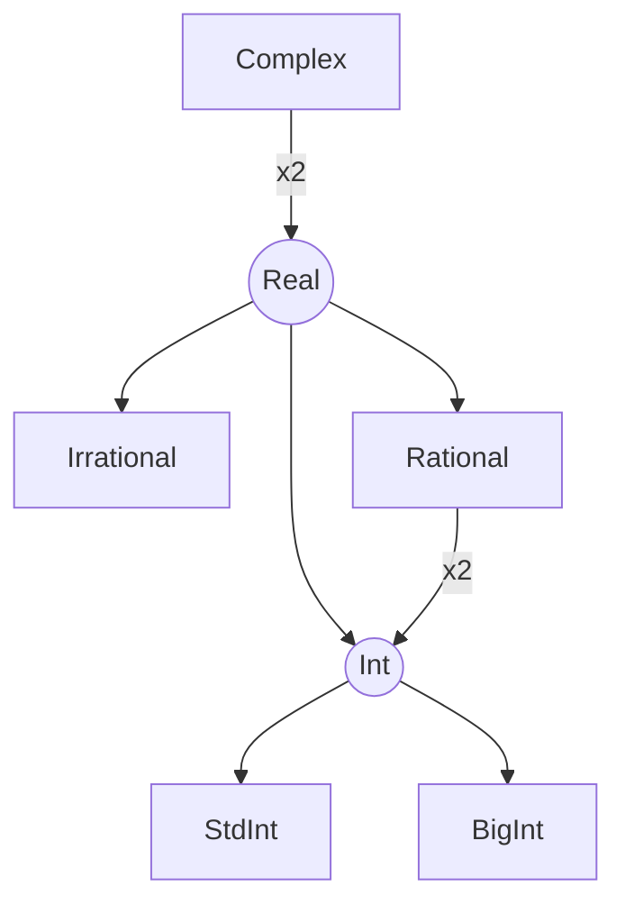

# Number Hierarchy

Note: this document includes exploratory hierarchy ideas. Any future domains such as vectors, matrices, or quaternions are proposals, not committed features.

Also note that future composite domains (for example vectors) likely should not follow scalar promotion rules. In particular, scalar-to-vector behavior is better modeled as operator-specific broadcasting, or by treating vectors as a separate language-level type family.

A sketch of the numerical types.



"Real" and "Int" are categories rather than concrete types. For example Rational numbers directly contain StdInt and BigInt components.

I guess we could create a concrete yaml description of this herarchy:

```yaml
structs:
    Complex:
        real: Real
        imag: Real
    Rational:
        numerator: Int
        denominator: Int
unions:
    Real:
        irrational: Irrational
        rational: Rational
        int: Int
    Int:
        stdint: StdInt
        bigint: BigInt
primitives:
    Irrational
    StdInt
    BigInt
```

One motivation for this is to try to simplify the byzantine logic in `arithmetic.c`, with some sort of formal strategy for coercion. With that in mind the actual coercion paths are not entirely in line with that original diagram above:

$$
\begin{align*}
\text{StdInt} \circ \text{BigInt} &= \text{BigInt}
\circ\text{BigInt} &\text{(coerce StdInt to BigInt)}
\\
\text{Int}\circ\text{Rat} &= \text{Rat}\circ\text{Rat} &\text{(coerce Int to Rat)}
\\
\text{Irrat}\circ\text{Rat} &= \text{Irrat}\circ\text{Irrat} &\text{(coerce Rat to Irrat)}
\\
\text{Real}\circ\text{Complex} &= \text{Complex}\circ\text{Complex}&\text{(coerce Real to Complex)}
\end{align*}
$$

But in reality some of these coercions are counter-productive or at least highly inneficient, it's much easier to calculate $(3 + 2i)^2$ than $(3 + 2i)^{2 + 0i}$ and you'd probably downcast the $2+0i$ back to $2$ in the process.

The reason for doing coercion up front is to reduce the combinatorial explosion of types and operators that would ensue otherwise. You still need a separate addition operator for each type, but you don't need one for each combination of those types.

## Coercion Table

|              | StdInt | BigInt | Rational | Float | Complex |
|--------------|--------|--------|----------|-------|---------|
| **StdInt**   | -      | BigInt | Rational | Float | Complex |
| **BigInt**   | <>     | -      | Rational | Float | Complex |
| **Rational** | <>     | <>     | -        | Float | Complex |
| **Float**    | <>     | <>     | <>       | -     | Complex |
| **Complex**  | <>     | <>     | <>       | <>    | -       |
