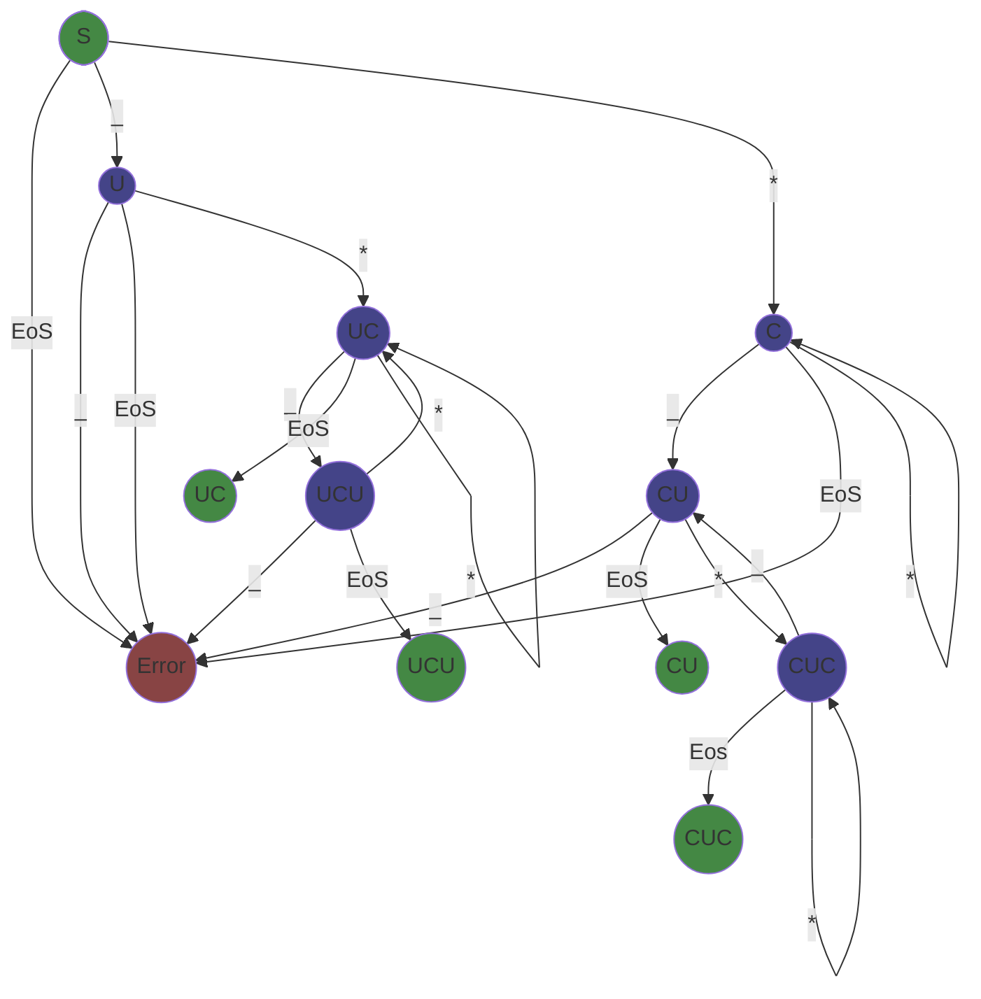

# Parsing MixFix Operator Patterns

MixFix operators are defined by patterns consisting of underscores representing
"holes" where a parameter would slot and sequences of other characters representing
the literal tokens of the operator. For example the infix addition operator would
be represented as `_+_` and the ternary conditional as `_?_:_`. There are only
a few simple rules to be followed when parsing:

1. No consecutive holes, each parameter must be separated from the others by an operator symbol.
2. At leeast one hole. You cannot have an operator without parameters.
3. At least one operator, you cannot have parameters without operators.

This converts nicely into a little state machine:

Which in turn can be translated into a state table

| STATE | CHAR | UNDERSCORE | END |
|-------|------|------------|-----|
| S     | C    | U          | ERR |
| C     | C    | CU         | ERR |
| CU    | CUC  | ERR        | CUF |
| CUC   | CUC  | CU         | CUCF |
| U     | UC   | ERR        | ERR |
| UC    | UC   | UCU        | UCF |
| UCU   | UC   | ERR        | UCUF |
| ERR   | ERR  | ERR        | ERR |
| CUF   | ERR  | ERR        | ERR |
| UCF   | ERR  | ERR        | ERR |
| UCUF  | ERR  | ERR        | ERR |