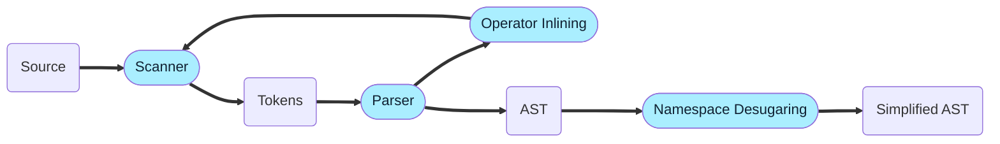
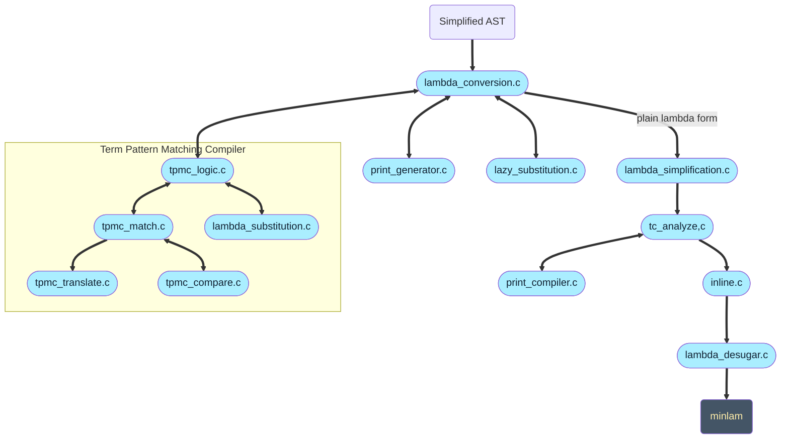
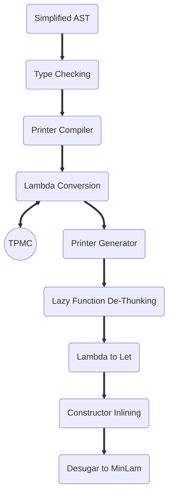

# Re-working the Early Stages of thr Pipeline

With the aim of simplifying future development and opening the way
for type classes, I need to re-organize the early parts
of the pipeline. There are a few specific goals:

1. Type check the AST as soon as possible, before lambda conversion and TPMC.
2. Untangle the rats nest during lambda conversion to a simple linear flow.
3. Get to the `minlam` representation as early as possible, hopefully as output directly from lambda conversion.

## Initial Parse

Copying the arcitecture graph from the README, the first parsing and namespace desugaring are good
and can remain.

The feedback loop from the parser to the scanner is necessary to
back-propogate tokens to be recognised as user-defined operators.
The Namespace Desugaring removes namespaces by prefixing namespaced
identifiers with a unique namespace id.
The output of this stage is a simplified AST without namespaces.

## Rat's Nest

What follows is the rats nest and a lot of manipulations of the bloated
lambda representation.

This is the section we will be reworking. First steps are to enumerate the
transformations it performs, to get a clear idea of what needs to be done.

* **lambda_conversion.c** is the overall conversion step, it performs the basic translations itself
  but hands off to specialiists for certain operations. `AST -> LamExp`
  * **tpmc_logic.c** is the front of the TPMC algorithm. It prepares the matrices for the `match` function, and uses
    `lambda_substitution.c` to substitute variables into the bodies of the function. `AST/LamExp -> LsmExp`
    * **tpmc_match.c** main algorithm translates matrices into a state transition network.
      * **tpmc_translate.c** translates the state networ into a LamExp nest of conditionals.
      * **tpmc_compare.c** separates out the matrix state comparison code.
    * **lambda_substitution.c** does the replacement of the variable names from the input with the names generated by the TPMC, in the bodies of the target functions. `LamExp => LamExp`
  * **print_generator.c** generates a parameterized print function for each typedef. `LamExp => LamExp`.
  * **Lazy_substitution.c** only covers the "de-thunking" of argument variables in the bodies of lazy functions (replacing `a` with `a()` ). `LamExp => LamExp`
* **lambda_simplification..c** rewrites anonymous lambda application into let statements so the type checker can do analysis of the body. This is required
particularily for switch statements which are desugared to anonymous function calls by the parser.
* **tc_analyze.c** is the actual type checking but it also calls out to `print_compiler.c`
  * **print_compiler.c** replaces `print` statements with lambdas that invoke the appropriate print functions.
* **inline.c** replaces constructor application with inline vector application. NOTE β-reduction can do this.
* **lambda_desugar.c** does the final (in this sequence) `LamExp => MinExp` conversion.

It may be unavoidable that Lambda Conversion invokes the TPMC, because
the entry point to the TPMC `tpmcConvert`, accepts a mix of `AstFargList`
and partially converted `LamExp`. However the additional printer generation
and lazy function dethunking can be linearized into subsequent transforms.

It might be worth considering extending the AST (and
potentially LamExp) to carry type information that
would be added by the type checker. That would decouple
the Printer Compiler from the Type Checker as long as
it remained downstream of it.

## Problems to Solve

What are we trying to achieve and why?
