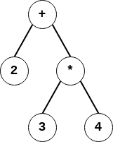

# CEKF Version 2 - Bytecode

Benchmarks so far have been encouraging, the `fib(35)` test with `-O2` now
takes around 5.5 seconds, but `fib(40)` still takes around 54 seconds,
while Nystrom's stack-based bytecode interpreter can do that calculation
in around 5 seconds. Of course this is due to using environments instead of
a stack, and walking trees instead of stepping through bytecode.

Another factor is that the entire AST needs to be protected, and must be
marked every time a garbage collection occurs.

So how difficult would it be to convert the AST to bytecode and use
a local stack? It turns out to be not so hard. Of course we still need
environments, because of closures that capture them, and it's quite
possible that version 2 will actually be **slower** initially, but
I'll discuss a possible version 2.1 later that I hope will fix that.

Anyway let's review the math from version 1 and see what the bytecode
equivalent might look like.

The new machine no longer has any $\mathcal{A}$, $applyproc$ or
$applykont$ functions, as they are subsumed into the general $step$ function.
However the basic structure and discussion is the same.

One big difference however is of course that since there is no longer an AST,
the C regiter is now an index into an array of bytecodes.

I'll present the original math for each step, then its bytecode equivalent.

> CAVEAT - NONE OF THIS IS TESTED YET. Please don't rush to implement and then blame me if
> it doesn't work, If/when I get it working I'll update this document.

## Internal Byteodes

These first few bytecodes are the equivalent of the old $\mathcal{A}$ function,
the interpreter is stepping through the code encountering these expressions
and not changing the overall machine state, just the stack. It will continue to
iterate, incrementing the address pointer appropriately, until it hits a
state-changing bytecode. State changing bytecodes are discussed in a later section.

### Variables

Variables get looked up in the environment:

$$
\mathcal{A} (\mathtt{var}, \rho) = \rho(\mathtt{var})
$$


bytecode for that:

| bytecode | action |
|----------|--------|
`\| VAR \| frame \| offset \|` | `push(lookup(frame, offset, env))` |


The bytecode consiste of three bytes, a `VAR` tag that identifies that a variable is coming
up, then a byte for its frame and a byte for its offset in the frame (see [Lexical
Addressing](LEXICAL_ADDRESSING.md) for details if you haven't already.)

On seeing that, the bytecode interpreter does the lookup, and pushes the result onto the stack.

`env` here is the $\rho$ argument to the old $\mathcal{A}$ function.

Note that evaluating an `aexp` always has a stack cost of 1, e.g. there
is always one more element on the stack after evaluation an `aexp`.

### Constants

Constants evaluate to their value equivalents:

$$
\begin{align}
\mathcal{A}(\mathtt{integer}, \rho) &= z
\\
\mathcal{A}( \mathtt{\\#t}, \rho) &=  \mathbf{\\#t}
\\
\mathcal{A}( \mathtt{\\#f}, \rho) &=  \mathbf{\\#f}
\end{align}
$$

| bytecode | action |
|----------|--------|
| `\| INT \| hi \| lo \|` | `push(hi << 8 \| lo);` |
| `\| TRUE \|` | `push(1);` |
| `\| FALSE \|` | `push(0);` |

(16 bit integers for now).

### Lambdas

Lambdas become closures:

$$
\mathcal{A}(\mathtt{lam}, \rho) = \mathbf{clo}(\mathtt{lam}, \rho)
$$

| bytecode | action |
|----------|--------|
| `\| LAM \| nvar \| addr(after exp) \| exp \|` | `push(clo(nvar, addr(exp), env);` |

Where `addr(exp)` is the index of the `exp` in the bytecode array.

Note the absence of explicit variable names. Again because of
lexical addressing the only thing the closure needs to know is the size
of the environment.

### Primitives

Primitive expressions are evaluated recursively:

$$
\mathcal{A}(\mathtt{(prim\ aexp_1\ aexp_2)}, \rho) =
  \mathcal{O}(\mathtt{prim})(\mathcal{A}(\mathtt{aexp_1}, \rho),
    \mathcal{A}(\mathtt{aexp_2}, \rho))
$$

where

$$
\mathcal{O} : \mathtt{prim} \rightharpoonup ((Value \times Value) \rightharpoonup Value)
$$

It starts to get interesting here, if we rewrite this to Reverse Polish
Notation we can achieve the entire operation very simply:

| bytecode | action |
|----------|--------|
| `\| aexp1 \| aexp2 \| PRIM \|` | `push(O(PRIM)(pop(), pop()));` |

I should probably explain that.

Consider a primitive sequence like `2 + 3 * 4`. That will parse to
`2 + (3 * 4)` and the AST will look like:



There are various ways to print out that tree, for example for each
(non-terminal) node, printing the left hand branch, then printing the
operation, then printing the right hand branch would recover the infix
notation we started with. Howver if instead we print the left-hand
branch, then the right-hand branch, then the operation, we end up with
reverse polish notation: `2 3 4 * +` which is exactly the order we need
to evaluate the expressions:

* push 2.
* push 3.
* push 4.
* pop the 3 and the 4, multiply them and push the result 12.
* pop the 2 and the 12, add them and push the result 14.

Note that the entire operation has a stack cost of 1, preserving
that invariant.

## State Changing Bytecodes

The rest of these situations change the overall state of the machine, corresponding to
$step$ returning a new state.

### Function calls

For function calls, `step` first evaluates the function,
then the arguments, then it applies the function:

$$
step(\mathtt{(aexp_0\ aexp_1\dots aexp_n)}, \rho, \kappa, f) = applyproc(proc,\langle val_1,\dots val_n\rangle, \kappa, f)
$$

where

$$
\begin{align}
proc &= \mathcal{A}(\mathtt{aexp_0}, \rho)
\\
val_i &= \mathcal{A}(\mathtt{aexp_i}, \rho)
\end{align}
$$

and

$$
applyproc : Value \times Value^* \times Kont \times Fail \rightharpoonup \Sigma
$$

is

$$
\begin{align}
applyproc( \mathbf{clo} (\mathtt{(lambda\ (var_1\dots var_n)\ body)}, \rho),\langle val_1\dots val_n\rangle, \kappa, f) &=
(\mathtt{body}, \rho', \kappa, f)
\\
applyproc( \mathbf{cont}(\kappa'), \langle val \rangle, \kappa, f) &= applykont(\kappa', val, f)
\end{align}
$$

where

$$
\rho' = \rho[\mathtt{var_i} \Rightarrow val_i]
$$

and

$$
\begin{align}
applykont(\mathbf{letk}(\mathtt{var}, \mathtt{body}, \rho, \kappa), val, f) &= (\mathtt{body}, \rho', \kappa, f)
\\
applykont(\mathbf{halt}, val, f) &= (\mathtt{DONE}, [], \mathbf{halt}, f)
\end{align}
$$

where

$$
\rho' = \rho[\mathtt{var} \Rightarrow val]
$$


| bytecode | condition | new state |
|----------|-----------|--------|
| `\| aexp1 \| ... \| aexpn \| aexp \| APPLY \|` | `clo(nargs, addr, env) = pop()` | `(addr, extend(env, pop(nargs)), K, F)` |
|  | `cont(letk(body, env, k')) = pop()` | `(body, extend(env, pop()), k', F)` |
| | `cont(halt) = pop();` | `(DONE, env, halt, F)` |

This is a bit more tricky. a sequence of `aexpn` arguments followed by a callable `aexp` followed by an `APPLY` token.
By the time we get to the `APPLY` all the `aexpx` have been evaluated and are sitting on the stack, with the
callable on top. But there are three possibilities. the callable could be a closure,
or it could be a continuation created by `call/cc`. If it's a continuation it could be a `letk` or a `halt`.
We deal with each separately.

The pseudocode `pop(nargs)` just means to copy the stack to the environment, a simple `memcpy` followed by a stack reset should suffice.

### Return

When the expression under evaluation is an `aexp`, that means we need
to return it to the continuation:

$$
step(\mathtt{aexp}, \rho, \kappa, f) = applykont(\kappa, val, f)
$$

where

$$
val = \mathcal{A}(\mathtt{aexp}, \rho)
$$

and

$$
applykont: Kont \times Value \times Fail \rightharpoonup \Sigma
$$

is

$$
\begin{align}
applykont(\mathbf{letk}(\mathtt{var}, \mathtt{body}, \rho, \kappa), val, f) &= (\mathtt{body}, \rho', \kappa, f)
\\
applykont(\mathbf{halt}, val, f) &= (\mathtt{DONE}, [], \mathbf{halt}, f)
\end{align}
$$

where

$$
\rho' = \rho[\mathtt{var} \Rightarrow val]
$$

| bytecode | condition | new state |
|----------|-----------|--------|
| `\| aexp \| RETURN \|` | `letk(body, env, k') = K` | `(body, extend(env, pop()), k', F)` |
|  | `halt = K` | `(DONE, E, K, F)` |

We'll need that `RETURN` code to stop the internal iterations from proceeding.
There are two possibilities here, the continuation `K` could be a `letk` or a `halt`.
we deal with each appropriately.

### Conditionals

$$
step(\mathtt{(if\ aexp\ e_{true}\ e_{false})},\rho,\kappa, f) = \left\\{
\begin{array}{ll}
(\mathtt{e_{false}},\rho,\kappa, f) & \mathcal{A}(\mathtt{aexp},\rho) = \\#f
\\
(\mathtt{e_{true}},\rho,\kappa, f) & \textup{otherwise}
\end{array}
\right.
$$

| bytecode | condition | new state |
|----------|-----------|--------|
| `\| aexp \| IF \| addr(ef) \| et \| JMP \| addr(after ef) \| ef \|` | `pop(p)` | `(addr(et), E, K, F)` |
|  | `!pop(p)` | `(addr(ef), E, K, F)` |

Not mutch to say here, if the value at the top of the stack after evaluating `aexp` is true, go to the true branch,
otherwise go to the false branch, but the true branch must jump over the false branch when complete.

### Let

Evaluating `let` forces the creation of a continuation

$$
step(\mathtt{(let\ (var\ exp)\ body)},\rho,\kappa, f) = (\mathtt{exp}, \rho, \kappa', f)
$$

where

$$
\kappa' = \mathbf{letk}(\mathtt{var}, \mathtt{body}, \rho, \kappa)
$$

| bytecode | new state |
|----------|-----------|
| `\| LET \| addr(body) \| exp \| body \|` | `(addr(exp), E, letk(addr(body), E, K), F)` |

Again just a re-expression of the specified behaviour.

### Recursion

$$
step(\mathtt{(letrec\ ((var_1\ aexp_1)\dots(var_n\ aexp_n))\ body)}, \rho, \kappa, f) = (\mathtt{body}, \rho', \kappa, f)
$$

where:

$$
\rho' = \rho[\mathtt{var_i} \Rightarrow \mathbf{void}]
$$

but subsequently mutated with pseudomath:

$$
\rho'[\mathtt{var_i}] \Leftarrow \mathcal{A}(\mathtt{aexp_i}, \rho')
$$

| bytecode | new state |
|----|----|
| `\| ENV \| nargs \|` | (C extend(E, nargs), K, F) |
| `\| aexp1 \| ... \| aexpn \| LETREC \| nargs \| body \|` | `(addr(body), E <== aexps, K, F)` |

This is meant to be read as a single squence of bytecodes.
The `ENV` followed by the number of arguments it should hold causes the current env to be extended
by a new frame with that many slots. Then each `aexp` is evaluated, then the new env is populated
with the values, then the body is evaluated in the new environment.

### call/cc

`call/cc` takes a function as argument and invokes it with the current
continuation (dressed up to look like a $Value$) as its only argument:

$$
step(\mathtt{(call/cc\ aexp)}, \rho, \kappa, f) = applyproc(\mathcal{A}(\mathtt{aexp}, \rho), \langle \mathbf{cont}(\kappa) \rangle, \kappa, f)
$$

as a reminder of $applyproc$

$$
\begin{align}
applyproc( \mathbf{clo} (\mathtt{(lambda\ (var_1\dots var_n)\ body)}, \rho),\langle val_1\dots val_n\rangle, \kappa, f) &=
(\mathtt{body}, \rho', \kappa, f)
\\
applyproc( \mathbf{cont}(\kappa'), \langle val \rangle, \kappa, f) &= applykont(\kappa', val, f)
\end{align}
$$

where

$$
\rho' = \rho[\mathtt{var_i} \Rightarrow val_i]
$$

and

$$
\begin{align}
applykont(\mathbf{letk}(\mathtt{var}, \mathtt{body}, \rho, \kappa), val, f) &= (\mathtt{body}, \rho', \kappa, f)
\\
applykont(\mathbf{halt}, val, f) &= (\mathtt{DONE}, [], \mathbf{halt}, f)
\end{align}
$$

where

$$
\rho' = \rho[\mathtt{var} \Rightarrow val]
$$
so

| bytecode | preparation | new state |
|----|----|----|
| `\| aexp \| CALLCC \|` | `K == letk(addr, env', k');`<br/>`env'' = extend(env' pop());` | `(addr, env'', k', F)` |

### Amb

`amb` arranges the next state such that its first argument will be
evaluated, and additionally installs a new Fail continuation that,
if backtracked to, will resume computation from the same state, except
evaluating the second argument.

$$
step(\mathtt{(amb\ exp_1\ exp_2)}, \rho, \kappa, f) = (\mathtt{exp_1}, \rho, \kappa, \mathbf{backtrack}(\mathtt{exp_2}, \rho, \kappa, f))
$$

| bytecode | new state |
|----|----|
| `\| AMB \| addr(e2) \| e1 \| JMP \| addr(after e2) \| e2 \|` | `(addr(e1), E, K, backtrack(addr(e2), E, K, F))` |

### Back

`back` invokes the failure continuation, restoring the state captured by
`amb`.

$$
\begin{align}
step(\mathtt{(back)}, \rho, \kappa, \mathbf{backtrack}(\mathtt{exp}, \rho', \kappa', f)) &= (\mathtt{exp}, \rho', \kappa', f)
\\
step(\mathtt{(back)}, \rho, \kappa, \mathbf{end}) &= (\mathtt{DONE}, \rho, \kappa, \mathbf{end})
\end{align}
$$

| bytecode | condition | new state |
|----|----|----|
| `\| BACK \|` | `F == backtrack(addr, E, K, F')` | `(addr, E, K, F')` |
|  | `F == end` | `(addr(DONE), E, K, F)` |

The `DONE` Exp signals termination.

### DONE

$$
step(\mathtt{DONE}, \rho, \kappa, f) = \varnothing
$$

terminates the machine, effectively it's undefined for $step$ to be
given this argument.

## V2.1

So why might V2 be slower, and how can we speed it up?

> Another caveat, this is quite vague at this point, I'm just thinking out loud.

My gut tells me that V2 will probably be a bit faster, but not by much. It gains the locality of a bytecode interpreter,
and the AST can be discarded, but I suspect the overhead of all that copying between stack and environment might offset
those benefits.

One observation is that many variables will be local to the function, if you look at how functions are called, their
arguments are built on the stack, then the environment of the closure is extended with the values from the stack,
then the values are popped off the stack, then the function is executed. Worse, when a function needs a variable
value it is copied back from the environment onto the stack again!

Why not use the values on the stack directly?

Variables are created in three ways:
1. as arguments to functions.
2. as bound `let` variables.
3. as `letrec` closures.

It should be easy to distinguish free variables from bound ones in a function, there are well-defined mechanisms,
plus we've already done lexical analysis and we know the frame of each variable, so a variable is bound if its frame
count minus its lexical depth (the number of `let`s and `letrec`s between it and the top-level of its function) is less than 1.

So imagine a fuction:

```
(lambda (a b c)
   (let (d <expr>)
        (let (e <expr>)
             (letrec (g (lambda (x) ...))
                     (h (lambda (y)
                                (+ (g y) y)))
                     (+ a b d e (h c))))))
```

and annotate its variable usage with `[frame:offset]`

```
(lambda (a b c)
   (let (d <expr>)
        (let (e <expr>)
             (letrec (g (lambda (x) ...))
                     (h (lambda (y)
                                (+ (g[1:0] y[0:0]) y[0:0])))
                     (+ a[3:0] b[3:1] d[2:0} e[1:0] (h[0:1] c[3:2]))))))
```

If instead of an environment, we used a stack for the function's variables, then at the point
of the body of the inner letrec, the stack would be:
```
[h]
[g] // letrec
[e] // let
[d] // let
[c]
[b]
[a] // lambda
```
We could then, instead annotate those local variables with a stack position, an offset from the base of the
current function's stack frame. We'd also need to tag them as a different type of variable, or maybe just
use a frame number of zero to indicate that (I think I prefer the first option):
```
(lambda (a b c)
   (let (d <expr>)
        (let (e <expr>)
             (letrec (g (lambda (x) ...))
                     (h (lambda (y)
                                (+ (g[0:0] y[0]) y[0])))
                     (+ a[0] b[1] d[3] e[4] (h[6] c[2]))))))
```
The closure generated by the function would no longer have a local environment, instead it would directly
hold a reference to its parent environment. A local environment would be constructed on demand when needed to
create a closure, and that environment would contain (a copy of) the complete stack frame of the function
up to that point, plus a pointer to the parent environment.

Note in the above `h` lambda, the `g` is non-local, but has a frame of 0 because 0 is now the parent frame.

### TCO

A feature of A-Normal form is that, even though it's not entirely in continuation-passing style, there is
only one situation where function calls are not in tail position, and that is the `exp` in a `(let (var exp) body)`
The place that requires a new closure in the evaluator is the same place where we can't throw away the current stack frame.
In all other cases the called function can re-use the calling function's stack frame.

### Changes to V2

Firstly we're going to need a new register to keep track of the stack, all the good letters are gone so I'm just going to call it `S`.
Our CEKF machine is now a CEKFS machine.

#### Variables

| bytecode | action |
|----------|--------|
`\| VAR \| frame \| offset \|` | `push(lookup(frame, offset, env))` |
`\| LVAR \| offset \|` | `push(stack[S + offset])` |

`VAR` is effectively unchanged (except its frame count is one less), the new local `LVAR` instead accesses
its value directly from the stack (unfortunately we need values guaranteed to be at the top of the stack.)

#### Constants

| bytecode | action |
|----------|--------|
| `\| INT \| hi \| lo \|` | `push(hi << 8 \| lo);` |
| `\| TRUE \|` | `push(1);` |
| `\| FALSE \|` | `push(0);` |

no change.

#### Lambdas

| bytecode | action |
|----------|--------|
| `\| LAM \| nvar \| exp \|` | `push(clo(nvar, addr(exp), env.extend(snapshot(frame)));` |

The new `snapshot(frame)` pseudocode means to copy the current stack frame into a new environment.

#### Primitives

| bytecode | action |
|----------|--------|
| `\| aexp1 \| aexp2 \| PRIM \|` | `push(O(PRIM)(pop(), pop()));` |

Unchanged.

#### Function calls

| bytecode | condition | new state |
|----------|-----------|--------|
| `\| aexp1 \| ... \| aexpn \| aexp \| APPLY \|` | `clo(nargs, addr, env) = pop()` | `(addr, env, K, F, sp - nargs)` |
|  | `cont(letk(body, env, k', s')) = pop()` | `(body, extend(env, pop()), k', F, s')` |
| | `cont(halt) = pop();` | `(DONE, env, halt, F, S)` |

We evaluate the args and the callable. If the callable is a closure we call it without extending its environment,
and we set the stack frame pointer to be the bottom of its arguments (`sp` is the current top of stack).

If it's a `letk` continuation ... TBD

#### Return

| bytecode | condition | preparation | new state |
|----------|-----------|-----|-----|
| `\| aexp \| RETURN \|` | `letk(body, env, k', s') = K` | `S[0] = pop()` | `(body, env, k', F, s')` |
|  | `halt = K` | | `(DONE, E, K, F, S)` |

We arrange for the result of the expression to be at the bottom of the called function's frame, then resore the caller.
