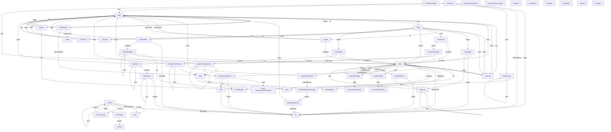

# anf

ANF structures to be converted to bytecode.

```mermaid
flowchart TD
AnfSymbolTable
CTIntTable --entries--> entries
CTEnv --isLocal--> bool
CTEnv --isNamespace--> bool
CTEnv --nbindings--> int
CTEnv --nsEnvs--> CTEnvArray
CTEnv --table--> CTIntTable
CTEnv --next--> CTEnv
AexpLam --nargs--> int
AexpLam --letRecOffset--> int
AexpLam --args--> AexpVarList
AexpLam --exp--> Exp
AexpVarList --var--> HashSymbol
AexpVarList --next--> AexpVarList
AexpAnnotatedVar --type--> AexpAnnotatedVarType
AexpAnnotatedVar --frame--> int
AexpAnnotatedVar --offset--> int
AexpAnnotatedVar --var--> HashSymbol
AexpPrimApp --type--> AexpPrimOp
AexpPrimApp --exp1--> Aexp
AexpPrimApp --exp2--> Aexp
AexpUnaryApp --type--> AexpUnaryOp
AexpUnaryApp --exp--> Aexp
AexpList --exp--> Aexp
AexpList --next--> AexpList
AexpIntList --integer--> int
AexpIntList --next--> AexpIntList
CexpApply --function--> Aexp
CexpApply --nargs--> int
CexpApply --args--> AexpList
AexpMakeVec --nargs--> int
AexpMakeVec --args--> AexpList
AexpNamespace --nbindings--> int
AexpNamespace --body--> Exp
AexpNamespaces --namespaces--> AexpNamespaceArray
AexpNamespaces --body--> Exp
CexpIf --condition--> Aexp
CexpIf --consequent--> Exp
CexpIf --alternative--> Exp
CexpCond --condition--> Aexp
CexpCond --cases--> CexpCondCases
CexpIntCondCases --option--> MaybeBigInt
CexpIntCondCases --body--> Exp
CexpIntCondCases --next--> CexpIntCondCases
CexpCharCondCases --option--> char
CexpCharCondCases --body--> Exp
CexpCharCondCases --next--> CexpCharCondCases
CexpMatch --condition--> Aexp
CexpMatch --clauses--> MatchList
MatchList --matches--> AexpIntList
MatchList --body--> Exp
MatchList --next--> MatchList
CexpLetRec --nbindings--> int
CexpLetRec --bindings--> LetRecBindings
CexpLetRec --body--> Exp
LetRecBindings --var--> HashSymbol
LetRecBindings --val--> Aexp
LetRecBindings --next--> LetRecBindings
CexpAmb --exp1--> Exp
CexpAmb --exp2--> Exp
CexpCut --exp--> Exp
ExpLet --var--> HashSymbol
ExpLet --val--> Exp
ExpLet --body--> Exp
ExpLookup --namespace--> index
ExpLookup --annotatedVar--> AexpAnnotatedVar
ExpLookup --body--> Exp
CexpCondCases --charCases--> CexpCharCondCases
CexpCondCases --intCases--> CexpIntCondCases
Aexp --t--> void_ptr
Aexp --f--> void_ptr
Aexp --v--> void_ptr
Aexp --lam--> AexpLam
Aexp --var--> HashSymbol
Aexp --annotatedVar--> AexpAnnotatedVar
Aexp --biginteger--> MaybeBigInt
Aexp --littleinteger--> int
Aexp --character--> char
Aexp --prim--> AexpPrimApp
Aexp --unary--> AexpUnaryApp
Aexp --makeVec--> AexpMakeVec
Aexp --namespaces--> AexpNamespaces
Cexp --back--> void_ptr
Cexp --error--> void_ptr
Cexp --apply--> CexpApply
Cexp --iff--> CexpIf
Cexp --cond--> CexpCond
Cexp --callCC--> Aexp
Cexp --letRec--> CexpLetRec
Cexp --amb--> CexpAmb
Cexp --cut--> CexpCut
Cexp --match--> CexpMatch
Exp --env--> void_ptr
Exp --done--> void_ptr
Exp --aexp--> Aexp
Exp --cexp--> Cexp
Exp --let--> ExpLet
Exp --lookup--> ExpLookup
AexpAnnotatedVarType["enum AexpAnnotatedVarType"]
AexpPrimOp["enum AexpPrimOp"]
AexpUnaryOp["enum AexpUnaryOp"]
AexpNamespaceArray["AexpNamespaceArray[]"] --entries--> AexpNamespace
CTEnvArray["CTEnvArray[]"] --entries--> CTEnv
CexpCondCasesVal
CexpCondCasesType
AexpVal
AexpType
CexpVal
CexpType
ExpVal
ExpType
```

> Generated from src/anf.yaml by tools/makeAST.py
