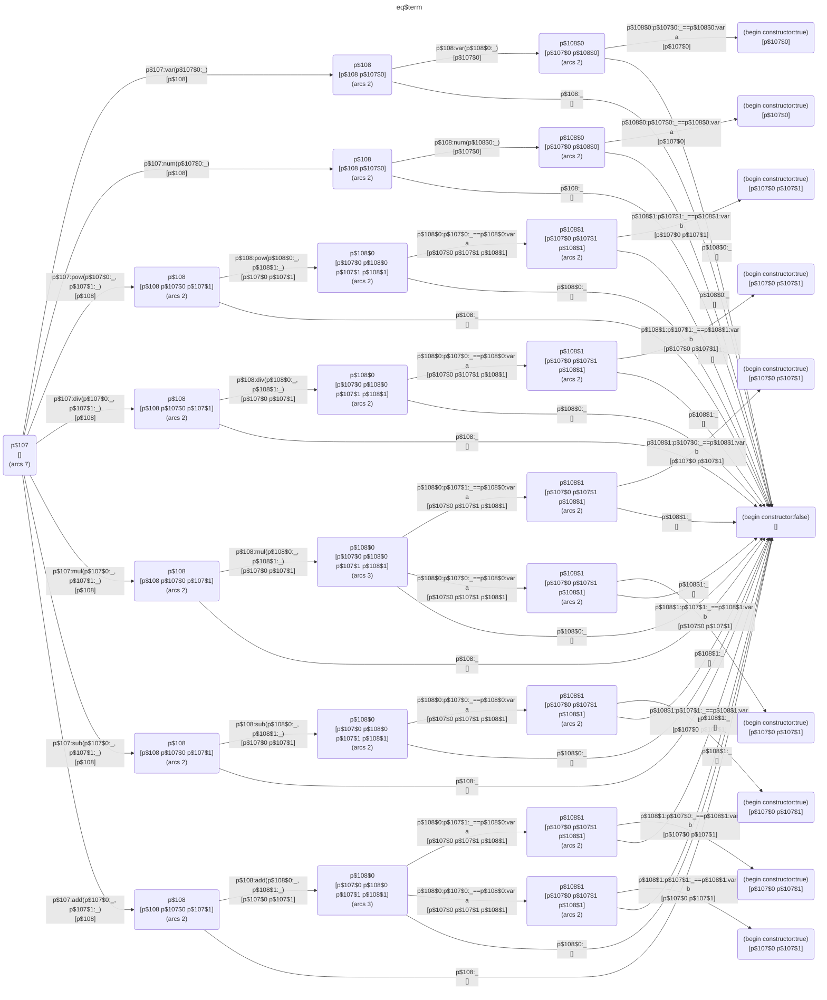

# Bespoke Equality Functions for User Types

Example type that prompted the idea:

```fn
typedef term {
    num(number) |
    var(string) |
    add(term, term) |
    sub(term, term) |
    mul(term, term) |
    div(term, term) |
    pow(term, term)
}
```

The `add` and `mul` operations are commutative, so as far as comparing them for semantic equality, `add(a, b)` is equal to `add(b, a)` etc. We may want this behavior when for example doing constant folding:

```fn
    ...
    sub(a, a) { num(0) }
    ...
```

Where the two arguments to `sub` should match if they are semantically equal, without needing to create cases for every possible arrangement of their components.

It's trivial to write a function to express this for a top-level comparison:

```fn
fn eq_term {
    (num(a), num(a)) |
    (var(a), var(a)) |
    (add(a, b), add(a, b)) |
    (add(b, a), add(a, b)) |
    (sub(a, b), sub(a, b)) |
    (mul(a, b), mul(a, b)) |
    (mul(b, a), mul(a, b)) |
    (div(a, b), div(a, b)) |
    (pow(a, b), pow(a, b)) { true }
    (_, _) { false }
}
```

but to be correct the function must also use its own definition: the unifying `a` and `b` variables need to be compared in the same way.

What makes this useful is that since the function has to override the built-in comparison operations to work in the first place, it should naturally do so for all comparisons of that type.

## How Recursion Works

The bespoke comparator must be invoked automatically during pattern matching. To achieve this, when TPMC compiles a pattern like `(add(a, b), add(a, b))`, it generates normal `eq` operations for the pattern variables, but the type checker later recognizes that `a` and `b` have type `term` and substitutes those `eq` calls with calls to `eq$term`.

Similarly, in the constant folding example:

```fn
    sub(a, a) { num(0) }
```

The pattern `sub(a, a)` requires the two arguments to match. TPMC generates an `eq` comparison; since both arguments are type `term`, the type checker substitutes `eq$term`, enabling semantic equality (so `sub(x+1, 1+x)` matches, as does `sub(y*2, 2*y)`).

Assuming a similar definition strategy to `print`, like: `eq type { ...body... }` the type of the function would be constrained to `type -> type -> bool`. When an `eq` comparison is reached in the type checker while the type of the operands is known, the compile-time environment is checked for a bespoke comparator and a call to that is substituted in place of the `eq`.

It would be simple enough to do a to-string and compare strings for structural equality if we needed it occasionally.

## Implementation

Looking at how the parser currently handles analogous `print` tokens in a `let`, it just calls the `defun` parser, passing it a flag `isPrinter = true` which causes the parser to generate a `print$type` name for the function being defined.

We could extend this by replacing the boolean with an enum, values `FUNCTION`, `PRINTER`, `EQUALITY` for now. Then the `defun` would generate an `eq$type` name if given an `EQUALITY` type. We just need to decide what the initiating token is.

On encountering an `eq$type` function, the typechecker would immediately create the type signature `type -> type -> bool` and unify the function against it before type checking the function body. Any type mismatches will produce normal type checking errors. On encountering an `eq` primitive operation, the type checker would inspect the current `TcEnv` for an `eq$type` function and if found would replace the `eq` with a call to that function. If the type encountered is namespace qualified then the type checker must inspect that namespace for the equivalent `eq$type` function and namespace-qualify the invocation.

TPMC requires no changes—it continues to generate `eq` operations for pattern variable comparisons as it always has. The type checker then substitutes these with bespoke comparator calls when appropriate.

### Limitation

The surface level `==` is a user defined operator that expands to a call to a macro: `x == y` becomes `(op$macro$1 (λ () x) (λ () y))` where `opMacro$1` is bound to `(λ (x1 x2) (eq (x1) (x2)))`. There is no way currently to get from `x == y` to `(eq x y)` - though it would be great if we could, likewise for the other primitives. Also if we plan to do constant folding in a later compiler pass we'll need to fix this. That's for another day.


