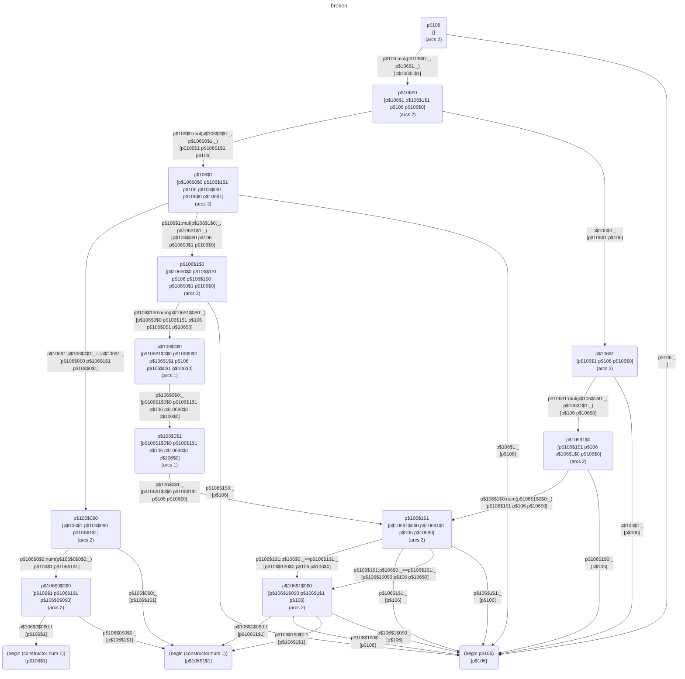
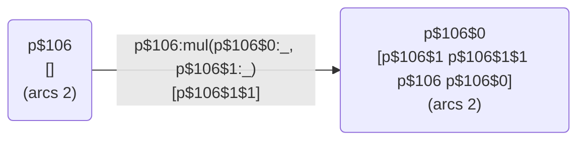

# TPMC Comparison Column Ordering Bug

## Summary

The pseudo-unification feature (where the same variable appearing twice in a pattern triggers an equality comparison) fails when the "previous" variable is nested deeper than the "current" variable in the pattern structure.

## Reproducing Test Case

File: `tests/fn/bug_unification.fn`

```fn
let
    typedef term {
        num(number) |
        mul(term, term)
    }

    fn broken {
        (mul(mul(num(1), x), x)) { num(1) }
        (mul(x, mul(num(1), x))) { num(1) }  // This pattern causes the bug
        (x) { x }
    }
in
    broken(mul(num(2), mul(num(1), num(2))))
```

Error:

```
undefined variable p$106$1$1 in tests/fn/bug_unification.fn, line 8
```

## Analysis

### Pattern Structure

For the problematic pattern `(mul(x, mul(num(1), x)))`:

- `p$106` = root argument
- `p$106$0` = first child of outer mul = `x` (first occurrence)
- `p$106$1` = second child of outer mul = `mul(num(1), x)`
- `p$106$1$0` = first child of inner mul = `num(1)`
- `p$106$1$1` = second child of inner mul = `x` (second occurrence → becomes comparison)

When the second `x` is encountered during `replaceComparisonRule()` in `tpmc_logic.c`, it's converted to a `TpmcComparisonPattern` with:

- `previous` = the pattern for the first `x` (path: `p$106$0`)
- `current` = the pattern for the second `x` (path: `p$106$1$1`)

### The Problem

The comparison requires both variables to be bound before the equality test. Variable binding occurs when the TPMC descends into a constructor pattern and extracts its components.

For this comparison to work:

1. `p$106$0` must be bound first (when matching outer `mul(p$106$0:_, p$106$1:_)`)
2. `p$106$1$1` must be bound second (when matching inner `mul(p$106$1$0:_, p$106$1$1:_)`)
3. Only then can the comparison `p$106$0 == p$106$1$1` be evaluated

However, the TPMC generates code that references `p$106$1$1` as a free variable at the top-level state, before descending into `p$106$1` to bind it.

### Current Heuristic

In `tpmc_match.c`, the `mixture()` function has this heuristic (lines 725-729):

```c
int firstConstructorColumn = findFirstConstructorColumn(M);
// this heuristic allows for comparisons to work:
if (firstConstructorColumn > 0 &&
    columnHasComparisons(firstConstructorColumn, M)) {
    firstConstructorColumn = 0;
}
```

This says: "if the selected column has comparisons, fall back to column 0 instead."

This heuristic was added to fix an earlier bug (documented in `docs/lambda-conversion.md`) where the comparison variable was in a different column. By forcing column 0 to be processed first, the variable would be bound.

### Why the Heuristic Fails Here

1. **Single-column case**: When there's only one column (or when column 0 is already selected), the heuristic doesn't help. The comparison is in column 0, but its `previous` variable is in a *sub-pattern* of the same column.

2. **Nested structure**: The `previous` variable `p$106$0` and the comparison at `p$106$1$1` are both descendants of `p$106`. The issue isn't about which column to process first, but about the order of processing within the recursive descent into a single column's pattern.

## TPMC Diagram Analysis

The full TPMC graph:



Key arc from the generated diagram:



The free variables list `[p$106$1$1]` indicates that the comparison variable is expected to already be available when transitioning from T196 (p$106). But at this point, we've only matched the outer `mul` - we haven't descended into `p$106$1` yet to bind `p$106$1$1`.

## Proposed Solution Approaches

### Approach 1: Track Comparison Dependencies

Modify the algorithm to track which paths a comparison depends on. Before processing a comparison, ensure all paths it references have been bound.

Implementation sketch:

1. In `replaceComparisonRule()`, record that the comparison at path P depends on path Q (where Q is the `previous` pattern's path)
2. In `mixture()`, when a comparison is encountered, check if its dependency path is a descendant of the current test path
3. If so, defer the comparison until after descending far enough to bind the dependency

### Approach 2: Path Prefix Analysis

For a comparison at path `p$A$B$C` referencing a variable at path `p$X$Y`:

- Find the longest common prefix of the two paths
- Ensure processing descends to at least that depth before the comparison is evaluated

For the bug case:

- Comparison is at `p$106$1$1`
- Reference is to `p$106$0`
- Common prefix is `p$106`
- The comparison should not be evaluated until after matching at `p$106$1` (to bind `p$106$1$1`)

#### Implementation Mechanisms for Approach 2

The challenge is that the matrix-based algorithm doesn't directly track path depths - it works on columns, and the relationship between columns and paths changes as the algorithm recurses and expands sub-patterns.

##### Mechanism A: Column Selection with Dependency Tracking

In `mixture()`, before selecting a column to process:

1. Scan all comparisons in the matrix
2. For each comparison, extract its `previous->path` (the referenced variable)
3. Check if that path is already "bound" (i.e., corresponds to a column that's already been processed in an ancestor call)
4. If a comparison references an unbound path, determine which column's expansion would eventually bind it
5. Prioritize processing that column first

Difficulty: after sub-pattern expansion in `makeSubPatternMatrix()`, the column structure changes. A path like `p$106$1$1` doesn't exist as a column until we've descended through `p$106` and then `p$106$1`.

##### Mechanism B: Propagate Comparisons Downward

Instead of keeping a comparison at the level where it's discovered, propagate it down to the level where its referenced variable becomes bound:

1. When a comparison at path `P` references path `Q`, compute the common prefix
2. "Attach" the comparison to the deepest state where both `P` and `Q` will be bound
3. During `mixture()`, comparisons only participate when they reach the appropriate depth

Implementation: the `TpmcComparisonPattern` could carry a "minimum depth" or "required bindings" field that's checked before including it in column selection.

This has been selected as the [Recommended Implementation](#recommended-implementation-approach-2-mechanism-b).

##### Mechanism C: Two-Phase Processing Within `mixture()`

1. First pass: identify all comparisons and their dependencies
2. Build a dependency graph: comparison C depends on paths P and Q
3. Process columns in topological order based on which paths they bind
4. Only "activate" a comparison when all its dependencies are satisfied

##### Practical Combination

The cleanest mechanism might combine approaches: during `replaceComparisonRule()` in `tpmc_logic.c`, annotate each comparison with the paths it requires. Then in `mixture()`, filter out comparisons whose requirements aren't yet met, effectively deferring them to a later recursive call where they'll reappear in the sub-matrix.

### Approach 3: Reorder Bindings in Code Generation

During the translation phase (`tpmc_translate.c`), ensure that within each arc's generated code, `let` bindings for constructor components are emitted before any comparison tests that reference those components.

This doesn't change the DFA structure or backtracking behavior - comparisons still generate `if` expressions with proper alternative branches. It only changes the order of operations within each arc's code to ensure variables are bound before use.

#### Translation Flow in `tpmc_translate.c`

```text
tpmcTranslate()
  └─> translateState()
        └─> translateStateToInlineCode()
              └─> translateTestState()
                    └─> translateArcList()
                          ├─> COMPARISON: translateComparisonArcListToIf()
                          │     └─> translateComparisonArcAndAlternativeToIf()
                          │           ├─> translateComparisonArcToTest()  [generates: (eq a b)]
                          │           └─> translateArcToCode()
                          │                 └─> prependLetBindings()  [wraps body with let bindings]
                          │
                          ├─> CONSTRUCTOR: translateConstructorArcList()
                          │     └─> translateArcToCode()
                          │           └─> prependLetBindings()
                          │
                          └─> WILDCARD/CONSTANT: translateState() [recurse to next state]
```

#### Core Problem Location

**Key function: `translateComparisonArcAndAlternativeToIf()`** (lines 245-259)

```c
static LamExp *
translateComparisonArcAndAlternativeToIf(TpmcArc *arc, LamExpTable *lambdaCache,
                                         LamExp *alternative) {
    LamExp *test = translateComparisonArcToTest(arc);      // generates (eq a b)
    LamExp *consequent = translateArcToCode(arc, lambdaCache);
    LamExp *res = makeLamExp_Iff(I, test, consequent, alternative);
    // Result: (if (eq a b) consequent alternative)
}
```

The problem is the order of operations:

1. `translateComparisonArcToTest()` generates `(eq p$previous p$current)` which references both paths
2. `translateArcToCode()` generates the consequent, which may call `prependLetBindings()` to bind variables
3. But the `let` bindings end up **inside** the consequent, **after** the comparison test

#### Why `prependLetBindings()` Doesn't Help

`prependLetBindings()` is called by `translateArcToCode()`, but only for constructor and tuple patterns:

```c
static LamExp *translateArcToCode(TpmcArc *arc, LamExpTable *lambdaCache) {
    LamExp *res = translateState(arc->state, lambdaCache);
    switch (arc->test->pattern->type) {
    case TPMCPATTERNVALUE_TYPE_CONSTRUCTOR:
    case TPMCPATTERNVALUE_TYPE_TUPLE:
        res = prependLetBindings(arc->test, arc->state->freeVariables, res);
        break;
    default:
        break;  // Comparisons fall through - no bindings added
    }
    return res;
}
```

When the arc's test is a comparison, no `let` bindings are prepended. The comparison's variables are assumed to already be bound.

#### The Binding Chain Problem

For `p$106$1$1` to be bound, we need:

```scheme
(let ((p$106$1 (deconstruct p$106 1)))
  (let ((p$106$1$1 (deconstruct p$106$1 1)))
    (if (eq p$106$0 p$106$1$1) ...)))
```

But the comparison is being emitted at a state where we've only matched the outer `mul` structure. The nested path `p$106$1$1` requires descending into `p$106$1` first.

#### Areas That Would Need to Change

1. **`translateComparisonArcAndAlternativeToIf()`** - Primary target. Currently generates the comparison test before any bindings for the referenced paths.

2. **Need ancestor context** - The binding for `p$106$1$1` comes from deconstructing `p$106$1`. But at the point where the comparison is translated, we don't have access to the ancestor arc that provides that binding.

3. **`translateTestState()`** - Potential refactoring point. Could scan arcs for comparisons, identify required bindings, and emit them before calling `translateArcList()`.

4. **`translateArcList()`** - May need comparison-aware preprocessing to separate "binding emission" from "test emission".

#### Suggested Refactoring Strategy

1. **Add a "required bindings" analysis pass** before translation
   - For each comparison, determine what paths need to be bound
   - Build a map from test states to required bindings

2. **Modify `translateTestState()`** to emit bindings first
   - Before translating arcs, emit `let` bindings for comparison-required paths
   - These bindings deconstruct from ancestor paths already in scope

3. **The hard part**: Determining *how* to bind a deeply nested path
   - `p$106$1$1` needs `(deconstruct p$106$1 1)`
   - But `p$106$1` needs `(deconstruct p$106 1)` first
   - Must emit a chain of `let` bindings in the right order

#### Assessment

The difficulty of implementing Approach 3 in `tpmc_translate.c` suggests that fixing this in the DFA construction phase (`tpmc_match.c`) might be cleaner - ensuring comparisons only appear in the state machine after their required bindings have been established by prior constructor matches.

### Approach 4: Sub-pattern Ordering

When expanding a constructor pattern into sub-patterns (`makeSubPatternMatrix()`), ensure that sub-patterns containing comparisons are ordered after sub-patterns containing the variables they reference.

## Related Code Locations

- `src/tpmc_logic.c`:
  - `replaceVarPattern()` - creates comparison patterns
  - `replaceComparisonRule()` - processes a rule to identify repeated variables
  
- `src/tpmc_match.c`:
  - `mixture()` - main pattern matching algorithm, contains the current heuristic
  - `columnHasComparisons()` - checks if a column contains comparison patterns
  - `findFirstConstructorColumn()` - selects which column to process
  - `makeSubPatternMatrix()` - expands constructor patterns into sub-patterns

- `src/tpmc_translate.c`:
  - `translateComparisonArcToTest()` - generates the equality test code
  - `addFreeVariablesRequiredByPattern()` - adds comparison dependencies to free variables

## Recommended Implementation: Approach 2, Mechanism B

### Overview

Track the required binding path in each comparison, and defer comparisons whose requirements aren't yet met.

### Data Structure Change

In `src/tpmc.yaml`, add a `requiredPath` field to `TpmcComparisonPattern`:

```yaml
TpmcComparisonPattern:
    data:
        previous: TpmcPattern
        current: TpmcPattern
        requiredPath: HashSymbol=NULL  # ADD THIS
```

This field stores the path of the first occurrence (the binding that must exist before the comparison is valid).

### Code Changes

#### 1. `src/tpmc_logic.c` - Record Required Path

In `replaceVarPattern()`, after creating the comparison, record the path that must be bound:

```c
static TpmcPattern *replaceVarPattern(TpmcPattern *pattern,
                                      TpmcPatternTable *seen) {
    TpmcPattern *other = NULL;
    if (getTpmcPatternTable(seen, pattern->pattern->val.var, &other)) {
        // ... existing error check for assignment ...
        TpmcPatternValue *val = makeTpmcPatternValue_Comparison(other, pattern);
        int save = PROTECT(val);
        TpmcPattern *result = newTpmcPattern(val);
        // NEW: Record the path that must be bound before this comparison
        val->val.comparison->requiredPath = other->path;
        UNPROTECT(save);
        return result;
    }
    // ... rest of function ...
}
```

#### 2. `src/tpmc_match.c` - Check Comparison Readiness

Add a helper to check if a comparison's required path is available:

```c
static bool comparisonIsReady(TpmcPattern *pattern, TpmcMatrix *matrix) {
    if (pattern->pattern->type != TPMCPATTERNVALUE_TYPE_COMPARISON) {
        return true;  // Not a comparison, always ready
    }
    HashSymbol *required = pattern->pattern->val.comparison->requiredPath;
    if (required == NULL) {
        return true;  // No requirement recorded
    }
    // Check if required path is a column header (root-level binding)
    for (Index x = 0; x < matrix->width; x++) {
        TpmcPattern *top = getTpmcMatrixIndex(matrix, x, 0);
        if (top->path == required) {
            return true;  // Required path is at root level
        }
    }
    return false;  // Required path is nested, not yet available
}
```

Modify `columnHasComparisons()` to only count "ready" comparisons:

```c
static bool columnHasReadyComparisons(int x, TpmcMatrix *matrix) {
    for (Index y = 0; y < matrix->height; y++) {
        TpmcPattern *p = getTpmcMatrixIndex(matrix, x, y);
        if (patternIsComparison(p) && comparisonIsReady(p, matrix)) {
            return true;
        }
    }
    return false;
}
```

Modify `findFirstConstructorColumn()` to treat non-ready comparisons as wildcards:

```c
static bool patternIsActionable(TpmcPattern *pattern, TpmcMatrix *matrix) {
    // Wildcards are not actionable
    if (patternIsWildCard(pattern)) {
        return false;
    }
    // Non-ready comparisons are treated as wildcards for column selection
    if (patternIsComparison(pattern) && !comparisonIsReady(pattern, matrix)) {
        return false;
    }
    return true;
}

static int findFirstActionableColumn(TpmcMatrix *matrix) {
    for (Index x = 0; x < matrix->width; x++) {
        if (patternIsActionable(getTpmcMatrixIndex(matrix, x, 0), matrix)) {
            return x;
        }
    }
    cant_happen("findFirstActionableColumn failed");
}
```

Update `mixture()` to use the new function and remove the column 0 fallback:

```c
// Find first column with an actionable pattern (constructor, literal, or ready comparison)
int firstConstructorColumn = findFirstActionableColumn(M);
// No fallback needed - non-ready comparisons are skipped by findFirstActionableColumn
```

### How This Fixes the Bug

For pattern `(mul(x, mul(num(1), x)))`:

1. First `x` is at path `p$106$0`, second `x` at path `p$106$1$1`
2. Comparison is created with `requiredPath = p$106$0`
3. Initially, the matrix has column `p$106` - neither `p$106$0` nor `p$106$1$1` are top-level
4. `comparisonIsReady()` returns `false` since `p$106$0` is not a column header
5. The comparison doesn't trigger column 0 fallback
6. Algorithm processes `p$106` first, expanding to columns `p$106$0` and `p$106$1`
7. Now `p$106$0` IS a column header - `comparisonIsReady()` returns `true`
8. The comparison can now safely execute because `p$106$0` (the binding) will be processed

### Edge Cases to Consider

1. **Multiple occurrences (>2)**: Initially restrict to exactly 2 occurrences of a variable per pattern. Add explicit rejection in `replaceVarPattern()` if a variable is seen a third time. Can revisit later to support more complex cases.

## Test Cases

Working cases (for reference):

- `tests/fn/test_pseudo_unification.fn` - comparison across different columns
- Pattern `(mul(mul(num(1), x), x))` - first `x` is deeper, works correctly

Broken case:

- `tests/fn/bug_unification.fn` - comparison where second occurrence is deeper
- Pattern `(mul(x, mul(num(1), x)))` - second `x` is deeper, fails

## References

- `docs/lambda-conversion.md` - Contains walkthrough of an earlier comparison bug fix
- `docs/agent/tpmc.md` - TPMC overview documentation
- Pettersson 1992 paper (`docs/pettersson92.pdf`) - Original algorithm (does not cover comparisons)
