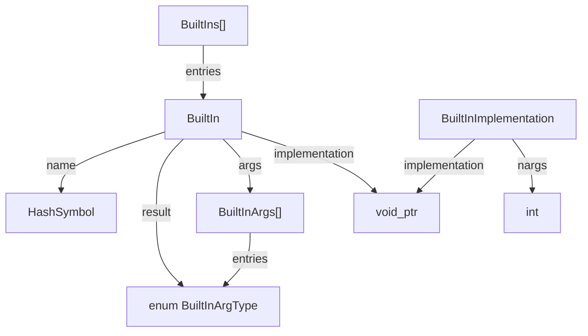

# builtins

Support for declaring builtins

```mermaid
flowchart TD
BuiltIn --name--> HashSymbol
BuiltIn --result--> BuiltInArgType
BuiltIn --args--> BuiltInArgs
BuiltIn --implementation--> void_ptr
BuiltInImplementation --implementation--> void_ptr
BuiltInImplementation --nargs--> int
BuiltInArgType["enum BuiltInArgType"]
BuiltInArgs["BuiltInArgs[]"] --entries--> BuiltInArgType
BuiltIns["BuiltIns[]"] --entries--> BuiltIn
```

> Generated from src/builtins.yaml by tools/makeAST.py
