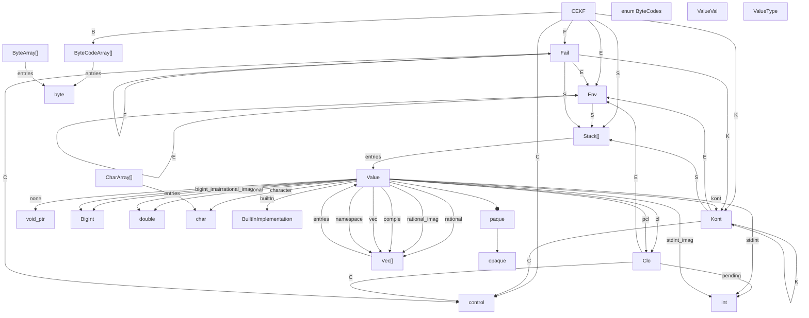

# cekfs

The structures of the CEKFs machine

```mermaid
flowchart TD
CEKF --C--> control
CEKF --E--> Env
CEKF --K--> Kont
CEKF --F--> Fail
CEKF --S--> Stack
CEKF --B--> ByteCodeArray
Env --S--> Stack
Env --E--> Env
Kont --C--> control
Kont --E--> Env
Kont --S--> Stack
Kont --K--> Kont
Clo --pending--> int
Clo --C--> control
Clo --E--> Env
Fail --C--> control
Fail --E--> Env
Fail --K--> Kont
Fail --S--> Stack
Fail --F--> Fail
Vec["Vec[]"] --entries--> Value
Value --none--> void_ptr
Value --stdint--> int
Value --bigint--> BigInt
Value --rational--> Vec
Value --rational_imag--> Vec
Value --irrational--> double
Value --stdint_imag--> int
Value --bigint_imag--> BigInt
Value --irrational_imag--> double
Value --complex--> Vec
Value --character--> char
Value --clo--> Clo
Value --pclo--> Clo
Value --kont--> Kont
Value --vec--> Vec
Value --builtIn--> BuiltInImplementation
Value --namespace--> Vec
Value --opaque--> opaque
ByteCodeArray["ByteCodeArray[]"] --entries--> byte
ByteCodes["enum ByteCodes"]
CharArray["CharArray[]"] --entries--> char
ByteArray["ByteArray[]"] --entries--> byte
Stack["Stack[]"] --entries--> Value
ValueVal
ValueType
```

> Generated from src/cekfs.yaml by tools/makeAST.py
