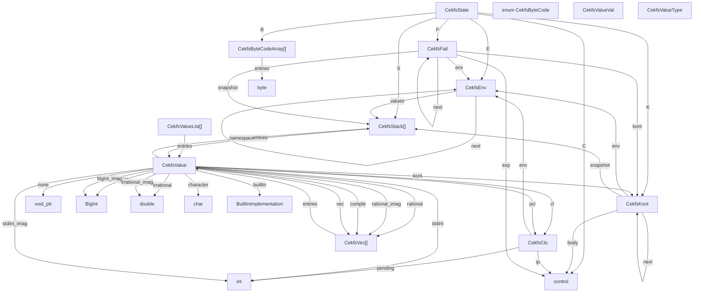

# cekfs

Runtime support for CEKFs

```mermaid
flowchart TD
CekfsState --C--> control
CekfsState --E--> CekfsEnv
CekfsState --K--> CekfsKont
CekfsState --F--> CekfsFail
CekfsState --S--> CekfsStack
CekfsState --B--> CekfsByteCodeArray
CekfsEnv --values--> CekfsStack
CekfsEnv --next--> CekfsEnv
CekfsKont --body--> control
CekfsKont --env--> CekfsEnv
CekfsKont --snapshot--> CekfsStack
CekfsKont --next--> CekfsKont
CekfsClo --pending--> int
CekfsClo --ip--> control
CekfsClo --env--> CekfsEnv
CekfsFail --exp--> control
CekfsFail --env--> CekfsEnv
CekfsFail --kont--> CekfsKont
CekfsFail --snapshot--> CekfsStack
CekfsFail --next--> CekfsFail
CekfsVec["CekfsVec[]"] --entries--> CekfsValue
CekfsValueList["CekfsValueList[]"] --entries--> CekfsValue
CekfsValue --none--> void_ptr
CekfsValue --stdint--> int
CekfsValue --bigint--> BigInt
CekfsValue --rational--> CekfsVec
CekfsValue --rational_imag--> CekfsVec
CekfsValue --irrational--> double
CekfsValue --stdint_imag--> int
CekfsValue --bigint_imag--> BigInt
CekfsValue --irrational_imag--> double
CekfsValue --complex--> CekfsVec
CekfsValue --character--> char
CekfsValue --clo--> CekfsClo
CekfsValue --pclo--> CekfsClo
CekfsValue --kont--> CekfsKont
CekfsValue --vec--> CekfsVec
CekfsValue --builtIn--> BuiltInImplementation
CekfsValue --namespace--> CekfsStack
CekfsByteCode["enum CekfsByteCode"]
CekfsStack["CekfsStack[]"] --entries--> CekfsValue
CekfsByteCodeArray["CekfsByteCodeArray[]"] --entries--> byte
CekfsValueVal
CekfsValueType
```

> Generated from src/cekfs.yaml by tools/makeAST.py
