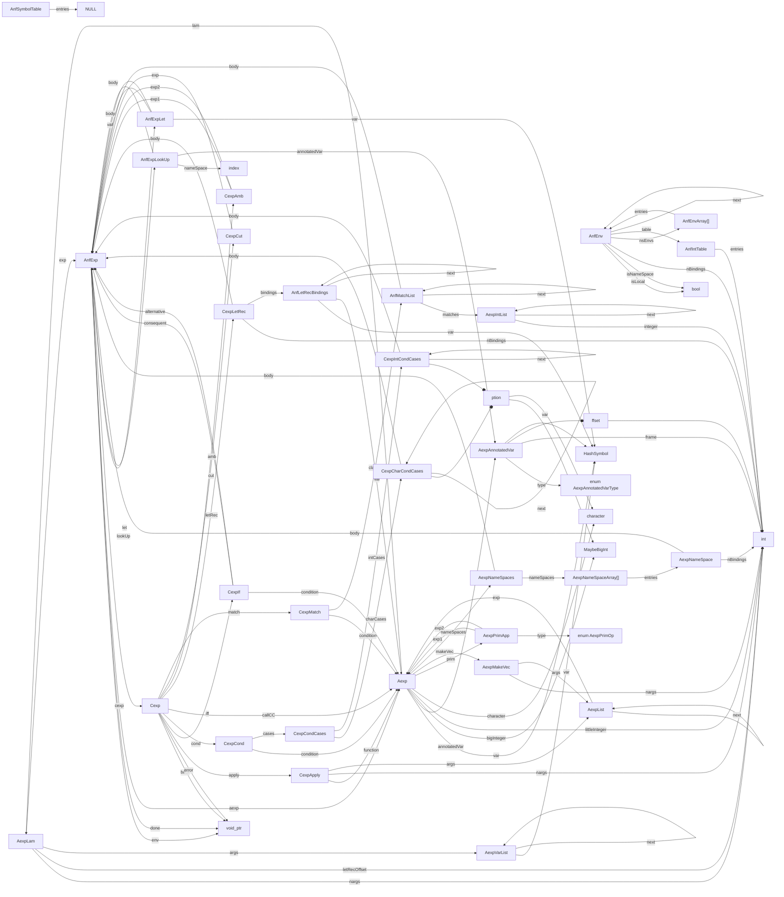

# anf

A-Normal Form (ANF) structures to be converted to bytecode.

```mermaid
flowchart LR
AnfSymbolTable --entries--> NULL
AnfIntTable --entries--> int
AnfEnv --isLocal--> bool
AnfEnv --isNameSpace--> bool
AnfEnv --nBindings--> int
AnfEnv --nsEnvs--> AnfEnvArray
AnfEnv --table--> AnfIntTable
AnfEnv --next--> AnfEnv
AexpLam --nargs--> int
AexpLam --letRecOffset--> int
AexpLam --args--> AexpVarList
AexpLam --exp--> AnfExp
AexpVarList --var--> HashSymbol
AexpVarList --next--> AexpVarList
AexpAnnotatedVar --type--> AexpAnnotatedVarType
AexpAnnotatedVar --frame--> int
AexpAnnotatedVar --offset--> int
AexpAnnotatedVar --var--> HashSymbol
AexpPrimApp --type--> AexpPrimOp
AexpPrimApp --exp1--> Aexp
AexpPrimApp --exp2--> Aexp
AexpList --exp--> Aexp
AexpList --next--> AexpList
AexpIntList --integer--> int
AexpIntList --next--> AexpIntList
AexpMakeVec --nargs--> int
AexpMakeVec --args--> AexpList
AexpNameSpace --nBindings--> int
AexpNameSpace --body--> AnfExp
AexpNameSpaces --nameSpaces--> AexpNameSpaceArray
AexpNameSpaces --body--> AnfExp
CexpApply --function--> Aexp
CexpApply --nargs--> int
CexpApply --args--> AexpList
CexpIf --condition--> Aexp
CexpIf --consequent--> AnfExp
CexpIf --alternative--> AnfExp
CexpCond --condition--> Aexp
CexpCond --cases--> CexpCondCases
CexpIntCondCases --option--> MaybeBigInt
CexpIntCondCases --body--> AnfExp
CexpIntCondCases --next--> CexpIntCondCases
CexpCharCondCases --option--> character
CexpCharCondCases --body--> AnfExp
CexpCharCondCases --next--> CexpCharCondCases
CexpMatch --condition--> Aexp
CexpMatch --clauses--> AnfMatchList
CexpLetRec --nBindings--> int
CexpLetRec --bindings--> AnfLetRecBindings
CexpLetRec --body--> AnfExp
CexpAmb --exp1--> AnfExp
CexpAmb --exp2--> AnfExp
CexpCut --exp--> AnfExp
AnfExpLet --var--> HashSymbol
AnfExpLet --val--> AnfExp
AnfExpLet --body--> AnfExp
AnfExpLookUp --nameSpace--> index
AnfExpLookUp --annotatedVar--> AexpAnnotatedVar
AnfExpLookUp --body--> AnfExp
AnfMatchList --matches--> AexpIntList
AnfMatchList --body--> AnfExp
AnfMatchList --next--> AnfMatchList
AnfLetRecBindings --var--> HashSymbol
AnfLetRecBindings --val--> Aexp
AnfLetRecBindings --next--> AnfLetRecBindings
CexpCondCases --charCases--> CexpCharCondCases
CexpCondCases --intCases--> CexpIntCondCases
Aexp --lam--> AexpLam
Aexp --var--> HashSymbol
Aexp --annotatedVar--> AexpAnnotatedVar
Aexp --bigInteger--> MaybeBigInt
Aexp --littleInteger--> int
Aexp --character--> character
Aexp --prim--> AexpPrimApp
Aexp --makeVec--> AexpMakeVec
Aexp --nameSpaces--> AexpNameSpaces
Cexp --back--> void_ptr
Cexp --error--> void_ptr
Cexp --apply--> CexpApply
Cexp --iff--> CexpIf
Cexp --cond--> CexpCond
Cexp --callCC--> Aexp
Cexp --letRec--> CexpLetRec
Cexp --amb--> CexpAmb
Cexp --cut--> CexpCut
Cexp --match--> CexpMatch
AnfExp --env--> void_ptr
AnfExp --done--> void_ptr
AnfExp --aexp--> Aexp
AnfExp --cexp--> Cexp
AnfExp --let--> AnfExpLet
AnfExp --lookUp--> AnfExpLookUp
AexpAnnotatedVarType["enum AexpAnnotatedVarType"]
AexpPrimOp["enum AexpPrimOp"]
AexpNameSpaceArray["AexpNameSpaceArray[]"] --entries--> AexpNameSpace
AnfEnvArray["AnfEnvArray[]"] --entries--> AnfEnv
```

> Generated from src/anf.yaml by tools/generate.py
