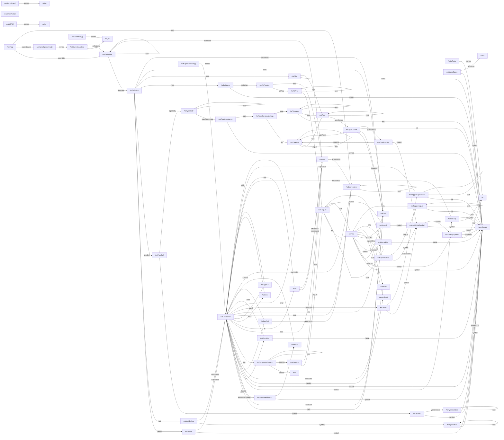

# ast

Abstract Syntax Tree (AST) structures generated by the parser. As this is close to the surface of the language, it is quite complicated. The complexity is reduced downstream by conversion to simple lambda form.

> Generated from src/ast.yaml by tools/generate.py
