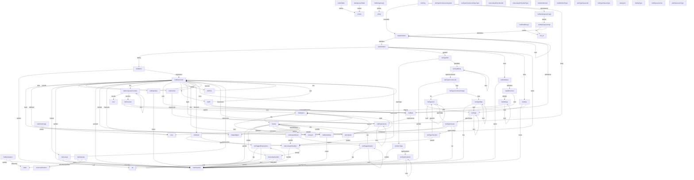

# ast

Abstract Syntax Tree structures generated by the parser.

```mermaid
flowchart TD
AstIntTable --entries--> entries
AstOperatorTable --entries--> entries
AstProg --preamble--> AstDefinitions
AstProg --namespaces--> AstNamespaceArray
AstProg --body--> AstExpressions
AstNest --definitions--> AstDefinitions
AstNest --expressions--> AstExpressions
AstNamespaceImpl --id--> file_id
AstNamespaceImpl --definitions--> AstDefinitions
AstNamespace --symbol--> HashSymbol
AstNamespace --reference--> index
AstDefinitions --definition--> AstDefinition
AstDefinitions --next--> AstDefinitions
AstDefine --symbol--> HashSymbol
AstDefine --expression--> AstExpression
AstAlias --name--> HashSymbol
AstAlias --type--> AstType
AstExprAlias --name--> HashSymbol
AstExprAlias --value--> AstExpression
AstDefMacro --name--> HashSymbol
AstDefMacro --definition--> AstAltFunction
AstTypeDef --userType--> AstUserType
AstTypeDef --typeBody--> AstTypeBody
AstUserType --symbol--> HashSymbol
AstUserType --typeSymbols--> AstTypeSymbols
AstTypeSymbols --typeSymbol--> HashSymbol
AstTypeSymbols --next--> AstTypeSymbols
AstTypeBody --typeConstructor--> AstTypeConstructor
AstTypeBody --next--> AstTypeBody
AstTypeConstructor --symbol--> HashSymbol
AstTypeConstructor --args--> AstTypeConstructorArgs
AstTypeFunction --symbol--> AstLookupOrSymbol
AstTypeFunction --typeList--> AstTypeList
AstTypeList --type--> AstType
AstTypeList --next--> AstTypeList
AstTypeMap --key--> HashSymbol
AstTypeMap --type--> AstType
AstTypeMap --next--> AstTypeMap
AstType --typeClause--> AstTypeClause
AstType --next--> AstType
AstCompositeFunction --unsafe--> bool
AstCompositeFunction --function--> AstFunction
AstCompositeFunction --next--> AstCompositeFunction
AstFunction --argList--> AstArgList
AstFunction --nest--> AstNest
AstArgList --arg--> AstArg
AstArgList --next--> AstArgList
AstTaggedArgList --tag--> HashSymbol
AstTaggedArgList --arg--> AstArg
AstTaggedArgList --next--> AstTaggedArgList
AstAltArgs --argList--> AstArgList
AstAltArgs --next--> AstAltArgs
AstAltFunction --altArgs--> AstAltArgs
AstAltFunction --nest--> AstNest
AstUnpack --symbol--> AstLookupOrSymbol
AstUnpack --argList--> AstArgList
AstUnpackStruct --symbol--> AstLookupOrSymbol
AstUnpackStruct --argList--> AstTaggedArgList
AstNamedArg --name--> HashSymbol
AstNamedArg --arg--> AstArg
AstFunCall --function--> AstExpression
AstFunCall --arguments--> AstExpressions
AstExpressions --expression--> AstExpression
AstExpressions --next--> AstExpressions
AstLookupSymbol --nsid--> int
AstLookupSymbol --nsSymbol--> HashSymbol
AstLookupSymbol --symbol--> HashSymbol
AstLookup --nsid--> int
AstLookup --nsSymbol--> HashSymbol
AstLookup --expression--> AstExpression
AstIff --test--> AstExpression
AstIff --consequent--> AstNest
AstIff --alternative--> AstNest
AstOperator --name--> HashSymbol
AstOperator --position--> AstPosition
AstOperator --precedence--> index
AstPrint --exp--> AstExpression
AstStruct --symbol--> AstLookupOrSymbol
AstStruct --expressions--> AstTaggedExpressions
AstTaggedExpressions --tag--> HashSymbol
AstTaggedExpressions --expression--> AstExpression
AstTaggedExpressions --next--> AstTaggedExpressions
AstTypeConstructorArgs --list--> AstTypeList
AstTypeConstructorArgs --map--> AstTypeMap
AstLookupOrSymbol --symbol--> HashSymbol
AstLookupOrSymbol --lookup--> AstLookupSymbol
AstDefinition --define--> AstDefine
AstDefinition --typeDef--> AstTypeDef
AstDefinition --macro--> AstDefMacro
AstDefinition --alias--> AstAlias
AstDefinition --blank--> void_ptr
AstTypeClause --integer--> void_ptr
AstTypeClause --character--> void_ptr
AstTypeClause --var--> HashSymbol
AstTypeClause --typeFunction--> AstTypeFunction
AstTypeClause --typeTuple--> AstTypeList
AstArg --wildcard--> void_ptr
AstArg --symbol--> HashSymbol
AstArg --lookup--> AstLookupSymbol
AstArg --named--> AstNamedArg
AstArg --unpack--> AstUnpack
AstArg --unpackStruct--> AstUnpackStruct
AstArg --number--> MaybeBigInt
AstArg --character--> char
AstArg --tuple--> AstArgList
AstExpression --back--> void_ptr
AstExpression --wildcard--> void_ptr
AstExpression --alias--> AstExprAlias
AstExpression --funCall--> AstFunCall
AstExpression --lookup--> AstLookup
AstExpression --symbol--> HashSymbol
AstExpression --gensym--> HashSymbol
AstExpression --number--> MaybeBigInt
AstExpression --character--> char
AstExpression --fun--> AstCompositeFunction
AstExpression --nest--> AstNest
AstExpression --iff--> AstIff
AstExpression --print--> AstPrint
AstExpression --tuple--> AstExpressions
AstExpression --env--> void_ptr
AstExpression --structure--> AstStruct
AstExpression --assertion--> AstExpression
AstExpression --error--> AstExpression
AstPosition["enum AstPosition"]
AstCharArray["AstCharArray[]"] --entries--> char
AstNamespaceArray["AstNamespaceArray[]"] --entries--> AstNamespaceImpl
AstFileIdArray["AstFileIdArray[]"] --entries--> file_id
AstStringArray["AstStringArray[]"] --entries--> string
AstTypeConstructorArgsVal
AstTypeConstructorArgsType
AstLookupOrSymbolVal
AstLookupOrSymbolType
AstDefinitionVal
AstDefinitionType
AstTypeClauseVal
AstTypeClauseType
AstArgVal
AstArgType
AstExpressionVal
AstExpressionType
```

> Generated from src/ast.yaml by tools/makeAST.py
