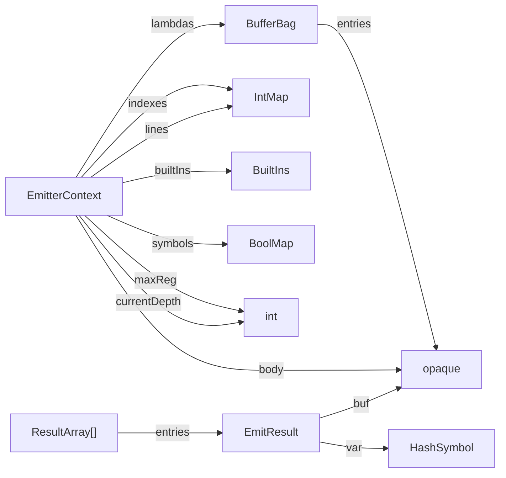

# emit

Code emission utilities

```mermaid
flowchart LR
BufferBag --entries--> opaque
EmitterContext --lambdas--> BufferBag
EmitterContext --indexes--> IntMap
EmitterContext --body--> opaque
EmitterContext --builtIns--> BuiltIns
EmitterContext --symbols--> BoolMap
EmitterContext --lines--> IntMap
EmitterContext --maxReg--> int
EmitterContext --currentDepth--> int
EmitResult --var--> HashSymbol
EmitResult --buf--> opaque
ResultArray["ResultArray[]"] --entries--> EmitResult
```

> Generated from src/emit.yaml by tools/generate.py
