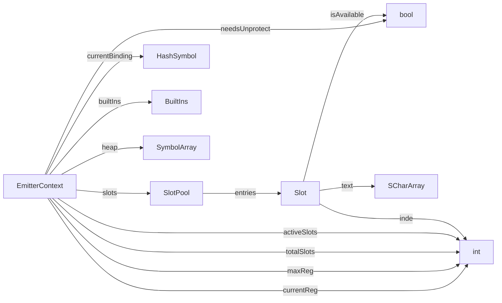

# emit

Shared code emission utilities

```mermaid
flowchart LR
SlotPool --entries--> Slot
Slot --isAvailable--> bool
Slot --text--> SCharArray
Slot --index--> int
EmitterContext --currentBinding--> HashSymbol
EmitterContext --builtIns--> BuiltIns
EmitterContext --slots--> SlotPool
EmitterContext --heap--> SymbolArray
EmitterContext --activeSlots--> int
EmitterContext --totalSlots--> int
EmitterContext --maxReg--> int
EmitterContext --currentReg--> int
EmitterContext --needsUnprotect--> bool
```

> Generated from src/emit.yaml by tools/generate.py
