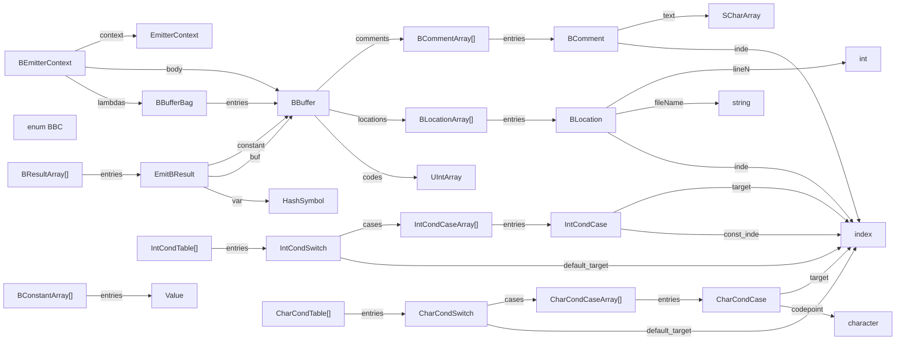

# emit_b

New byteode emission utilities

```mermaid
flowchart LR
BBufferBag --entries--> BBuffer
BEmitterContext --lambdas--> BBufferBag
BEmitterContext --body--> BBuffer
BEmitterContext --context--> EmitterContext
BBuffer --codes--> UIntArray
BBuffer --locations--> BLocationArray
BBuffer --comments--> BCommentArray
BLocation --index--> index
BLocation --fileName--> string
BLocation --lineNo--> int
BComment --index--> index
BComment --text--> SCharArray
IntCondCase --const_index--> index
IntCondCase --target--> index
CharCondCase --codepoint--> character
CharCondCase --target--> index
IntCondSwitch --default_target--> index
IntCondSwitch --cases--> IntCondCaseArray
CharCondSwitch --default_target--> index
CharCondSwitch --cases--> CharCondCaseArray
EmitBResult --var--> HashSymbol
EmitBResult --buf--> BBuffer
EmitBResult --constant--> BBuffer
BBC["enum BBC"]
BResultArray["BResultArray[]"] --entries--> EmitBResult
BLocationArray["BLocationArray[]"] --entries--> BLocation
BCommentArray["BCommentArray[]"] --entries--> BComment
BConstantArray["BConstantArray[]"] --entries--> Value
IntCondCaseArray["IntCondCaseArray[]"] --entries--> IntCondCase
CharCondCaseArray["CharCondCaseArray[]"] --entries--> CharCondCase
IntCondTable["IntCondTable[]"] --entries--> IntCondSwitch
CharCondTable["CharCondTable[]"] --entries--> CharCondSwitch
```

> Generated from src/emit_b.yaml by tools/generate.py
