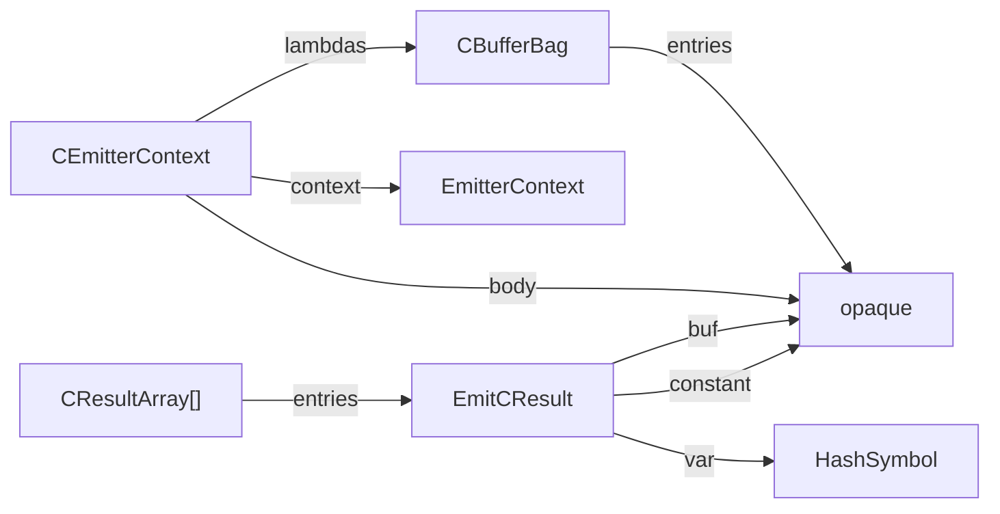

# emit_c

C code emission utilities

```mermaid
flowchart LR
CBufferBag --entries--> opaque
CEmitterContext --lambdas--> CBufferBag
CEmitterContext --body--> opaque
CEmitterContext --context--> EmitterContext
EmitCResult --var--> HashSymbol
EmitCResult --buf--> opaque
EmitCResult --constant--> opaque
CResultArray["CResultArray[]"] --entries--> EmitCResult
```

> Generated from src/emit_c.yaml by tools/generate.py
