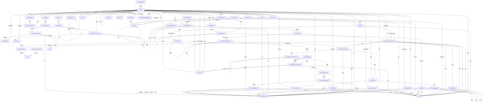

# lambda

Plain lambda structures generated by lambda conversion.

```mermaid
flowchart TD
LamMacroTable --entries--> NULL
LamMacroArgsTable --entries--> NULL
LamInfoTable --entries--> LamInfo
LamAliasTable --entries--> LamTypeConstructorType
LamExpTable --entries--> LamExp
LamLam --args--> LamVarList
LamLam --exp--> LamExp
LamVarList --var--> HashSymbol
LamVarList --next--> LamVarList
LamPrimApp --type--> LamPrimOp
LamPrimApp --exp1--> LamExp
LamPrimApp --exp2--> LamExp
LamSequence --exp--> LamExp
LamSequence --next--> LamSequence
LamArgs --exp--> LamExp
LamArgs --next--> LamArgs
LamApply --function--> LamExp
LamApply --args--> LamArgs
LamLookup --nsid--> int
LamLookup --nsSymbol--> HashSymbol
LamLookup --exp--> LamExp
LamLookupSymbol --nsid--> int
LamLookupSymbol --nsSymbol--> HashSymbol
LamLookupSymbol --symbol--> HashSymbol
LamConstant --name--> HashSymbol
LamConstant --tag--> int
LamConstruct --name--> HashSymbol
LamConstruct --tag--> int
LamConstruct --args--> LamArgs
LamDeconstruct --name--> HashSymbol
LamDeconstruct --nsid--> int
LamDeconstruct --vec--> int
LamDeconstruct --exp--> LamExp
LamTupleIndex --vec--> int
LamTupleIndex --size--> int
LamTupleIndex --exp--> LamExp
LamMakeVec --nargs--> int
LamMakeVec --args--> LamArgs
LamIff --condition--> LamExp
LamIff --consequent--> LamExp
LamIff --alternative--> LamExp
LamCond --value--> LamExp
LamCond --cases--> LamCondCases
LamIntCondCases --constant--> MaybeBigInt
LamIntCondCases --body--> LamExp
LamIntCondCases --next--> LamIntCondCases
LamCharCondCases --constant--> character
LamCharCondCases --body--> LamExp
LamCharCondCases --next--> LamCharCondCases
LamMatch --index--> LamExp
LamMatch --cases--> LamMatchList
LamMatchList --matches--> LamIntList
LamMatchList --body--> LamExp
LamMatchList --next--> LamMatchList
LamIntList --item--> int
LamIntList --name--> HashSymbol
LamIntList --nsid--> int
LamIntList --next--> LamIntList
LamLet --var--> HashSymbol
LamLet --value--> LamExp
LamLet --body--> LamExp
LamLetRec --nbindings--> int
LamLetRec --bindings--> LamLetRecBindings
LamLetRec --body--> LamExp
LamLetRecBindings --var--> HashSymbol
LamLetRecBindings --val--> LamExp
LamLetRecBindings --next--> LamLetRecBindings
LamContext --frame--> LamInfoTable
LamContext --aliases--> LamAliasTable
LamContext --macros--> LamMacroTable
LamContext --parent--> LamContext
LamAmb --left--> LamExp
LamAmb --right--> LamExp
LamPrint --exp--> LamExp
LamPrint --printer--> LamExp
LamTypeDefs --typeDefs--> LamTypeDefList
LamTypeDefs --body--> LamExp
LamTypeDefList --typeDef--> LamTypeDef
LamTypeDefList --next--> LamTypeDefList
LamTypeDef --type--> LamTypeSig
LamTypeDef --constructors--> LamTypeConstructorList
LamTypeConstructorList --constructor--> LamTypeConstructor
LamTypeConstructorList --next--> LamTypeConstructorList
LamTypeSig --name--> HashSymbol
LamTypeSig --args--> LamTypeSigArgs
LamTypeTags --tag--> HashSymbol
LamTypeTags --next--> LamTypeTags
LamTypeSigArgs --name--> HashSymbol
LamTypeSigArgs --next--> LamTypeSigArgs
LamTypeConstructor --name--> HashSymbol
LamTypeConstructor --type--> LamTypeSig
LamTypeConstructor --args--> LamTypeConstructorArgs
LamTypeConstructorArgs --arg--> LamTypeConstructorType
LamTypeConstructorArgs --next--> LamTypeConstructorArgs
LamTypeFunction --name--> LamLookupOrSymbol
LamTypeFunction --args--> LamTypeConstructorArgs
LamTypeConstructorInfo --name--> HashSymbol
LamTypeConstructorInfo --nsid--> int
LamTypeConstructorInfo --type--> LamTypeConstructor
LamTypeConstructorInfo --tags--> LamTypeTags
LamTypeConstructorInfo --needsVec--> bool
LamTypeConstructorInfo --arity--> int
LamTypeConstructorInfo --size--> int
LamTypeConstructorInfo --index--> int
LamExp --namespaces--> LamNamespaceArray
LamExp --lam--> LamLam
LamExp --var--> HashSymbol
LamExp --stdint--> int
LamExp --biginteger--> MaybeBigInt
LamExp --prim--> LamPrimApp
LamExp --sequence--> LamSequence
LamExp --makeVec--> LamMakeVec
LamExp --construct--> LamConstruct
LamExp --deconstruct--> LamDeconstruct
LamExp --tuple_index--> LamTupleIndex
LamExp --make_tuple--> LamArgs
LamExp --tag--> LamExp
LamExp --constant--> LamConstant
LamExp --apply--> LamApply
LamExp --iff--> LamIff
LamExp --callcc--> LamExp
LamExp --letrec--> LamLetRec
LamExp --typedefs--> LamTypeDefs
LamExp --let--> LamLet
LamExp --match--> LamMatch
LamExp --cond--> LamCond
LamExp --amb--> LamAmb
LamExp --print--> LamPrint
LamExp --character--> character
LamExp --back--> void_ptr
LamExp --error--> void_ptr
LamExp --cond_default--> void_ptr
LamExp --env--> void_ptr
LamExp --lookup--> LamLookup
LamExp --constructor--> LamTypeConstructorInfo
LamLookupOrSymbol --symbol--> HashSymbol
LamLookupOrSymbol --lookup--> LamLookupSymbol
LamCondCases --integers--> LamIntCondCases
LamCondCases --characters--> LamCharCondCases
LamTypeConstructorType --integer--> void_ptr
LamTypeConstructorType --character--> void_ptr
LamTypeConstructorType --var--> HashSymbol
LamTypeConstructorType --function--> LamTypeFunction
LamTypeConstructorType --tuple--> LamTypeConstructorArgs
LamInfo --typeConstructorInfo--> LamTypeConstructorInfo
LamInfo --namespaceInfo--> LamContext
LamInfo --nsid--> int
LamPrimOp["enum LamPrimOp"]
LamNamespaceArray["LamNamespaceArray[]"] --entries--> LamExp
```

> Generated from src/lambda.yaml by tools/makeAST.py
