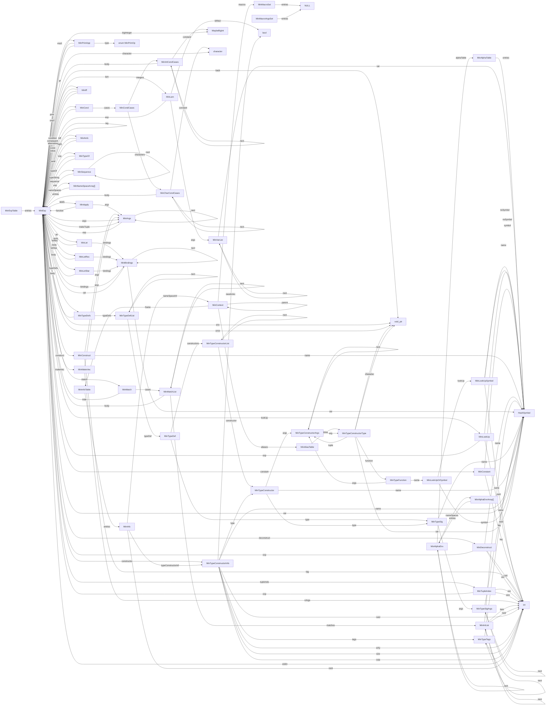

# minlam

Minimal lambda calculus AST after desugaring

```mermaid
flowchart LR
MinMacroSet --entries--> NULL
MinMacroArgsSet --entries--> NULL
MinInfoTable --entries--> MinInfo
MinAliasTable --entries--> MinTypeConstructorType
MinExpTable --entries--> MinExp
MinAlphaTable --entries--> HashSymbol
MinLam --args--> MinVarList
MinLam --exp--> MinExp
MinLam --isMacro--> bool
MinVarList --var--> HashSymbol
MinVarList --next--> MinVarList
MinPrimApp --type--> MinPrimOp
MinPrimApp --exp1--> MinExp
MinPrimApp --exp2--> MinExp
MinSequence --exp--> MinExp
MinSequence --next--> MinSequence
MinArgs --exp--> MinExp
MinArgs --next--> MinArgs
MinApply --function--> MinExp
MinApply --args--> MinArgs
MinLookUp --nsId--> int
MinLookUp --nsSymbol--> HashSymbol
MinLookUp --exp--> MinExp
MinLookUpSymbol --nsId--> int
MinLookUpSymbol --nsSymbol--> HashSymbol
MinLookUpSymbol --symbol--> HashSymbol
MinConstant --name--> HashSymbol
MinConstant --tag--> int
MinConstruct --name--> HashSymbol
MinConstruct --tag--> int
MinConstruct --args--> MinArgs
MinDeconstruct --name--> HashSymbol
MinDeconstruct --nsId--> int
MinDeconstruct --vec--> int
MinDeconstruct --exp--> MinExp
MinTupleIndex --vec--> int
MinTupleIndex --size--> int
MinTupleIndex --exp--> MinExp
MinMakeVec --nArgs--> int
MinMakeVec --args--> MinArgs
MinIff --condition--> MinExp
MinIff --consequent--> MinExp
MinIff --alternative--> MinExp
MinCond --value--> MinExp
MinCond --cases--> MinCondCases
MinIntCondCases --constant--> MaybeBigInt
MinIntCondCases --body--> MinExp
MinIntCondCases --next--> MinIntCondCases
MinCharCondCases --constant--> character
MinCharCondCases --body--> MinExp
MinCharCondCases --next--> MinCharCondCases
MinMatch --index--> MinExp
MinMatch --cases--> MinMatchList
MinMatchList --matches--> MinIntList
MinMatchList --body--> MinExp
MinMatchList --next--> MinMatchList
MinIntList --item--> int
MinIntList --name--> HashSymbol
MinIntList --nsId--> int
MinIntList --next--> MinIntList
MinLet --bindings--> MinBindings
MinLet --body--> MinExp
MinLetRec --bindings--> MinBindings
MinLetRec --body--> MinExp
MinLetStar --bindings--> MinBindings
MinLetStar --body--> MinExp
MinBindings --var--> HashSymbol
MinBindings --val--> MinExp
MinBindings --next--> MinBindings
MinContext --frame--> MinInfoTable
MinContext --aliases--> MinAliasTable
MinContext --macros--> MinMacroSet
MinContext --parent--> MinContext
MinAmb --left--> MinExp
MinAmb --right--> MinExp
MinTypeOf --exp--> MinExp
MinTypeOf --typeString--> MinExp
MinTypeDefs --typeDefs--> MinTypeDefList
MinTypeDefs --body--> MinExp
MinTypeDefList --typeDef--> MinTypeDef
MinTypeDefList --next--> MinTypeDefList
MinTypeDef --type--> MinTypeSig
MinTypeDef --constructors--> MinTypeConstructorList
MinTypeConstructorList --constructor--> MinTypeConstructor
MinTypeConstructorList --next--> MinTypeConstructorList
MinTypeSig --name--> HashSymbol
MinTypeSig --args--> MinTypeSigArgs
MinTypeTags --tag--> HashSymbol
MinTypeTags --next--> MinTypeTags
MinTypeSigArgs --name--> HashSymbol
MinTypeSigArgs --next--> MinTypeSigArgs
MinTypeConstructor --name--> HashSymbol
MinTypeConstructor --type--> MinTypeSig
MinTypeConstructor --args--> MinTypeConstructorArgs
MinTypeConstructorArgs --arg--> MinTypeConstructorType
MinTypeConstructorArgs --next--> MinTypeConstructorArgs
MinTypeFunction --name--> MinLookUpOrSymbol
MinTypeFunction --args--> MinTypeConstructorArgs
MinTypeConstructorInfo --name--> HashSymbol
MinTypeConstructorInfo --nsId--> int
MinTypeConstructorInfo --type--> MinTypeConstructor
MinTypeConstructorInfo --tags--> MinTypeTags
MinTypeConstructorInfo --needsVec--> bool
MinTypeConstructorInfo --arity--> int
MinTypeConstructorInfo --size--> int
MinTypeConstructorInfo --index--> int
MinAlphaEnv --alphaTable--> MinAlphaTable
MinAlphaEnv --next--> MinAlphaEnv
MinAlphaEnv --nameSpaces--> MinAlphaEnvArray
MinExp --amb--> MinAmb
MinExp --apply--> MinApply
MinExp --args--> MinArgs
MinExp --back--> void_ptr
MinExp --bigInteger--> MaybeBigInt
MinExp --bindings--> MinBindings
MinExp --callCC--> MinExp
MinExp --character--> character
MinExp --cond--> MinCond
MinExp --constant--> MinConstant
MinExp --construct--> MinConstruct
MinExp --constructor--> MinTypeConstructorInfo
MinExp --deconstruct--> MinDeconstruct
MinExp --env--> void_ptr
MinExp --error--> void_ptr
MinExp --iff--> MinIff
MinExp --lam--> MinLam
MinExp --let--> MinLet
MinExp --letRec--> MinLetRec
MinExp --letStar--> MinLetStar
MinExp --lookUp--> MinLookUp
MinExp --makeTuple--> MinArgs
MinExp --makeVec--> MinMakeVec
MinExp --match--> MinMatch
MinExp --nameSpaces--> MinNameSpaceArray
MinExp --prim--> MinPrimApp
MinExp --sequence--> MinSequence
MinExp --stdint--> int
MinExp --tag--> MinExp
MinExp --tupleIndex--> MinTupleIndex
MinExp --typeDefs--> MinTypeDefs
MinExp --typeOf--> MinTypeOf
MinExp --var--> HashSymbol
MinLookUpOrSymbol --symbol--> HashSymbol
MinLookUpOrSymbol --lookUp--> MinLookUpSymbol
MinCondCases --integers--> MinIntCondCases
MinCondCases --characters--> MinCharCondCases
MinTypeConstructorType --integer--> void_ptr
MinTypeConstructorType --character--> void_ptr
MinTypeConstructorType --var--> HashSymbol
MinTypeConstructorType --function--> MinTypeFunction
MinTypeConstructorType --tuple--> MinTypeConstructorArgs
MinInfo --typeConstructorInfo--> MinTypeConstructorInfo
MinInfo --nameSpaceInfo--> MinContext
MinInfo --nsId--> int
MinPrimOp["enum MinPrimOp"]
MinNameSpaceArray["MinNameSpaceArray[]"] --entries--> MinExp
MinAlphaEnvArray["MinAlphaEnvArray[]"] --entries--> MinAlphaEnv
```

> Generated from src/minlam.yaml by tools/generate.py
