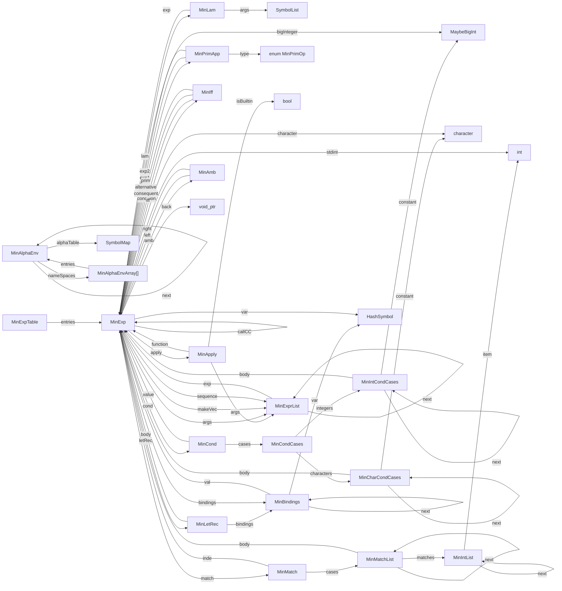

# minlam

Minimal AST after desugaring

```mermaid
flowchart LR
MinExpTable --entries--> MinExp
MinLam --args--> SymbolList
MinLam --exp--> MinExp
MinExprList --exp--> MinExp
MinExprList --next--> MinExprList
MinPrimApp --type--> MinPrimOp
MinPrimApp --exp1--> MinExp
MinPrimApp --exp2--> MinExp
MinApply --function--> MinExp
MinApply --args--> MinExprList
MinApply --isBuiltin--> bool
MinIff --condition--> MinExp
MinIff --consequent--> MinExp
MinIff --alternative--> MinExp
MinCond --value--> MinExp
MinCond --cases--> MinCondCases
MinIntCondCases --constant--> MaybeBigInt
MinIntCondCases --body--> MinExp
MinIntCondCases --next--> MinIntCondCases
MinCharCondCases --constant--> character
MinCharCondCases --body--> MinExp
MinCharCondCases --next--> MinCharCondCases
MinMatch --index--> MinExp
MinMatch --cases--> MinMatchList
MinMatchList --matches--> MinIntList
MinMatchList --body--> MinExp
MinMatchList --next--> MinMatchList
MinIntList --item--> int
MinIntList --next--> MinIntList
MinLetRec --bindings--> MinBindings
MinLetRec --body--> MinExp
MinBindings --var--> HashSymbol
MinBindings --val--> MinExp
MinBindings --next--> MinBindings
MinAmb --left--> MinExp
MinAmb --right--> MinExp
MinAlphaEnv --alphaTable--> SymbolMap
MinAlphaEnv --next--> MinAlphaEnv
MinAlphaEnv --nameSpaces--> MinAlphaEnvArray
MinExp --amb--> MinAmb
MinExp --apply--> MinApply
MinExp --args--> MinExprList
MinExp --back--> void_ptr
MinExp --bigInteger--> MaybeBigInt
MinExp --bindings--> MinBindings
MinExp --callCC--> MinExp
MinExp --character--> character
MinExp --cond--> MinCond
MinExp --iff--> MinIff
MinExp --lam--> MinLam
MinExp --letRec--> MinLetRec
MinExp --makeVec--> MinExprList
MinExp --match--> MinMatch
MinExp --prim--> MinPrimApp
MinExp --sequence--> MinExprList
MinExp --stdint--> int
MinExp --var--> HashSymbol
MinCondCases --integers--> MinIntCondCases
MinCondCases --characters--> MinCharCondCases
MinPrimOp["enum MinPrimOp"]
MinAlphaEnvArray["MinAlphaEnvArray[]"] --entries--> MinAlphaEnv
```

> Generated from src/minlam.yaml by tools/generate.py
