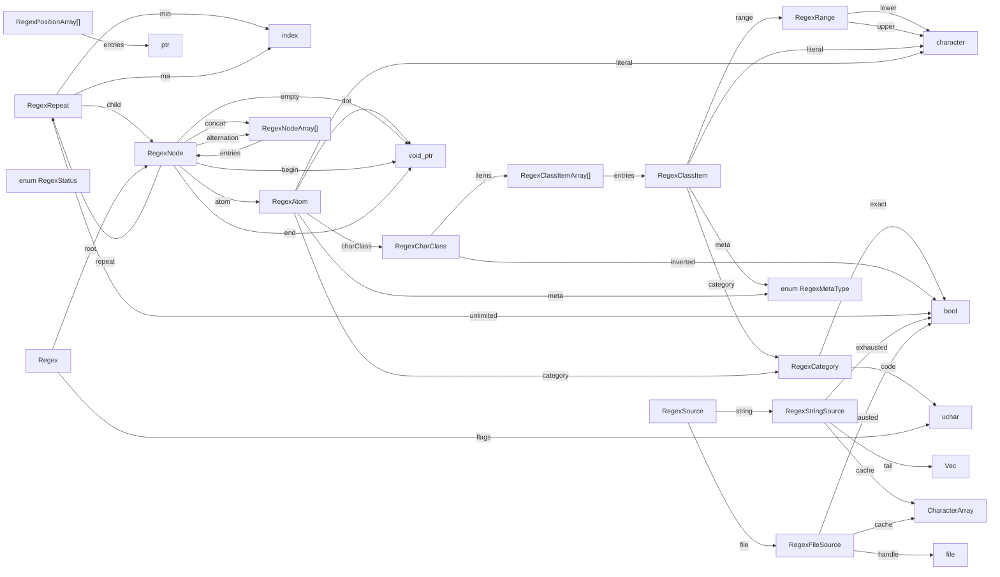

# regex

Regex AST and helper data structures

```mermaid
flowchart LR
RegexCategory --code--> uchar
RegexCategory --exact--> bool
RegexRange --lower--> character
RegexRange --upper--> character
RegexCharClass --inverted--> bool
RegexCharClass --items--> RegexClassItemArray
RegexRepeat --child--> RegexNode
RegexRepeat --min--> index
RegexRepeat --max--> index
RegexRepeat --unlimited--> bool
Regex --root--> RegexNode
Regex --flags--> uchar
RegexStringSource --tail--> Vec
RegexStringSource --cache--> CharacterArray
RegexStringSource --exhausted--> bool
RegexFileSource --handle--> file
RegexFileSource --cache--> CharacterArray
RegexFileSource --exhausted--> bool
RegexClassItem --literal--> character
RegexClassItem --range--> RegexRange
RegexClassItem --meta--> RegexMetaType
RegexClassItem --category--> RegexCategory
RegexAtom --literal--> character
RegexAtom --dot--> void_ptr
RegexAtom --charClass--> RegexCharClass
RegexAtom --meta--> RegexMetaType
RegexAtom --category--> RegexCategory
RegexNode --empty--> void_ptr
RegexNode --atom--> RegexAtom
RegexNode --begin--> void_ptr
RegexNode --end--> void_ptr
RegexNode --concat--> RegexNodeArray
RegexNode --alternation--> RegexNodeArray
RegexNode --repeat--> RegexRepeat
RegexSource --string--> RegexStringSource
RegexSource --file--> RegexFileSource
RegexStatus["enum RegexStatus"]
RegexMetaType["enum RegexMetaType"]
RegexClassItemArray["RegexClassItemArray[]"] --entries--> RegexClassItem
RegexNodeArray["RegexNodeArray[]"] --entries--> RegexNode
RegexPositionArray["RegexPositionArray[]"] --entries--> ptr
```

> Generated from src/regex.yaml by tools/generate.py
