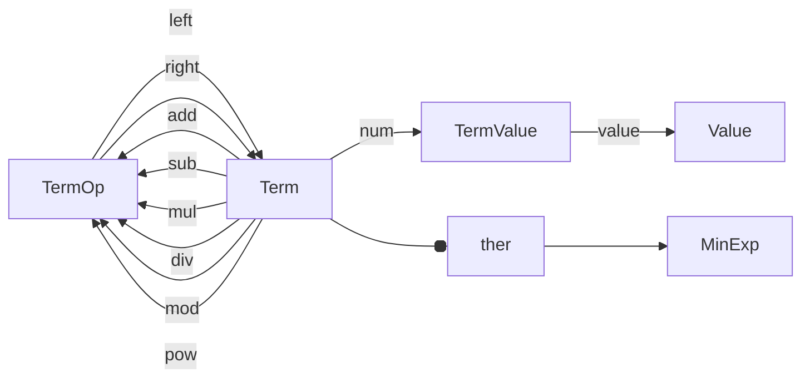

# term

Specific arithmetic structures for performing constant folding.

```mermaid
flowchart LR
TermOp --left--> Term
TermOp --right--> Term
TermValue --value--> Value
Term --add--> TermOp
Term --sub--> TermOp
Term --mul--> TermOp
Term --div--> TermOp
Term --mod--> TermOp
Term --pow--> TermOp
Term --num--> TermValue
Term --other--> MinExp
```

> Generated from src/term.yaml by tools/generate.py
