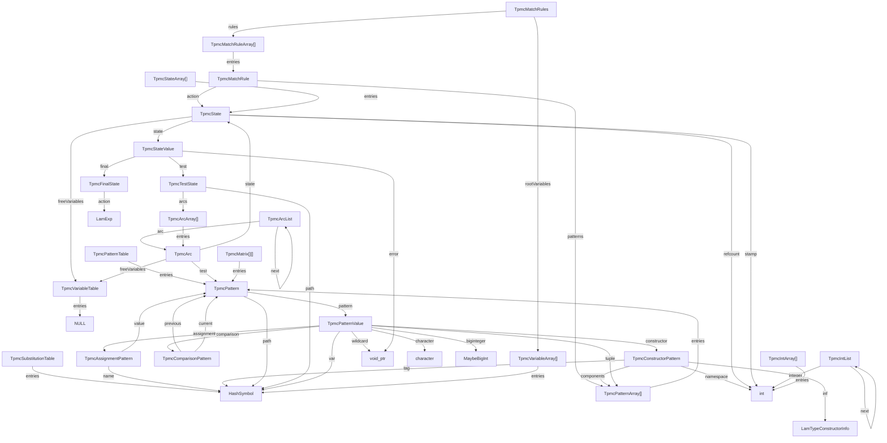

# tpmc

Term Pattern Matching Compiler types

```mermaid
flowchart TD
TpmcVariableTable --entries--> NULL
TpmcSubstitutionTable --entries--> HashSymbol
TpmcPatternTable --entries--> TpmcPattern
TpmcMatchRules --rules--> TpmcMatchRuleArray
TpmcMatchRules --rootVariables--> TpmcVariableArray
TpmcMatchRule --action--> TpmcState
TpmcMatchRule --patterns--> TpmcPatternArray
TpmcComparisonPattern --previous--> TpmcPattern
TpmcComparisonPattern --current--> TpmcPattern
TpmcAssignmentPattern --name--> HashSymbol
TpmcAssignmentPattern --value--> TpmcPattern
TpmcConstructorPattern --tag--> HashSymbol
TpmcConstructorPattern --namespace--> int
TpmcConstructorPattern --info--> LamTypeConstructorInfo
TpmcConstructorPattern --components--> TpmcPatternArray
TpmcPattern --path--> HashSymbol
TpmcPattern --pattern--> TpmcPatternValue
TpmcTestState --path--> HashSymbol
TpmcTestState --arcs--> TpmcArcArray
TpmcFinalState --action--> LamExp
TpmcState --refcount--> int
TpmcState --stamp--> int
TpmcState --freeVariables--> TpmcVariableTable
TpmcState --state--> TpmcStateValue
TpmcArc --state--> TpmcState
TpmcArc --test--> TpmcPattern
TpmcArc --freeVariables--> TpmcVariableTable
TpmcArcList --arc--> TpmcArc
TpmcArcList --next--> TpmcArcList
TpmcIntList --integer--> int
TpmcIntList --next--> TpmcIntList
TpmcPatternValue --var--> HashSymbol
TpmcPatternValue --comparison--> TpmcComparisonPattern
TpmcPatternValue --assignment--> TpmcAssignmentPattern
TpmcPatternValue --wildcard--> void_ptr
TpmcPatternValue --character--> character
TpmcPatternValue --biginteger--> MaybeBigInt
TpmcPatternValue --constructor--> TpmcConstructorPattern
TpmcPatternValue --tuple--> TpmcPatternArray
TpmcStateValue --test--> TpmcTestState
TpmcStateValue --final--> TpmcFinalState
TpmcStateValue --error--> void_ptr
TpmcMatchRuleArray["TpmcMatchRuleArray[]"] --entries--> TpmcMatchRule
TpmcVariableArray["TpmcVariableArray[]"] --entries--> HashSymbol
TpmcPatternArray["TpmcPatternArray[]"] --entries--> TpmcPattern
TpmcStateArray["TpmcStateArray[]"] --entries--> TpmcState
TpmcArcArray["TpmcArcArray[]"] --entries--> TpmcArc
TpmcIntArray["TpmcIntArray[]"] --entries--> int
TpmcMatrix["TpmcMatrix[][]"] --entries--> TpmcPattern
```

> Generated from src/tpmc.yaml by tools/makeAST.py
