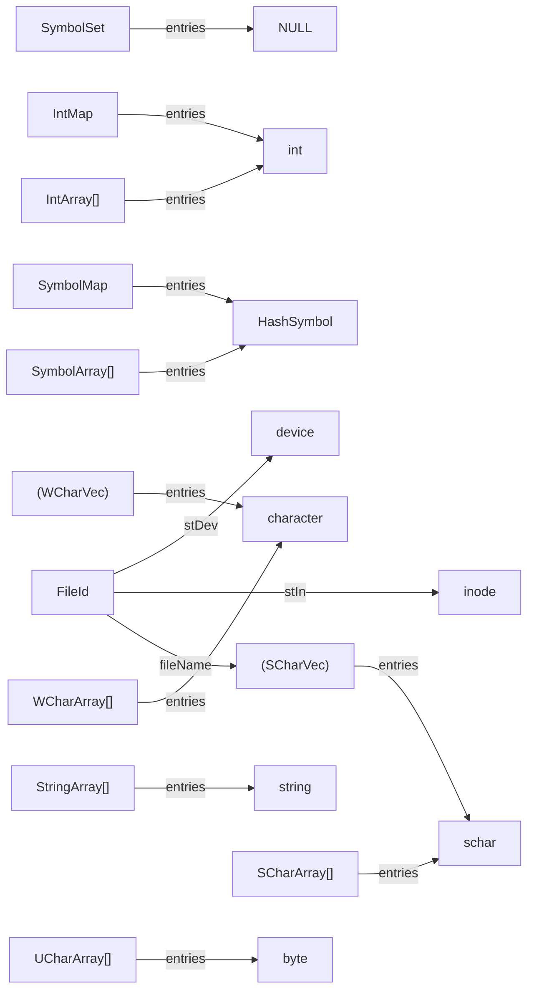

# utils

Common utility structures

```mermaid
flowchart LR
SymbolSet --entries--> NULL
IntMap --entries--> int
SymbolMap --entries--> HashSymbol
FileId --stDev--> device
FileId --stIno--> inode
FileId --fileName--> SCharVec
SCharVec["(SCharVec)"] --entries--> schar
WCharVec["(WCharVec)"] --entries--> character
StringArray["StringArray[]"] --entries--> string
WCharArray["WCharArray[]"] --entries--> character
UCharArray["UCharArray[]"] --entries--> byte
SCharArray["SCharArray[]"] --entries--> schar
SymbolArray["SymbolArray[]"] --entries--> HashSymbol
IntArray["IntArray[]"] --entries--> int
```

> Generated from src/utils.yaml by tools/generate.py
