# Lambda Conversion

This is the stage before type checking where we desugar and rewrite the
input into something close to the lambda calculus, which then becomes
input to the final A-Normal form conversion to generate the structures
that are used to generate the bytecode which is input to the CEKF machine
for execution.

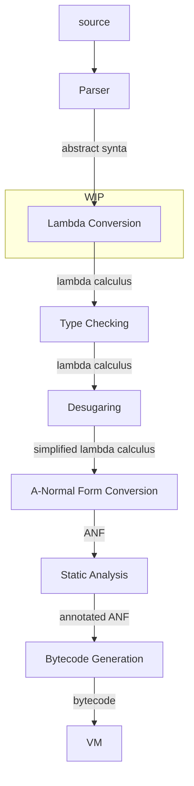

Mostly lambda conversion is a fairly straightforward process, a one-to-one
mapping between high-level and lower-level. However dealing with the pattern
matching of composite functions is much less so.

My current thinking is to convert the arguments to an NFA, then convert that
to a DFA, then compile that to a "parser" for the actual arguments received.
The advantages of this approach seem to be:

 1. Reqular expressions and the NFA to DFA conversion are well understood.
 2. An NFA with multiple end states is perfectly feasible (Lex/Flex for example).
 3. The resulting code should be fast.
 4. Using regular expression techniques gives us actual regular expressions in formal arguments almost for free if we want to implement them later.

So lets work through some examples to make sure it'll work.

```fn
fn xor {
 (false, false) { false }
 (false, true)  { true }
 (true, false)  { true }
 (true, true)   { false }
}
```

Produces an NFA:

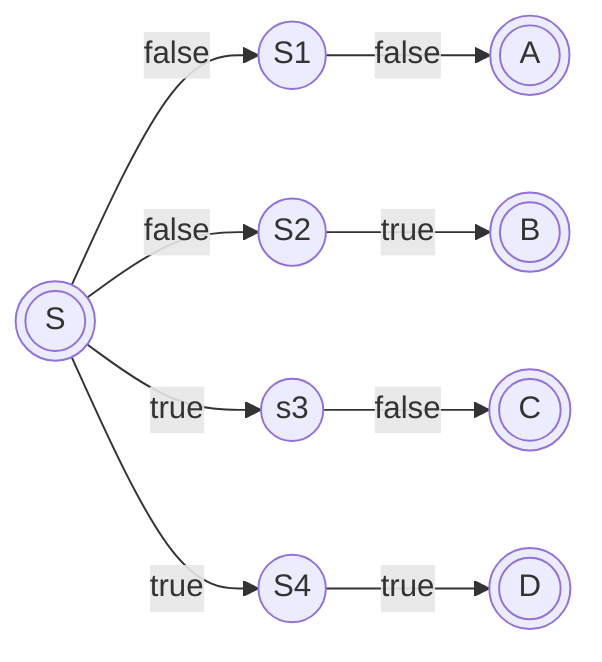

Which in this case we can trivially convert to a DFA:


Which in turn can be trivially compiled to a nested case statement

```scheme
(lambda ($a $b)
  (match $a (0 (match $b (0 0)
                         (1 1))
             1 (match $b (0 1)
                         (1 0)))))
```

let's try something a bit more ambitious.

```fn
fn map {
    (_, []) { [] }
    (f, h @ t) { f(h) @ map(f, t) }
}
```

NFA:

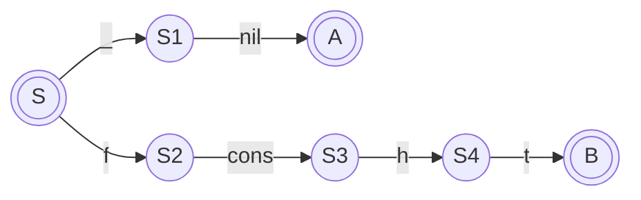

I think it's neccessary to include walking the structs as part of the automaton, especially
when things get more complex later.

DFA:

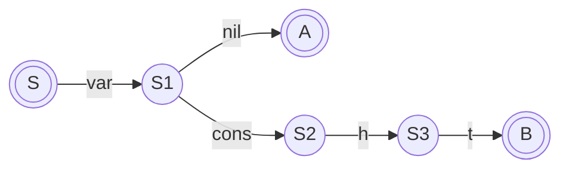

compiling this is much less trivial. the end result should be something like

```scheme
(lambda ($a $b)
  (match (vec $b 0) (0 (make-vec 1 0))
                    (1 (let (f $a)
                            (let (h (vec $b 1))
                                 (let t (vec $b 2)
                                        (cons (f h) (map f t)))))))
```

The main problem is the `let` bindings. in the conversion from an NFA to a DFA we seem to have lost some information. We might have to work backwards from the final state to the NFA transition that bound the variable. In which case we might have to additionally create an annotated inversion of the NFA:

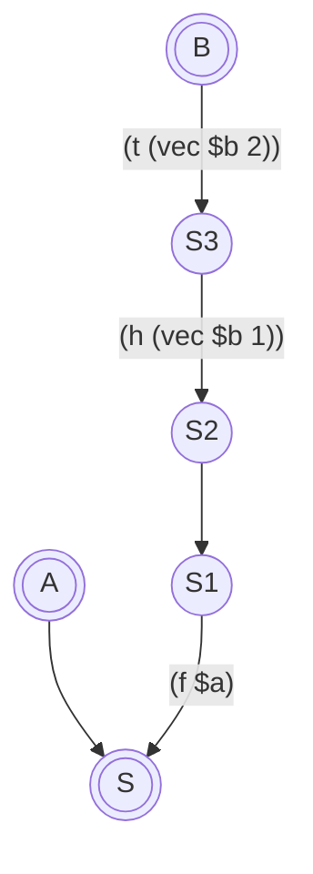

To track the variable bindings that have to be performed for each final state.

Thankfully, if this is done on the DFA, it can be done without having to cross-reference the component functions in the composite function, and doesn't have any implications for the NFA to DFA conversion.

Another example

```fn
fn member {
  (x, x @ _) { true }
  (x, []) { false }
  (y, h @ t) { member(y, t) }
}
```

first the DFA

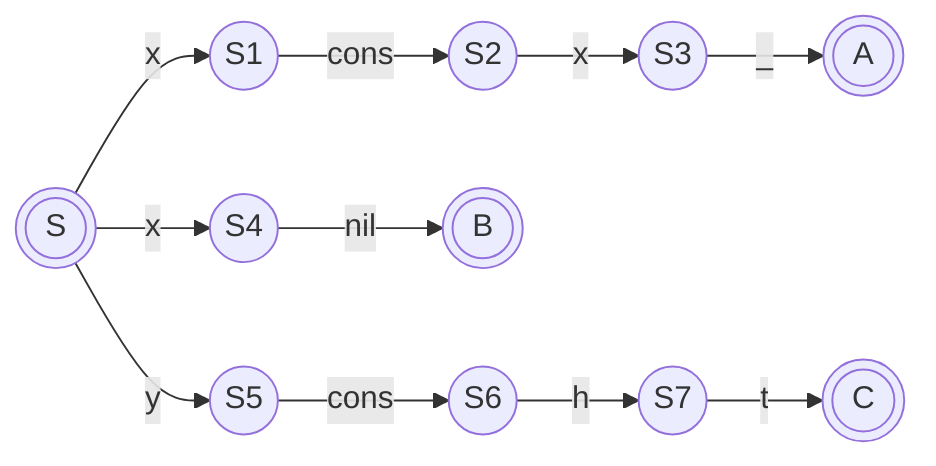

Now the annotation/inversion

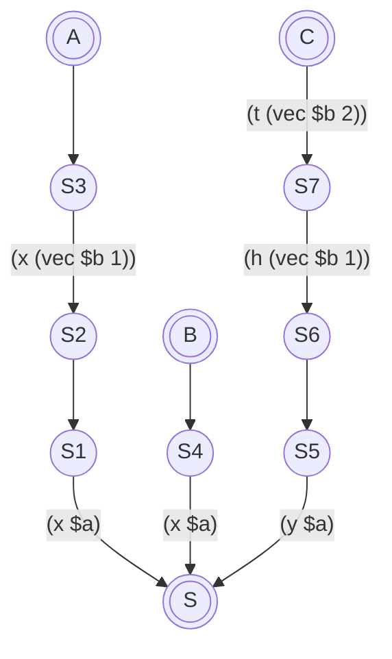

The NFA

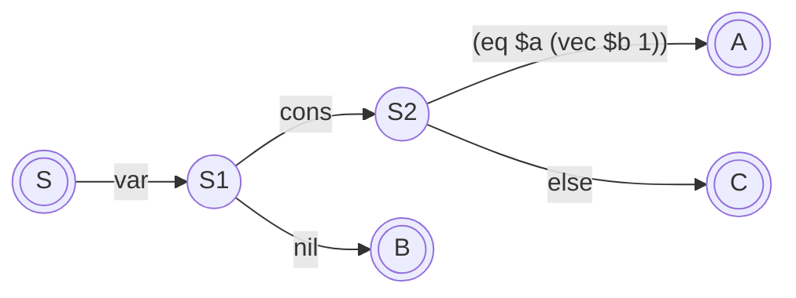

The resulting lambda

```scheme
(lambda ($a $b)
  (match (vec $a 0)
         (0 0)
         (1 (match (eq $a (vec $b 1))
                   (0 (let (x $a)
                           (let (h (vec $b 1))
                                (let (t (vec $b 2))
                                     (member x t)))))
                   (1 1)))))
```

Note the equality check has to be part of the DFA, because we don't yet
know which branch we're on so can't start binding variables that will
differ between branches.

## New Approach

None of the above pans out, there are issues with variable binding confusing the NFA to DFA converter. You can see how far I got in prototyping this in [prototyping/DFATree.py](../prototyping/DFATree.py).

The new approach is to do what Haskell perportedly does, which is to check each pattern in turn. This is certainly simpler, and we can use a beefed-up variant of `amb` to help out by backtracking when a branch doesn't match.

The basic skeleton of the generated code should be something like:

```scheme
(amb (<check branch 1> <body 1>)
     (amb (<check branch 2> <body 2>)
          (amb (<check branch 3> <body 3>)
               (error "patterns exhausted"))))
```

Each branch can be generated completely independantly of the others, and need only do a `(back)` if the args fail to match.

However there is a little problem, if such a function is backtracked through
for other reasons (normal use of `amb` by other code) then a subsequent branch
would be attempted in error.

How Prolog addresses this problem, where a branch once determined should be committed to, is to use a mechanism called a "green cut". This ensures that when a function body is backtracked out of, the entire function is backtracked out of.

We can achieve the same by having a new version of `amb` which I'm calling `escape`, and a new version of `back` which I'm calling `cut`.

`escape` is just like `amb` except it takes only one argument expression, and when backtracked to from that expression, it itself backtracks.

`cut` is a little different from a normal `back` though, when invoked, instead of just restoring the previous failure continuation, it repeatedly restores the previous continuation unlil it encounters an `escape` continuation.

The skeleton now becomes:

```scheme
(escape
  (amb (<check branch 1> (amb <body 1> (cut))
       (amb (<check branch 2> (amb <body 2> (cut))
            (amb (<check branch 3> (amb <body 3> (cut))
                 (error "patterns exhausted")))))
```

So if for example downstream code attempts to backtrack through `<body 1>`, the innermost `amb` will catch the failure and invoke `cut`, which will jump over the outer `amb` to the `escape` which will then continue to backtrack out of the entire compound function.

Let's look at some concrete examples converting familiar functions to lambdas,
first here's `map`

```scheme
; fn map {
;   (_, []) { [] }
;   (f, h @ t) { f(h) @ map(f, t) }
; }
(define map
  (lambda ($1 $2)
    (escape
      (amb (match $2
                  (nil (amb nil (cut)))
                  (pair (back))
           (amb (let (f $1)
                  (match $2
                         (nil (let (h (field $2 0))
                                (let (t (field $2 1))
                                  (amb (pair (f h) (map f t)) (cut)))))
                         (pair (back))))
                (error "patterns exhausted in function map")))))))
```

Arguments to the lambda are bound to generated symbols, which shouldn't be
lexically symbols so they can't conflict (dollar-prefix should do it).

Then the entire compound is wrapped in an escape, and a nest of `amb`s check
each branch.

`match` is a simple exhaustive case statement for types.

`field` extracts a zero-indexed field from a compound structure like `pair`.

Nested `let`s bind variables appropriately, and the body of the function is constructed within those `let` bindings, wrapped in an `amb` with a trailing `cut`.

next let's look at `member`.

```scheme
; fn member {
;   (_, []) { false }
;   (x, x @ _) { true }
;   (x, _ @ t) { member(x, t) }
; }
(define member
  (lambda ($1 $2)
    (escape
      (amb (match $2
                  (0 (amb false (cut)))
                  (1 (back)))
           (amb (let (x $1)
                  (match $2
                         (1 (if (eq x (field $2 0))
                                (amb true (cut))
                                (back)))
                         (0 (back))))
                (amb (let (x $1)
                       (match $2
                              (1 (let (t (field $2 1))
                                   (amb (member x t) (cut))))
                              (0 (back))))
                     (error "patterns exhausted in function member")))))))
```

Much the same process, The additional wrinkle is the comparison of the second
binding of `x` in the true branch, rather than just binding `x`.

There's rather an accumulation of failure continuations using this approach,
a function call not otherwise using `amb` now costs 2 failure continuations
that are likely never invoked if the application makes no use of `amb`.

Maybe there's a less costly way.

## Refinement

Leave `escape` as is, but change the behaviour of `cut`. Have `cut` now take an expression to evaluate, and *before* evaluating it, peel away all the failure
continuations up to and including the `escape`.

So instead of:

```scheme
(amb (member x t) (cut))
```

We just need:

```scheme
(cut (member x t))
```

In fact we can gain a bit more efficiency still by having `escape` merely
tag the current failure continuation, then `cut` peels back to leave that
continuation, un-tagging it instead of removing it. Any downstream backtracking
from the argument to `cut` will hit that continuation.

In fact, we probably don't even need `escape`. If the use of `cut` is restricted
to this specific situation, there will only ever be one failure continuation
installed for pattern matching, and `cut` merely restores the previous one.

## Changes to "The Math"

Complex expressions now include `cut`

$$
\begin{array}{rcl}
\mathtt{cexp} &::=& \mathtt{(aexp_0\\ aexp_1\dots aexp_n)}
\\
      &|&  \mathtt{(if\\ aexp\\ exp\\ exp)}
\\
      &|&  \mathtt{(call/cc\\ aexp)}
\\
      &|&  \mathtt{(letrec\\ ((var_1\\ aexp_1)\dots(var_n\\ aexp_n))\\ exp)}
\\
      &|&  \mathtt{(amb\\ exp\\ exp)}
\\
      &|&  \mathtt{(cut\\ exp)}
\\
      &|&  \mathtt{(back)}
\end{array}
$$

`cut` pops the topmost failure continuation and arranges for its argument to be evaluated. It would be an error if `cut` was invoked without a failure continuation in place:

$$
step(\mathtt{(cut\ exp)}, \rho, \kappa, \mathbf{backtrack}(\mathtt{exp'}, \rho', \kappa', f)) = (\mathtt{exp}, \rho, \kappa, f)
$$

That's it. We won't expose `cut` as a language feature because its use is purely internal to the implementation.

`cut` is now implemented, the ANF [scm/map-amb.scm](../scm/map-amb.scm) file demonstrates the expected behaviour, that file has been
translated into C structs with [tools/makeTree.py](../tools/makeTree.py) and the resulting C code pasted into [src/tests/exp.inc](../src/tests/exp.inc) as a test `makeTestExpMap()`.

There are problems with this approach too, after a day or so of more prototyping, it definately will work (is working)
see [my prototype](../prototyping/Args.py)
but the resulting code is horribly inneficcient. For example given:

```plaintext
typedef colour { red | green | blue }
```

this function:

```plaintext
fn colourToChar {
  (red) => { 'r' }
  (green) => { 'g' }
  (blue) => { 'b' }
}
```

compiles to this!

```scheme
(define colourToChar
        (lambda (arg0)
                (amb (match arg0
                            ((0) (cut 'r'))
                            ((1 2) (back)))
                     (amb (match arg0
                                 ((1) (cut 'g'))
                                 ((0 2) (back)))
                          (amb (match arg0
                                      ((2) (cut 'b'))
                                      ((0 1) (back)))
                               (error "patterns exhausted in function colourToChar"))))))
```

Which is hardly ideal. An ideal translation would just be:

```scheme
(define colourToChar
        (lambda (arg0)
                (amb (match arg0
                            ((0) (cut 'r'))
                            ((1) (cut 'g'))
                            ((2) (cut 'b'))
                     (error "patterns exhausted in function colourToChar")))))
```

or even just:

```scheme
(define colourToChar
        (lambda (arg0)
                (match arg0
                       ((0) 'r')
                       ((1) 'g')
                       ((2) 'b'))))
```

I've already implemented `cut`, and I think I'll leave it in because it might yet prove useful, but since efficiency is one
of the primary motivations for this project, I can't use it here.

Fortunately there's still life in the original idea. I started searching for pattern matching algorithms, found some very
good documentation on Rust internals which finally led me to
[this paper](https://www.classes.cs.uchicago.edu/archive/2011/spring/22620-1/papers/pettersson92.pdf).
I'm quite gratified that I wasn't alone in thinking regular expressions were the way to go, but this paper
has a complete algorithm described and working that does exactly what I want!

Plan now is to get that working as a Python prototype, then translate into C.

## Description of the TPMC Algorithm

Explaining it to myself.

### Step 1. Renaming

All patterns in the arguments to a composite function are collected into a matrix
of patterns, and the components are renamed and labelled in a consistent way,
such thar the same variable position has the same name, for example in

```fn
fn map {
    (_, nil) { nil }
    (f, pair(h, t)) { pair(f(h), map(f, t)) }
}
```

The matrix is

```fn
(_, nil)
(f, pair(h, t))
```

and after renaming and labelling that becomes

```fn
(p$0=_, p$1=nil)
(p$0=_, p$1=pair(p$1$0=_, p$1$1=_))
```

An array of final states (the bodies of the individual functions) is also constructed

```fn
{ nil }
{ pair(p$0(p$1$0), map(p$0, p$1$1)) }
```

### Step 2. Generating the DFA

The input to the `match` algorithm is that matrix of patterns M and the array of final states S.
The output of the `match` algorithm is the DFA for the matrix.

`match` inspects the first (top) row of M. If all of the patterns in the row are
variables then it cannot fail to match any arguments. This invokes the "Variable Rule".
Otherwise at least one pattern in the top row is a constructor or constant. This situation
invokes the "Mixture Rule".

#### The Variable Rule

If there are no constructors or constants in the top row then the result is the first state in the array of final states.

#### The Mixture Rule

* select any column C whose first pattern is not a wildcard.
* construct an array N containing the patterns from any column whose first pattern is not a wildcard.
* construct a new matrix MN consisting of all the columns from M except that column.
* construct a new test state T.
* for each constructor K in N:
  * let AK be the arity of K.
  * let {i1 .. ii} be the indices of the patterns in N (both wildcards and equal constructors) that match that constructor.
  * let {p1 .. pi} be the patterns at those indices.
  * let L be the size of {p1 .. pi}
  * construct a matrix MNC from MN by selecting rows {i1 .. ii}
  * construct a matrix NC with AK columns and L rows
  * for each pattern pj in {p1 .. pi}
    * if pj is a constructor place a row of the constructor's AK arguments in row j of NC
    * otherwise place a row of AK wildcards with appropriate names (p$1$1 etc.( in row j of NC
  * construct a new matrix MNCNC by appending MN to MNC
  * let SN be an array of S's states {i1 .. ii}
  * call `match` on MNCNC and SN to get state F
  * create an arc from T to F, labelling it with the constructor K
* if the list of constructors in N is exhaustive
  * return T
* else if there are wildcards in N:
  * let {w1 .. wi} be the indices of the wildcards in N
  * construct a matrix MNF by selecting rows {w1 .. wn}
  * construct a state array SF from S by selecting states {w1 .. wi}
  * call match on MNF and SF resulting in a DFA F
  * add an arc from T to F labelled with a wildcard
  * return T
* else:
  * add an arc from T to the error state E
  * return T

### Step 3. Optimize the DFA

This just involves reference counting states and removing duplicates.
States with a reference count greater than one will become local functions.

### Step 4. Generate Intermediate Code

Again this is fairly straightforward, local procedures are created for those
states with multiple entry points, so track must be kept of free variables etc.
Otherwise a test state becomes a switch statement (in our case either a `MATCH`
for constructors or a `COND` for constants), an arc becomes a case in that statement,
and a final state is either the body of the state or a call to the local procedure.

And it's working! At least the python prototype [TPMC2.py](../prototyping/TPMC2.py). For sample inputs here's the output:

```scheme
; {
;   [_, null] => null
;   [f, cons(h, t)] => (cons (f h) (map f t))
; }
(lambda (p0 p1)
        (match (vec 0 p1)
               ((0) null)
               ((1) (let (p1$1 (vec 1 p1))
                         (let (p1$2 (vec 2 p1))
                              (cons (p0 p1$1)
                                    (map p0 p1$2)))))))

; {
;   [f, cons(h, t)] => (cons (f h) (map f t))
; }
(lambda (p0 p1)
        (match (vec 0 p1)
               ((1) (let (p1$1 (vec 1 p1))
                    (let (p1$2 (vec 2 p1))
                         (cons (p0 p1$1)
                               (map p0 p1$2)))))
               ((0) (ERROR))))
; non-exhaustive pattern match detected

; {
;   [_, null] => null
; }
(lambda (p0 p1)
        (match (vec 0 p1)
               ((0) null)
               ((1) (ERROR))))
; non-exhaustive pattern match detected

; {
;   [0] => 1
;   [n] => (* n (factorial (- n 1)))
; }
(lambda (p0)
        (cond p0 (0 1)
                 (else (* p0 (factorial (- p0 1))))))

; {
;   [n] => (* n (factorial (- n 1)))
; }
(lambda (p0) (* p0 (factorial (- p0 1))))

; {
;   [0] => 1
; }
(lambda (p0)
        (cond p0 (0 1)
                 (else (ERROR))))
; non-exhaustive pattern match detected

; {
;   [null, null] => A
;   [xs, ys] => (B xs ys)
; }
(lambda (p0 p1)
        (letrec ((q0 (lambda () (B p0 p1))))
                (match (vec 0 p0)
                       ((0) (match (vec 0 p1)
                                   ((0) A)
                                   ((1) (q0))))
                       ((1) (q0)))))

; {
;   [null, ys] => E1
;   [xs, null] => E2
;   [cons(x, xs), cons(y, ys)] => E3
; }
(lambda (p0 p1)
        (match (vec 0 p0)
               ((0) E1)
               ((1) (let (p0$1 (vec 1 p0))
                         (let (p0$2 (vec 2 p0))
                              (match (vec 0 p1)
                                     ((0) E2)
                                     ((1) (let (p1$1 (vec 1 p1))
                                               (let (p1$2 (vec 2 p1))
                                                    E3)))))))))
```

### Extending TPMC to Support Comparison

The language requires an addition, if possible to the kinds of pattern matching available.
Specific example is `member`

```fn
let
  fn member {
    (_, []) { false }
    (x, x @ _) { true }
    (x, _ @ t) { member(x, t) }
  }
in
  member('c', "abc")
```

Where the second match succeeds if the first argument equals the head of the second argument.

While I thought I had this working, simply treating comparison as a new kind of "constructor",
in fact in my tests it was only working accidentally.
In general there is no guarantee that the variable representing the thing being compared is
in scope when the comparison happens. In the above example x in the second match is only in scope
because it is bound at the top level.

In the original algorithm variables are brought in to scope by the conversion of the arc pattern.
But the non-locality of the variable being compared causes problems.

```fn
let
    typedef baz { foo(int) | bar(baz) }
    fn fail {
        (x, x) { 1 }
        (bar(x), x) { 2 }
    }
in
    print(fail(foo(1), foo(1)))
###
undefined variable p$15$0 in analyzeVar
```

The DFA constructed is

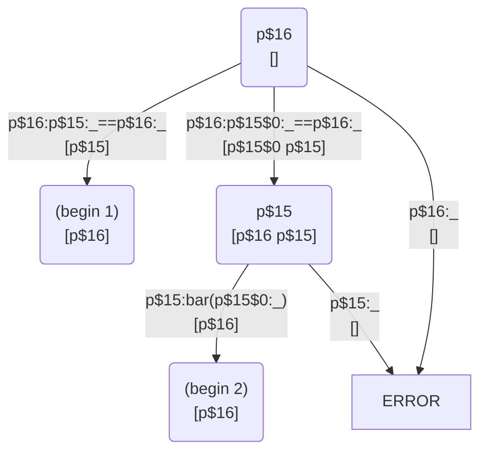

(`cekf --tpmc-mermaid` will generate the above diagram)

And the intermediate code generated is

```scheme
(lambda (p$15 p$16)
  (letrec (($tpmc38 (lambda () (error))))
    (if (eq p$15 p$16)
      (begin 1)
      (if (eq p$15$0 p$16)
        (match (tag p$15)
               ((1:bar) (begin 2))
               ((0:foo) ($tpmc38)))
        ($tpmc38)))))
```

So walking through, the matrix M and final states S will be

| M1                  | M2              | S           |
| ------------------- | --------------- | ----------- |
| `p$15`              | `p$16==p$15`    | `(begin 1)` |
| `p$15=bar(p$15$0)`  | `p$16==p$15$0`  | `(begin 2)` |

The mixture rule applies on row 1 column 2 because it is a comparison
not just a var.

So The algorithm finds two constructors in column 2, both are distict
comparisons so don't match one another.

Construction of the first arc for Row 1 compiles fine, match recurses
on `p$15` where the variable rule applies and the final state `1` is
returned, then an arc from the start state to the first final state is
constructed, labelled by the comparison:

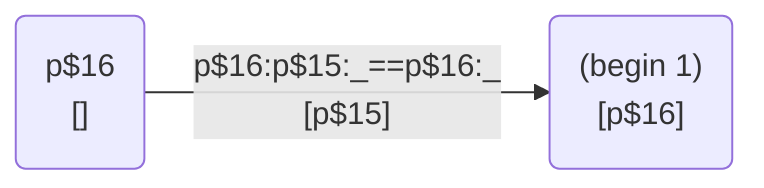

The reason this compiles ok is that `p$15` (the first `x` in of the
source function) is bound by the top-level function before the comparison
is done.

The free variable `[p$15]` on the arc is because of an earlier attempt
to fix the issue, it wouldn't be there in the vanilla implementation.

Anyway the problem occurs when compiling the second row of the matrix.
Match recurses on `p$15=bar(p$15$0)` where the mixture rule applies,
eventually resulting in an intermediate test state and arc to the final
state labelled with the constructor:

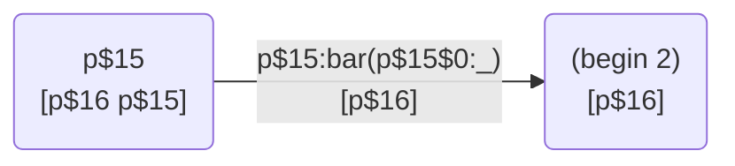

and `mixture` then prepends this with an arc from the start state,
labelled with the comparison:

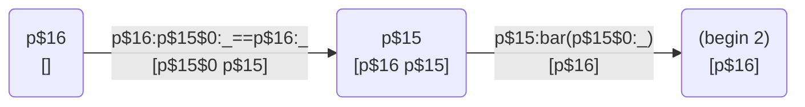

The problem is that when the intermediate code is generated, `p$15$0`
is free (not yet bound by the second match) at the time the comparison
code is emitted.

To summarise, the algorithm given the initial matrix skips past the
plain var `x` in row 1 to find column 2, which in turn results in row
2 column 2 being processed before row 2 column 1.

### Possible Solutions

One possibility, extend the algorithm so that after identifying column
2 in the above, it finally decides to process column 1 instead, because
it sees the depenancy of row 2 column 2 on row 2 column 1. In fact could
it just say "because there is a pattern in the first row, process the
first column"? I suspect not, there are potentially no constructors
in column 1, but would that be a problem? Very easy to try out and it
seems to work! The generated DFA for `fail` has one extra state, so maybe
it's less optimised, but all tests still pass and fail now works!

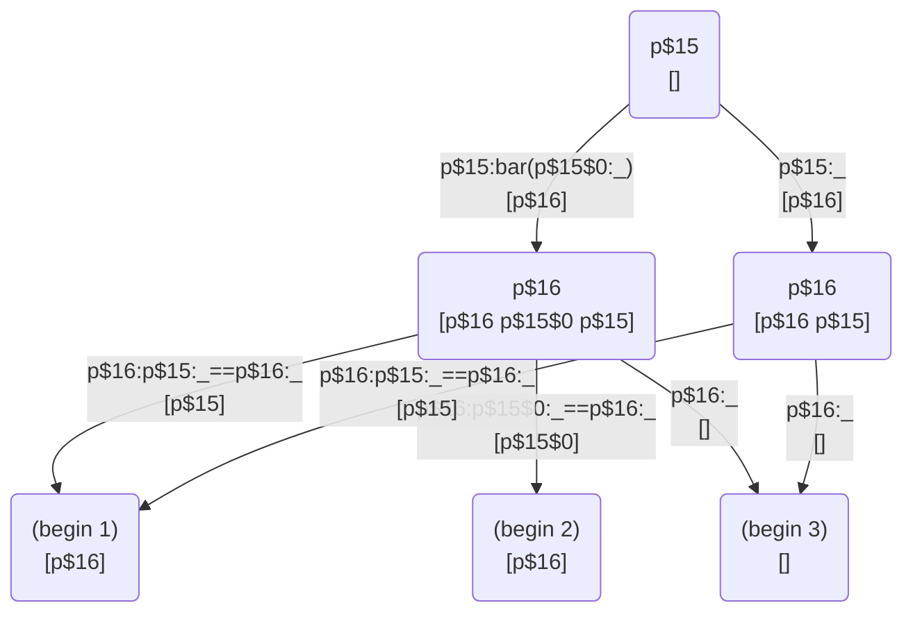
