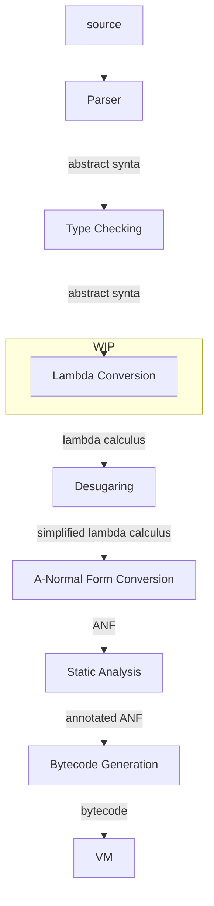
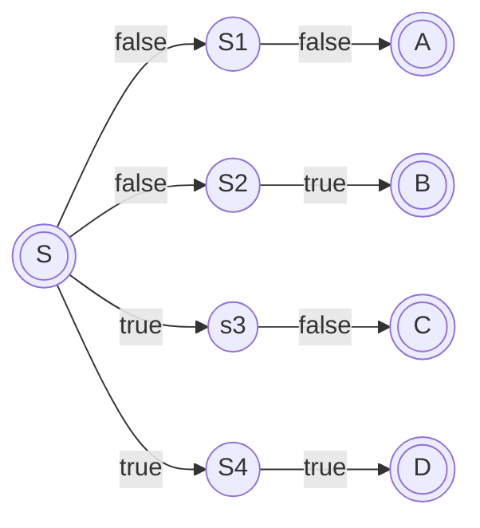
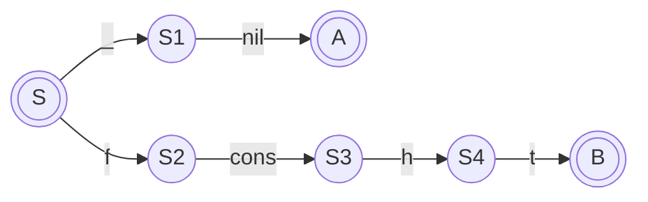
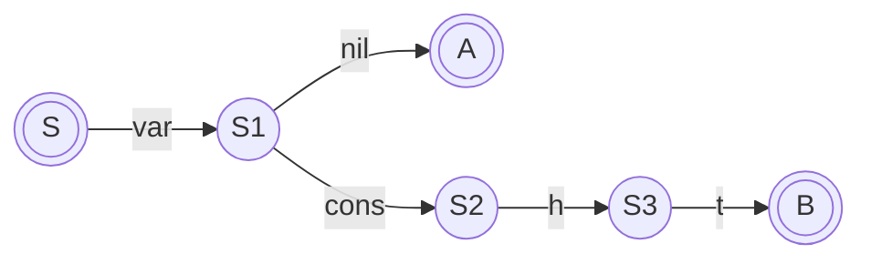
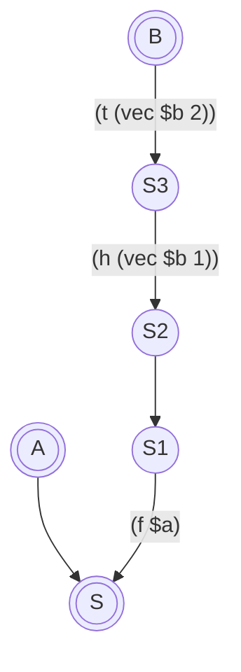
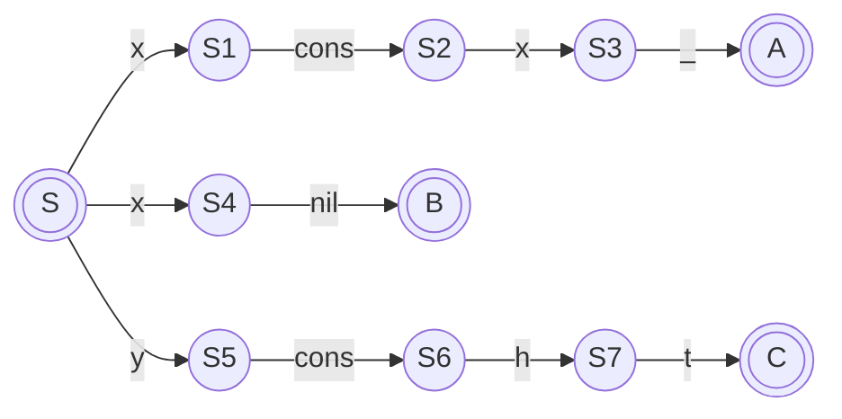
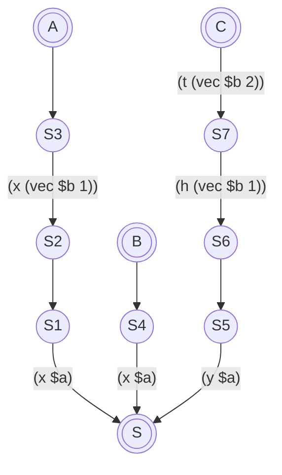
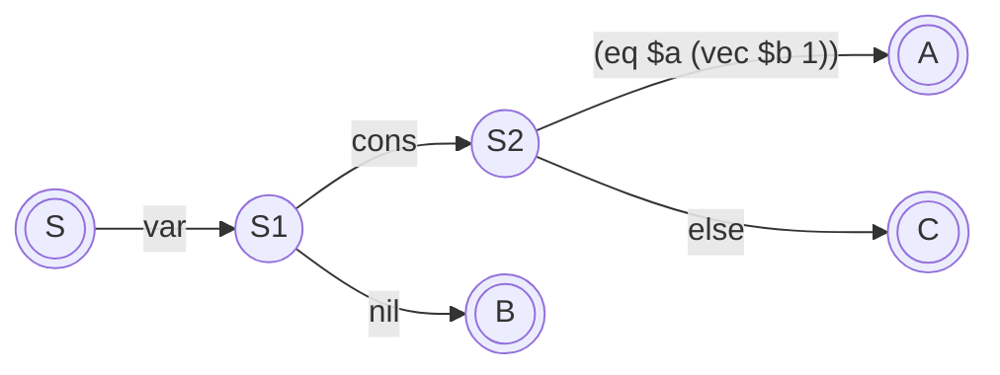

# Lambda Conversion

This is the stage after type checking where we desugar and rewrite the
input into something close to the lambda calculus, which then becomes
input to the final A-Normal form conversion to generate the structures
that are used to generate the bytecode which is input to the CEKF machine
for execution.



Mostly lambda conversion is a fairly straightforward process, a one-to-one
mapping between high-level and lower-level. However dealing with the pattern
matching of composite functions is much less so.

My current thinking is to convert the arguments to an NFA, then convert that
to a DFA, then compile that to a "parser" for the actual arguments received.
The advantages of this approach seem to be:

 1. Reqular expressions and the NFA to DFA conversion are well understood.
 2. An NFA with multiple end states is perfectly feasible (Lex/Flex for example).
 3. The resulting code should be fast.
 4. Using regular expression techniques gives us actual regular expressions in formal arguments almost for free if we want to implement them later.

So lets work through some examples to make sure it'll work.

```
fn xor {
	(false, false) { false }
	(false, true)  { true }
	(true, false)  { true }
	(true, true)   { false }
}
```

Produces an NFA:



Which in this case we can trivially convert to a DFA:


Which in turn can be trivially compiled to a nested case statement

```
(lambda ($a $b)
  (match $a (0 (match $b (0 0)
                         (1 1))
             1 (match $b (0 1)
                         (1 0)))))
```

let's try something a bit more ambitious.

```
fn map {
    (_, []) { [] }
    (f, h @ t) { f(h) @ map(f, t) }
}
```

NFA:



I think it's neccessary to include walking the structs as part of the automaton, especially
when things get more complex later.

DFA:



compiling this is much less trivial. the end result should be something like

```
(lambda ($a $b)
  (match (vec $b 0) (0 (make-vec 1 0))
                    (1 (let (f $a)
                            (let (h (vec $b 1))
                                 (let t (vec $b 2)
                                        (cons (f h) (map f t)))))))
```

The main problem is the `let` bindings. in the conversion from an NFA to a DFA we seem to have lost some information. We might have to work backwards from the final state to the NFA transition that bound the variable. In which case we might have to additionally create an annotated inversion of the NFA:



To track the variable bindings that have to be performed for each final state.

Thankfully, if this is done on the DFA, it can be done without having to cross-reference the component functions in the composite function, and doesn't have any implications for the NFA to DFA conversion.

Another example

```
fn member {
  (x, x @ _) { true }
  (x, []) { false }
  (y, h @ t) { member(y, t) }
}
```

first the DFA



Now the annotation/inversion



The NFA



The resulting lambda

```
(lambda ($a $b)
  (match (vec $a 0)
         (0 0)
         (1 (match (eq $a (vec $b 1))
                   (0 (let (x $a)
                           (let (h (vec $b 1))
                                (let (t (vec $b 2))
                                     (member x t)))))
                   (1 1)))))
```

Note the equality check has to be part of the DFA, because we don't yet
know which branch we're on so can't start binding variables that will
differ between branches.


