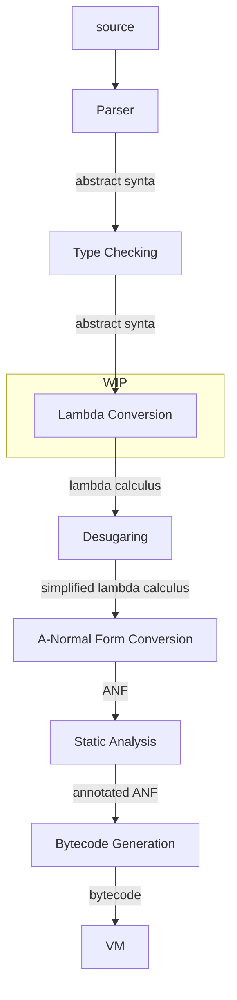
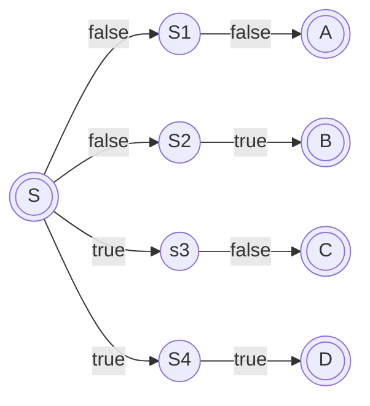
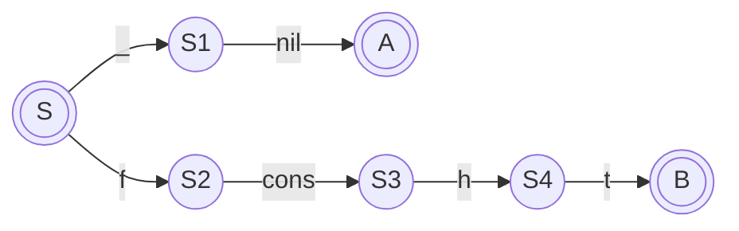
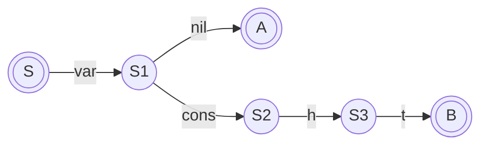
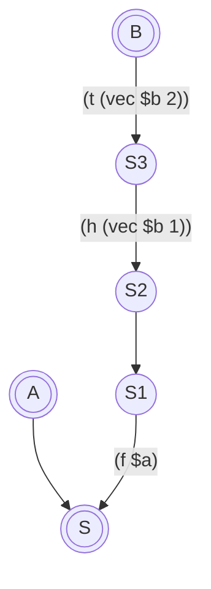
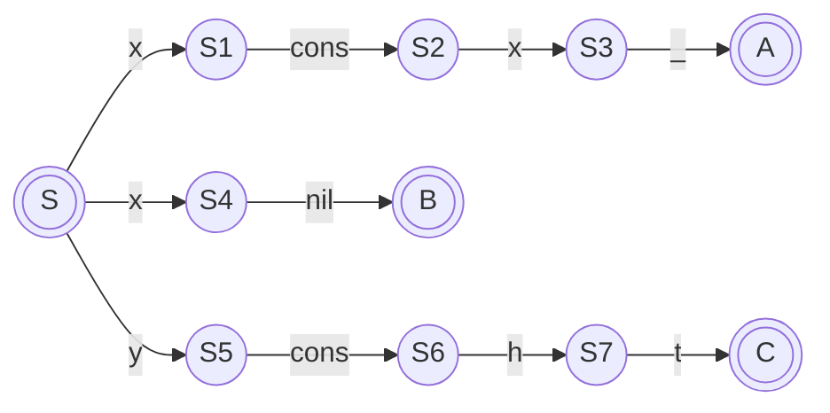
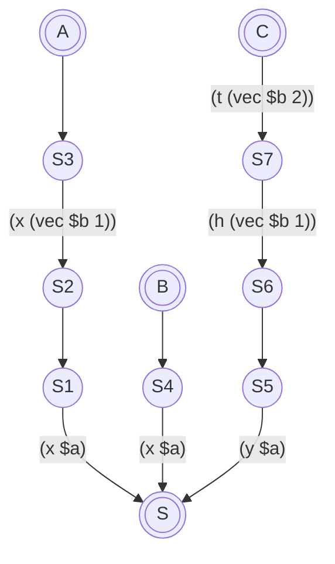
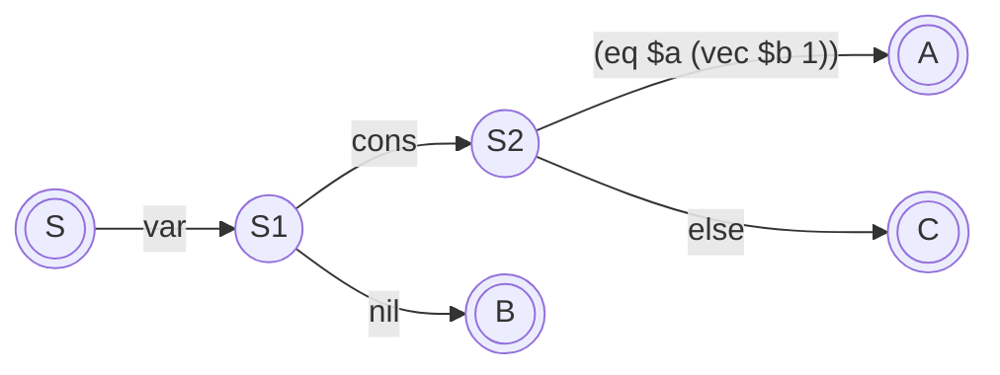

# Lambda Conversion

This is the stage after type checking where we desugar and rewrite the
input into something close to the lambda calculus, which then becomes
input to the final A-Normal form conversion to generate the structures
that are used to generate the bytecode which is input to the CEKF machine
for execution.



Mostly lambda conversion is a fairly straightforward process, a one-to-one
mapping between high-level and lower-level. However dealing with the pattern
matching of composite functions is much less so.

My current thinking is to convert the arguments to an NFA, then convert that
to a DFA, then compile that to a "parser" for the actual arguments received.
The advantages of this approach seem to be:

 1. Reqular expressions and the NFA to DFA conversion are well understood.
 2. An NFA with multiple end states is perfectly feasible (Lex/Flex for example).
 3. The resulting code should be fast.
 4. Using regular expression techniques gives us actual regular expressions in formal arguments almost for free if we want to implement them later.

So lets work through some examples to make sure it'll work.

```
fn xor {
	(false, false) { false }
	(false, true)  { true }
	(true, false)  { true }
	(true, true)   { false }
}
```

Produces an NFA:



Which in this case we can trivially convert to a DFA:


Which in turn can be trivially compiled to a nested case statement

```
(lambda ($a $b)
  (match $a (0 (match $b (0 0)
                         (1 1))
             1 (match $b (0 1)
                         (1 0)))))
```

let's try something a bit more ambitious.

```
fn map {
    (_, []) { [] }
    (f, h @ t) { f(h) @ map(f, t) }
}
```

NFA:



I think it's neccessary to include walking the structs as part of the automaton, especially
when things get more complex later.

DFA:



compiling this is much less trivial. the end result should be something like

```
(lambda ($a $b)
  (match (vec $b 0) (0 (make-vec 1 0))
                    (1 (let (f $a)
                            (let (h (vec $b 1))
                                 (let t (vec $b 2)
                                        (cons (f h) (map f t)))))))
```

The main problem is the `let` bindings. in the conversion from an NFA to a DFA we seem to have lost some information. We might have to work backwards from the final state to the NFA transition that bound the variable. In which case we might have to additionally create an annotated inversion of the NFA:



To track the variable bindings that have to be performed for each final state.

Thankfully, if this is done on the DFA, it can be done without having to cross-reference the component functions in the composite function, and doesn't have any implications for the NFA to DFA conversion.

Another example

```
fn member {
  (x, x @ _) { true }
  (x, []) { false }
  (y, h @ t) { member(y, t) }
}
```

first the DFA



Now the annotation/inversion



The NFA



The resulting lambda

```
(lambda ($a $b)
  (match (vec $a 0)
         (0 0)
         (1 (match (eq $a (vec $b 1))
                   (0 (let (x $a)
                           (let (h (vec $b 1))
                                (let (t (vec $b 2))
                                     (member x t)))))
                   (1 1)))))
```

Note the equality check has to be part of the DFA, because we don't yet
know which branch we're on so can't start binding variables that will
differ between branches.

## New Approach

None of the above pans out, there are issues with variable binding confusing the NFA to DFA converter. You can see how far I got in prototyping this in [prototyping/DFATree.py](../prototyping/DFATree.py).

The new approach is to do what Haskell perportedly does, which is to check each pattern in turn. This is certainly simpler, and we can use a beefed-up variant of `amb` to help out by backtracking when a branch doesn't match.

The basic skeleton of the generated code should be something like:

```scheme
(amb (<check branch 1> <body 1>)
     (amb (<check branch 2> <body 2>)
          (amb (<check branch 3> <body 3>)
               (error "patterns exhausted"))))
```

Each branch can be generated completely independantly of the others, and need only do a `(back)` if the args fail to match.

However there is a little problem, if such a function is backtracked through
for other reasons (normal use of `amb` by other code) then a subsequent branch
would be attempted in error.

How Prolog addresses this problem, where a branch once determined should be committed to, is to use a mechanism called a "green cut". This ensures that when a function body is backtracked out of, the entire function is backtracked out of.

We can achieve the same by having a new version of `amb` which I'm calling `escape`, and a new version of `back` which I'm calling `cut`.

`escape` is just like `amb` except it takes only one argument expression, and when backtracked to from that expression, it itself backtracks.

`cut` is a little different from a normal `back` though, when invoked, instead of just restoring the previous failure continuation, it repeatedly restores the previous continuation unlil it encounters an `escape` continuation.

The skeleton now becomes:

```scheme
(escape
  (amb (<check branch 1> (amb <body 1> (cut))
       (amb (<check branch 2> (amb <body 2> (cut))
            (amb (<check branch 3> (amb <body 3> (cut))
                 (error "patterns exhausted")))))
```

So if for example downstream code attempts to backtrack through `<body 1>`, the innermost `amb` will catch the failure and invoke `cut`, which will jump over the outer `amb` to the `escape` which will then continue to backtrack out of the entire compound function.

Let's look at some concrete examples converting familiar functions to lambdas,
first here's `map`

```scheme
; fn map {
;   (_, []) { [] }
;   (f, h @ t) { f(h) @ map(f, t) }
; }
(define map
  (lambda ($1 $2)
    (escape
      (amb (match $2
                  (nil (amb nil (cut)))
                  (pair (back))
           (amb (let (f $1)
                  (match $2
                         (nil (let (h (field $2 0))
                                (let (t (field $2 1))
                                  (amb (pair (f h) (map f t)) (cut)))))
                         (pair (back))))
                (error "patterns exhausted in function map")))))))
```

Arguments to the lambda are bound to generated symbols, which shouldn't be
lexically symbols so they can't conflict (dollar-prefix should do it).

Then the entire compound is wrapped in an escape, and a nest of `amb`s check
each branch.

`match` is a simple exhaustive case statement for types.

`field` extracts a zero-indexed field from a compound structure like `pair`.

Nested `let`s bind variables appropriately, and the body of the function is constructed within those `let` bindings, wrapped in an `amb` with a trailing `cut`.

next let's look at `member`.

```scheme
; fn member {
;   (_, []) { false }
;   (x, x @ _) { true }
;   (x, _ @ t) { member(x, t) }
; }
(define member
  (lambda ($1 $2)
    (escape
      (amb (match $2
                  (0 (amb false (cut)))
                  (1 (back)))
           (amb (let (x $1)
                  (match $2
                         (1 (if (eq x (field $2 0))
                                (amb true (cut))
                                (back)))
                         (0 (back))))
                (amb (let (x $1)
                       (match $2
                              (1 (let (t (field $2 1))
                                   (amb (member x t) (cut))))
                              (0 (back))))
                     (error "patterns exhausted in function member")))))))
```

Much the same process, The additional wrinkle is the comparison of the second
binding of `x` in the true branch, rather than just binding `x`.

There's rather an accumulation of failure continuations using this approach,
a function call not otherwise using `amb` now costs 2 failure continuations
that are likely never invoked if the application makes no use of `amb`.

Maybe there's a less costly way.

## Refinement

Leave `escape` as is, but change the behaviour of `cut`. Have `cut` now take an expression to evaluate, and *before* evaluating it, peel away all the failure
continuations up to and including the `escape`.

So instead of:

```scheme
(amb (member x t) (cut))
```

We just need:

```scheme
(cut (member x t))
```

In fact we can gain a bit more efficiency still by having `escape` merely
tag the current failure continuation, then `cut` peels back to leave that
continuation, un-tagging it instead of removing it. Any downstream backtracking
from the argument to `cut` will hit that continuation.


In fact, we probably don't even need `escape`. If the use of `cut` is restricted
to this specific situation, there will only ever be one failure continuation
installed for pattern matching, and `cut` merely restores the previous one.

## Changes to "The Math"

Complex expressions now include `cut`

$$
\begin{array}{rcl}
\mathtt{cexp} &::=& \mathtt{(aexp_0\\ aexp_1\dots aexp_n)}
\\
      &|&  \mathtt{(if\\ aexp\\ exp\\ exp)}
\\
      &|&  \mathtt{(call/cc\\ aexp)}
\\
      &|&  \mathtt{(letrec\\ ((var_1\\ aexp_1)\dots(var_n\\ aexp_n))\\ exp)}
\\
      &|&  \mathtt{(amb\\ exp\\ exp)}
\\
      &|&  \mathtt{(cut\\ exp)}
\\
      &|&  \mathtt{(back)}
\end{array}
$$

`cut` pops the topmost failure continuation and arranges for its argument to be evaluated. It would be an error if `cut` was invoked without a failure continuation in place:

$$
step(\mathtt{(cut\ exp)}, \rho, \kappa, \mathbf{backtrack}(\mathtt{exp'}, \rho', \kappa', f) = (\mathtt{exp}, \rho, \kappa, f))
$$

That's it. We won't expose `cut` as a language feature because its use is purely internal to the implementation.
