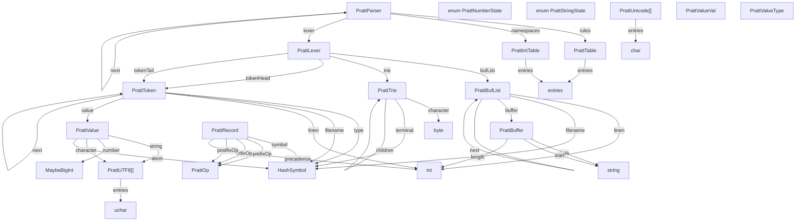

# pratt

Pratt Parser support

```mermaid
flowchart TD
PrattTable --entries--> entries
PrattIntTable --entries--> entries
PrattTrie --character--> byte
PrattTrie --terminal--> HashSymbol
PrattTrie --siblings--> PrattTrie
PrattTrie --children--> PrattTrie
PrattBuffer --data--> string
PrattBuffer --start--> string
PrattBuffer --length--> int
PrattBufList --lineno--> int
PrattBufList --filename--> HashSymbol
PrattBufList --buffer--> PrattBuffer
PrattBufList --next--> PrattBufList
PrattToken --type--> HashSymbol
PrattToken --filename--> HashSymbol
PrattToken --lineno--> int
PrattToken --value--> PrattValue
PrattToken --next--> PrattToken
PrattLexer --bufList--> PrattBufList
PrattLexer --trie--> PrattTrie
PrattLexer --tokenHead--> PrattToken
PrattLexer --tokenTail--> PrattToken
PrattParser --rules--> PrattTable
PrattParser --namespaces--> PrattIntTable
PrattParser --lexer--> PrattLexer
PrattParser --next--> PrattParser
PrattRecord --symbol--> HashSymbol
PrattRecord --prefixOp--> PrattOp
PrattRecord --infixOp--> PrattOp
PrattRecord --postfixOp--> PrattOp
PrattRecord --precedence--> int
PrattValue --string--> PrattUTF8
PrattValue --number--> MaybeBigInt
PrattValue --character--> PrattUTF8
PrattValue --atom--> HashSymbol
PrattNumberState["enum PrattNumberState"]
PrattStringState["enum PrattStringState"]
PrattUTF8["PrattUTF8[]"] --entries--> uchar
PrattUnicode["PrattUnicode[]"] --entries--> char
PrattValueVal
PrattValueType
```

> Generated from src/pratt.yaml by tools/makeAST.py
