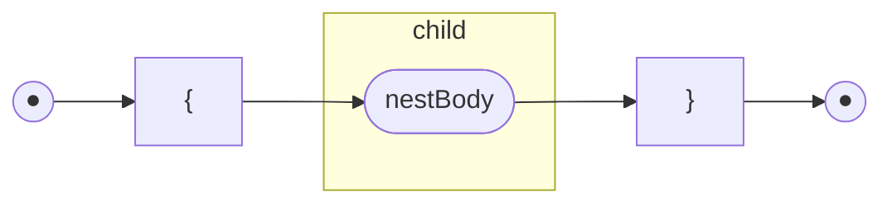
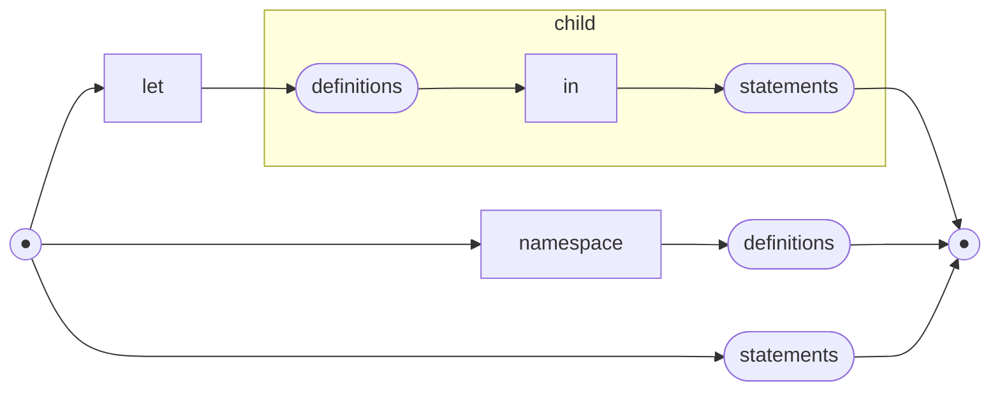
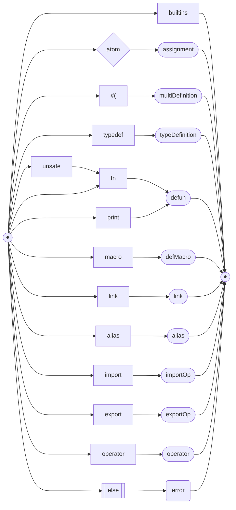
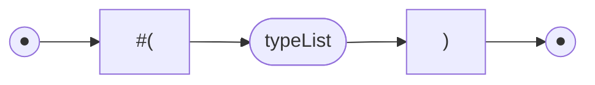
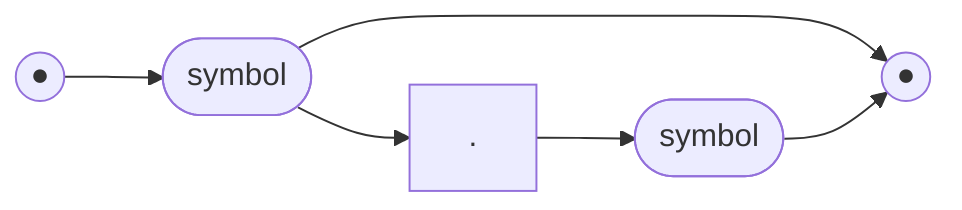

# Railroad Diagrams of F♮ Syntax

## Top Level Stuff

### nest



* [nestBody](#nestbody)

### nestBody



* [definitions](#definitions)
* [statements](#statements)

### definitions


* [definition](#definition)
* [definitions](#definitions)

### statements


* [expression](#expression)
* [statements](#statements)

### definition



* [assignment](#assignment)
* [multiDefinition](#multidefinition)
* [typeDefinition](#typedefinition)
* [defun](#defun)
* [defMacro](#defmacro)
* [link](#link)
* [alias](#alias)
* [importOp](#importop)
* [exportOp](#exportop)
* [operator](#operator)

### expression


`expressionPrecedence` is the core Pratt Parser algorithm, and `synchronize` attempts to
resume parsing in the case of an error.

* [expressionPrecedence](#expressionprecedence)

### assignment


* [expression](#expression)

### multiDefinition


 The `#(` has already been consumed before entering this routine, and `symbolList`
 consumes the matching close `)`.

* [symbolList](#symbollist)
* [expression](#expression)

## Types

### typeDefinition


* [typeVariables](#typevariables)
* [typeBody](#typebody)

### typeVariables


* [typeVariable](#typevariable)
* [typeVariables](#typevariables)

### typeVariable


### typeBody


* [typeConstructor](#typeconstructor)
* [typeBody](#typebody)

### typeConstructor


* [typeList](#typelist)
* [typeMap](#typemap)

### typeList


* [typeType](#typetype)
* [typeList](#typelist)

### typeType


* [typeClause](#typeclause)
* [typeType](#typetype)

### typeClause


* [typeVariable](#typevariable)
* [typeFunction](#typefunction)
* [typeTuple](#typetuple)

### typeFunction


* [scopedSymbol](#scopedsymbol)
* [typeList](#typelist)

### typeMap


* [typeType](#typetype)
* [typeMap](#typemap)

### typeTuple



* [typeList](#typelist)

## Other Bits

### scopedSymbol



### defun

```mermaid
flowchart LR
s(("●"))
e(("●"))
s --> symbol([symbol]) --> cf([compositeFunction]) --> e
```

The `fn` token has already been consumed. There is more going on here than is apparent in the diagram since
the `defun` parser is being passed extra arguments regarding the type of definition (`unsafe` or `print` etc.)

* [compositeFunction](#compositefunction)

### compositeFunction

```mermaid
flowchart LR
s(("●"))
e(("●"))
s --> lcurly["{"] --> functions([functions]) --> rcurly["}"] --> e
s --> af([altFunction]) --> e
```

* [functions](#functions)
* [altFunction](#altfunction)

### functions

```mermaid
flowchart LR
s(("●"))
e(("●"))
s --> af([altFunction])
af --> open{"("} --> fns([functions]) --> e
af --> e
```

* [functions](#functions)
* [altFunction](#altfunction)

### altFunction

```mermaid
flowchart LR
s(("●"))
e(("●"))
s --> altArgs([altArgs]) --> nest([nest]) --> e
```

* [altArgs](#altargs)
* [nest](#nest)

### altArgs

```mermaid
flowchart LR
s(("●"))
e(("●"))
s --> fargs([fargs])
fargs --> pipe["|"] --> aa([altArgs]) --> e
fargs --> e
```

* [fargs](#fargs)
* [altArgs](#altargs)

### fargs

```mermaid
flowchart LR
s(("●"))
e(("●"))
s --> open["("] --> expressions([expressions]) --> close[")"] --> e
```

* [expressions](#expressions)

### expressions

```mermaid
flowchart LR
s(("●"))
e(("●"))
s --> ca([collectArguments]) --> e
```

* [collectArguments](#collectarguments)

### collectArguments

```mermaid
flowchart LR
s(("●"))
e(("●"))
s --> ep[/expressionPrecedence\]
ep --> comma[","]
comma --> e
comma --> ca([collectArguments]) --> e
ep --> e
```

* [collectArguments](#collectarguments)
* [expressionPrecedence](#expressionprecedence)

### defMacro

```mermaid
flowchart LR
s(("●"))
e(("●"))
s --> symbol([symbol]) --> af([altFunction]) --> e
```

The `macro` token has already been consumed.
The `defMacro` parser only recognises a single `altFunction` (alternative function body of a composite function).

* [altFunction](#altfunction)

### link

```mermaid
flowchart LR
s(("●"))
e(("●"))
s --> rawString([rawString]) --> as --> symbol([symbol]) --> e
```

### alias

```mermaid
flowchart LR
s(("●"))
e(("●"))
s --> symbol([symbol]) --> assign["="] --> typeType([typeType]) --> e
```

* [typeType](#typetype)

### importOp

```mermaid
flowchart LR
s(("●"))
e(("●"))
s --> symbol([symbol])
symbol --> operators --> e
symbol --> operator --> rs([rawString]) --> e
```

### exportOp

```mermaid
flowchart LR
s(("●"))
e(("●"))
s --> operators --> e
s --> operator --> str([rawString]) --> owp([operatorWithPattern]) --> e
```

* [operatorWithPattern](#operatorwithpattern)

### operator

```mermaid
flowchart LR
s(("●"))
e(("●"))
s --> str([rawString]) --> owp([operatorWithPattern]) --> e
```

* [operatorWithPattern](#operatorwithpattern)

### operatorWithPattern

```mermaid
flowchart LR
s(("●"))
e(("●"))
s --> number[NUMBER] --> expr([expression]) --> e
```

* [expression](#expression)

### symbolList

```mermaid
flowchart LR
s(("●"))
e(("●"))
s --> close[")"] --> e
s --> ATOM
ATOM --> comma[","] --> sl([symbolList]) --> e
ATOM --> close
```

The opening `(`  or `#(` has already been consumed.

* [symbolList](#symbollist)

## expressionPrecedence

This is different from the rest of the parser in that it is table-driven. Entries
in the table are tokens and are associated with prefix, infix and postfix operators.

This is a precis of that table with links to the relevant parselets. There are no
built-in postfix operators so that column is omitted, as are entries where there
are no parselets. Parselets which do no further parsing, such as `makeAtom`, are present
but do not link to a railroad diagram.

| Token | Prefix | Infix |
| ----- | ------ | ----- |
| `->` | | [infixRight](#infixright) |
| `assert` | [pAssert](#passert) | |
| `=` | | [exprAlias](#expralias) |
| atom | makeAtom | |
| `back` | back | |
| char | makeChar | |
| `#` | [doPrefix](#doprefix) | |
| `if` | [iff](#iff) | |
| `error` | [error](#error) | |
| `{` | [nestExpr](#nestexpr) | [makeStruct](#makestruct) |
| `[` | [list](#list) | |
| `macro` | [macro](#macro) | |
| number | makeNumber | |
| `(` | [grouping](#grouping) | [call](#call) |
| `.` | | [lookUp](#lookup) |
| `print` | [print](#print) | |
| string | makeString | |
| `switch` | [switchExp](#switchexp) | |
| `#(` | [tuple](#tuple) | |
| `typeof` | [typeOfExp](#typeofexp) | |
| `unsafe` | [unsafe](#unsafe) | |
| `_` | wildCard | |

### infixRight

```mermaid
flowchart LR
s(("●"))
e(("●"))
s --> ep[/expressionPrecedence\] --> e
```

* [expressionPrecedence](#expressionprecedence)

### pAssert

```mermaid
flowchart LR
s(("●"))
e(("●"))
s --> ep[/expressionPrecedence\] --> e
```

* [expressionPrecedence](#expressionprecedence)

### exprAlias

```mermaid
flowchart LR
s(("●"))
e(("●"))
s --> ep[/expressionPrecedence\] --> e
```

* [expressionPrecedence](#expressionprecedence)

### doPrefix

```mermaid
flowchart LR
s(("●"))
e(("●"))
s --> ep[/expressionPrecedence\] --> e
```

* [expressionPrecedence](#expressionprecedence)

### iff

```mermaid
flowchart LR
s(("●"))
e(("●"))
s --> open["("] --> test([expression]) --> close[")"]
--> cons([nest]) --> else["else"]
else --> alt([nest]) --> e
else --> if --> iff([iff]) --> e
```

* [expression](#expression)
* [nest](#nest)
* [iff](#iff)

### error

```mermaid
flowchart LR
s(("●"))
e(("●"))
s --> ep[/expressionPrecedence\] --> e
```

* [expressionPrecedence](#expressionprecedence)

### nestExpr

```mermaid
flowchart LR
s(("●"))
e(("●"))
subgraph child
body([nestBody]) --> rcurly["}"]
end
s --> body
rcurly --> e
```

* [nestBody](#nestbody)

### makeStruct

```mermaid
flowchart LR
s(("●"))
e(("●"))
s --> te([taggedExpressions]) --> rcurly["}"] --> e
```

* [taggedExpressions](#taggedexpressions)

### list

```mermaid
flowchart LR
s(("●"))
e(("●"))
s --> cons([consList]) --> rsq["]"] --> e
```

* [consList](#conslist)

### consList

```mermaid
flowchart LR
s(("●"))
e(("●"))
s --> rsq{"]"} --> e
s --> expr([expression])
expr --> comma[","] --> cl([consList]) --> e
expr --> cl
```

Clearly this is wrong and needs fixing.

### taggedExpressions

```mermaid
flowchart LR
s(("●"))
e(("●"))
s --> symbol([symbol]) --> colon[":"] --> ep[/expressionPrecedence\]
ep --> comma[","]
comma --> e
comma --> te([taggedExpressions]) --> e
ep --> e
```

* [expressionPrecedence](#expressionprecedence)
* [taggedExpressions](#taggedexpressions)

### macro

```mermaid
flowchart LR
s(("●"))
e(("●"))
s --> error(error) --> e
```

Explicit dissalow on creating macros as expressions.

### grouping

```mermaid
flowchart LR
s(("●"))
e(("●"))
s --> ep[/expressionPrecedence\] --> close[")"] --> e
```

* [expressionPrecedence](#expressionprecedence)

### call

```mermaid
flowchart LR
s(("●"))
e(("●"))
s --> exps([expressions]) --> close[")"] --> e
```

* [expressions](#expressions)

### lookUp

```mermaid
flowchart LR
s(("●"))
e(("●"))
s --> ep[/expressionPrecedence\] --> e
```

* [expressionPrecedence](#expressionprecedence)

### print

```mermaid
flowchart LR
s(("●"))
e(("●"))
s --> ep[/expressionPrecedence\] --> e
```

* [expressionPrecedence](#expressionprecedence)

### switchExp

```mermaid
flowchart LR
s(("●"))
e(("●"))
s --> sfc([switchFC]) --> e
```

Although this looks redundant, `switchFC` is shared with other parselets, and
`switchExp` wraps the result in a different type.

* [switchFC](#switchfc)

### switchFC

```mermaid
flowchart LR
s(("●"))
e(("●"))
s --> open["("] --> exprs([expressions]) --> close[")"]
--> cf([compositeFunction]) --> e
```

* [expressions](#expressions)
* [compositeFunction](#compositefunction)

### tuple

```mermaid
flowchart LR
s(("●"))
e(("●"))
s --> exprs([expressions]) --> close[")"] --> e
```

* [expressions](#expressions)

### typeOfExp

```mermaid
flowchart LR
s(("●"))
e(("●"))
s --> ep[/expressionPrecedence\] --> e
```

* [expressionPrecedence](#expressionprecedence)

### unsafe

```mermaid
flowchart LR
s(("●"))
e(("●"))
s --> fn --> cf([compositeFunction]) --> e
s --> switch --> sw([switchFC]) --> e
```

* [compositeFunction](#compositefunction)
* [switchFC](#switchfc)
