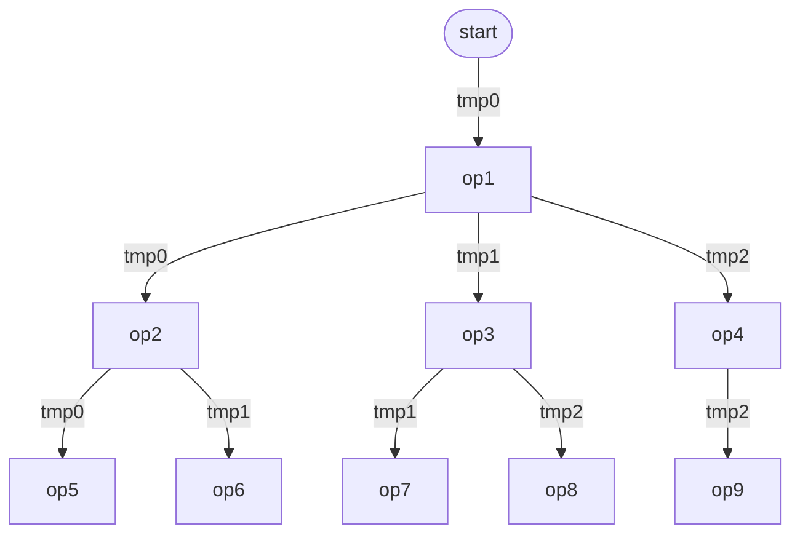
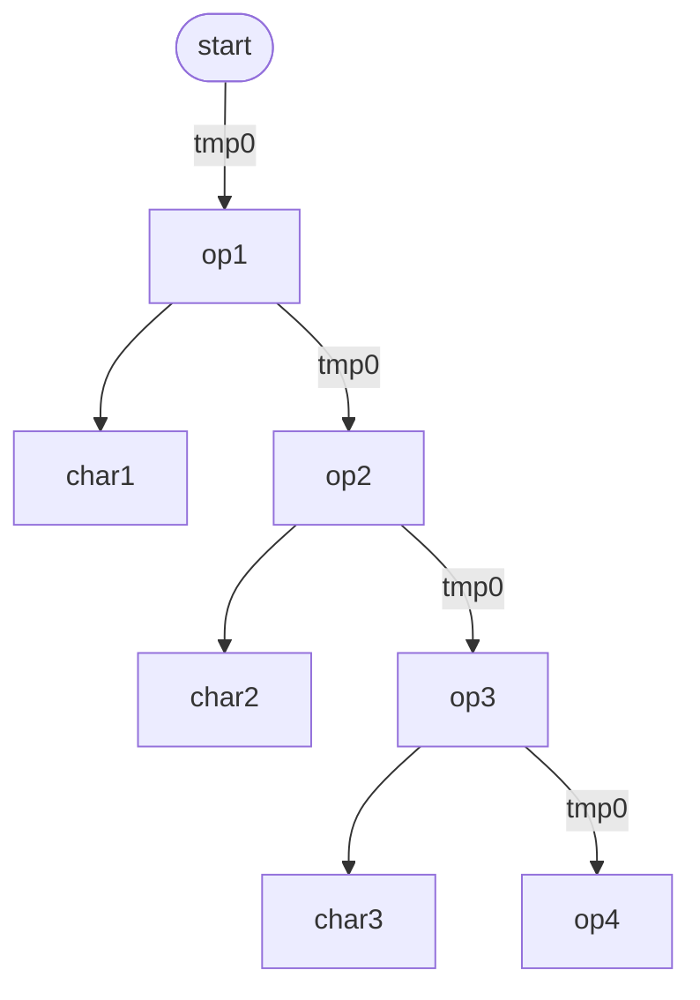
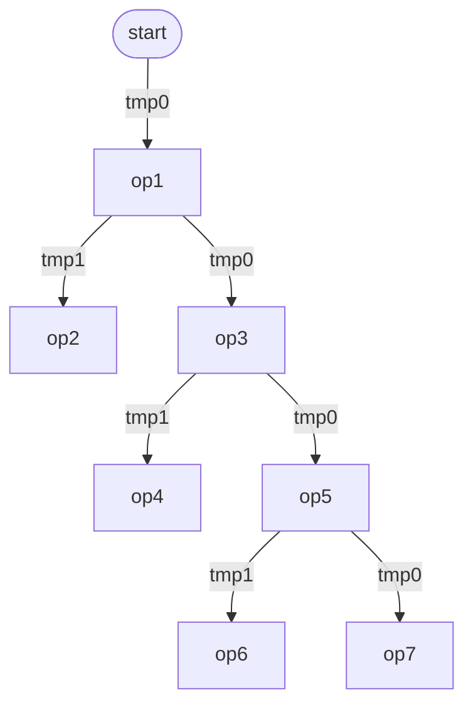

# Target C as a Compilation Step

As a stopgap before targetting LLVM, but also as a useful exercise that
might inform the LLVM work, I'd like to attempt to generate a standalone
`main` function from the MinExp (`minlam.yaml`) structures after CPS
transformation and closure conversion.

This seems reasonable as CPS allows all function calls to be replaced
with `goto`, and the closure conversion means that all variable access
is local.

Also the recent AMB transform has "un-magic'd" the `amb` operator
to a plain failure continuation passed along with, and to, the CPS
continuation.

It is envisaged that lambdas will be stored in `Value`s as computed gotos:
`void *` pointers created with the gcc/clang `&&LABEL` syntax.

Before we can proceed, we need to decide how to represent, and where
to store, local variables. The "env" structures that are generated as
a result of closure-conversion have been desugared to simple `make-vec`
calls, and the dereferencing of their contents to primitive `VEC` indexed
O(1) lookups. Those envs in turn are either contained by other envs or
directly by local variables so it all comes down to how local variables
are handled.

I *think* that in turn devolves to the choice between a register machine
and a stack.

Once that decision is made, and the details are thrashed out, the next
step is likely to be a variable-annotation pass to convert variables
to locations. After that the C code generation should be fairly
straightforward.

## Update

After consultation, the decision is some sort of register machine, as
a stack is overkill for a known set of variables. The best solution
for performance is a set of named C variables allowing direct access,
but probably an array is more pragmatic as it can be memory-managed
more easily.

Annotation is implemented in `src/minlam_annotate.[ch]` and wired into
`main`.

## Next Steps

### Design the Code Layout

This is just thinking out loud at the moment, no commitment.
Also we're not addressing garbage collection yet, that will need
to be layered on top of this design.

#### `letrec`

```yaml
    MinLetRec:
        data:
            bindings: MinBindings
            body: MinExp

    MinBindings:
        data:
            var: HashSymbol
            val: MinExp
            arity: int=-1
            next: MinBindings
```

| LABEL | INSTRUCTION | Comment |
| --- | --- | --- |
| | `goto SETUP_LETREC_1;` | Jump over the bindings. |
| `LETREC_{FUNCNAME_1}:` | | Use binding names to keep it readable |
| | `...` | Whatever the binding code does |
| `LETREC_{FUNCNAME_2}:` | | |
| | `...` | |
| `SETUP_LETREC_1:` | | Assign the registers |
| | `reg[4] = &&LETREC_{FUNCNAME_1};` | may not start from 0 because of outer lambda bindings and letrecs |
| | `reg[5] = &&LETREC_{FUNCNAME_2};` | |
| | `...` | Body of the `letrec` |

Currently letrec-bound variables (and formal lambda arguments) are not
annotated, it would seem to make sense to annotate those too to make the
`SETUP_LETREC_n` section simpler to generate. However formal arguments
are a `SymbolList` not a `MinExprList` so we'd need to have a distinct
`AnnotatedLambda` type. Also `MinBindings` only hold `HashSymbols`.
Probably the simplest solution is to have the `VisitorContext` include the
current number of vars in use, reset to `countSymbolList(lambda->args)`
on entry to a lambda and incremented by the letrec (letrecs can nest).

On a related topic, a visitor should non-destructively walk the code using
that same logic, colleting the max registers in use for the top-level
`Value reg[MAX_REGISTERS];`.

#### `apply`

```yaml
    MinApply:
        data:
            function: MinExp
            args: MinExprList
            isBuiltin: bool=false
            cc: bool=false
```

| LABEL | INSTRUCTION | Comment |
| --- | --- | --- |
| | `{` | scope |
| | `Value tmp0 = ...;` | collect arguments |
| | `Value tmp1 = ...;` | |
| | `goto AFTERFN_<n>;` | jump over fn |
| | `...` | body of fn |
| `AFTERFN_<n>:` | | |
| | `Value function = ...;` | compute fn |
| | `reg[0] = tmp0;` | assign to registers |
| | `reg[1] = tmp1;` | |
| | `void *ptr = function.addr;` | new value type for computed gotos |
| | `goto *ptr;` | call the func |
| | `}` | scope |

### Concrete Example

```shell
bin/fn -e 'let fn add(a, b) { a + b } in add(2, 3)'
```

```scheme
(letrec
  (
    (add$0$arity_2
      (make-vec
        (λ (env$388 p$110$0 p$111$0 k$213 f$387)
          ((vec 0 k$213<3>) (vec 1 k$213<3>) (+ p$110$0<1> p$111$0<2>) f$387<4>))
        (make-vec)))
    (add$0
      (make-vec
        (λ (env$390 p$110$0 k$211 f$388)
          ((vec 0 k$211<2>) (vec 1 k$211<2>)
            (make-vec
              (λ (env$389 p$111$0 k$212 f$389)
                ((vec 0 k$212<2>) (vec 1 k$212<2>) (+ (vec 0 env$389<0>) p$111$0<1>) f$389<3>))
              (make-vec p$110$0<1>)) f$388<3>))
        (make-vec))))
  ((vec 0 add$0$arity_2<136>) ;; add
    (vec 1 add$0$arity_2<136>) ;; env
    2 ;; arg
    3 ;; arg
    (make-vec ;; halt
      (λ (env$392 k$0 f$390)
        (done))
      (make-vec))
    (make-vec ;; fail
      (λ (env$391)
        (done))
      (make-vec))))
```

AI-generated output

```c
Value reg[MAX_REGISTERS];

// ===== letrec bindings (the lambda bodies) =====

// --- add body: (λ (env$388<0> a<1> b<2> k<3> f<4>) ...) ---
LETREC_add_arity_2:
{
    // body: ((vec 0 k<3>) (vec 1 k<3>) (+ a<1> b<2>) f<4>)
    // This calls continuation k with (a + b), passing f along.
    //
    // k is a closure (2-vec) in reg[3].
    // The call target is k's code:   vec 0 of reg[3]
    // The call passes:
    //   arg 0 (env):    vec 1 of reg[3]   -- k's captured env
    //   arg 1 (result): a + b             -- the computed value!
    //   arg 2 (fail):   reg[4]            -- thread the failure cont through

    void *target = reg[3].vec[0];   // k's code label
    Value env    = reg[3].vec[1];   // k's env
    Value result = add(reg[1], reg[2]);  // a + b
    Value fail   = reg[4];

    reg[0] = env;       // callee's param 0: env
    reg[1] = result;    // callee's param 1: the answer (5)
    reg[2] = fail;      // callee's param 2: fail cont
    goto *target;       // jump to k's code
}

// --- halt continuation: (λ (env$392<0> k$0<1> f<2>) (done)) ---
HALT_CONT:
{
    // The program is finished. reg[1] holds the result value.
    // reg[0] is env (empty), reg[2] is fail (unused).
    printf("%d\n", reg[1].integer);  // or however done prints
    exit(0);
}

// --- fail continuation: (λ (env$391<0>) (done)) ---
FAIL_CONT:
{
    // Backtracking exhausted. No solution.
    // reg[0] is env (empty). No other args.
    exit(1);  // or however failure is signaled
}

// ===== letrec setup =====
SETUP_LETREC:
    // Build the closure for add$0$arity_2: [&&LETREC_add_arity_2, []]
    reg[ADD_REG] = make_2vec(&&LETREC_add_arity_2, make_vec(/*empty*/));

// ===== body of the letrec: the top-level call =====
{
    // ((vec 0 add<R>) (vec 1 add<R>) 2 3 halt_closure fail_closure)
    //
    // Build halt closure: [&&HALT_CONT, []]
    Value halt = make_2vec(&&HALT_CONT, make_vec(/*empty*/));
    // Build fail closure: [&&FAIL_CONT, []]
    Value fail = make_2vec(&&FAIL_CONT, make_vec(/*empty*/));

    void *target = reg[ADD_REG].vec[0];  // &&LETREC_add_arity_2
    Value env    = reg[ADD_REG].vec[1];  // [] (empty env)

    reg[0] = env;          // env$388
    reg[1] = int_val(2);   // a
    reg[2] = int_val(3);   // b
    reg[3] = halt;         // k (the halt continuation closure)
    reg[4] = fail;         // f (the fail continuation closure)
    goto *target;          // jumps to LETREC_add_arity_2
}
```

So to summarize, any lambda body in a letrec gets added to a big bag of lambdas
that are all written to main with their binding names as labels. Any other anonymous
lambdas have a label invented for them and also added to the big bag. All the make-vec
code that creates the lambda closures and installs them in their registers is added
to a local bag and written to the preamble of the letrec concerned, and the body of
the letrec is appended.

## Structures we will need

An `Opaque` wrapper around a membuf:

```c
typedef struct EmitBuffer {
  FILE *fh;
  char *buffer;
  size_t size;
} EmitBuffer;
```

We can use lower-level ALLOCATE/FREE macros to manage this, it can't be directly
memory managed (can't have a header) because the mark/sweep isn't smart enough
to clean it up.

```c
EmitBuffer *newEmitBuffer() {
  EmitBuffer *result = ALLOCATE(EmitBuffer);
  result->buffer = NULL;
  result->size = 0;
  result->fh = open_memstream(&result->buffer, &size);
  return result;
}

char *getEmitBuffer(EmitBuffer *buffer) {
  fflush(buffer->fh);
  return buffer->buffer;
}

void cleanEmitBuffer(void *buffer) {
  EmitBuffer *b = (EmitBuffer *)buffer;
  fclose(b->fh);
  free(b->buffer);
  FREE(b);
}

void printEmitBuffer(void *buffer) {
  EmitBuffer *b = (EmitBuffer *)buffer;
  fflush(b->fh);
  if (b->buffer != NULL)
    eprintf("%s", b->buffer);
}

EmitBuffer *buffer = newEmitBuffer();

Opaque *container = newOpaque(buffer, cleanEmitBuffer, printEmitBuffer, NULL);
int save = PROTECT(container); // back in a safe place
```

We should probably bundle the EmitBuffer and Opaque wrapper creation, and
the get and put operations too.

```c
static inline Opaque *newOpaque_EmitBuffer() {
  EmitBuffer *buffer = newEmitBuffer();
  return newOpaque(buffer, cleanEmitBuffer, printEmitBuffer, NULL);
}

static inline char *opaqueEmitBufferContent(Opaque *container) {
  return getEmitBuffer((EmitBuffer *)container->data);
}

static inline FILE *opaqueEmitBufferFh(Opaque *container) {
  return ((EmitBuffer *)(container->data))->fh;
}

```

We're going to need a new `emit.yaml` to hold memory-managed helpers:

```yaml
structs:
  EmitContext:
    meta:
      brief: VisitorContext for emitMinExp
    data:
      lambdas: BufferBag
      letrecBindings: BufferBag
      body: opaque
      maxReg: int=0

hashes:
  BufferBag:
    data:
      entries: opaque

primitives: !include primitives.yaml
```

## Temporary Variables

After the initial implementation attempt, one problem that becomes very apparent
is the huge proliferation of temporary variables. These are the results of holding
intermediate results of primitive operations. We mitigate that to an extent by
categorizing primitive operations as atomic or non-atomic, where atomic operations
do not require memory allocation and the operation can be directly substituted for
the variable use. However there are still many many temps created.

Instead of creating temps on the fly, it is envisaged
that an initially empty pool is created. At the end
of processing, all temps in that pool are declared at
the top-level of `main()`.

Let's look at a hypothetical tree of primitive operations and try to analyse the
minimum number of temps that would be needed to perform the operations.



* When `start` requests a temp it gets `tmp0`.
* When `op1` requests a temp it also gets `tmp0`.
* When `op1` requests a second temp it gets `tmp1`.

That might be the insight, temps are claimed by assignment **to**, and released by assignment **from**.

Assuming depth first left to right RPN, the sequence is:

| STEP | TEMPS IN USE |
| --- | --- |
| `op5` claims `tmp0` | `tmp0` |
| `op6` claims `tmp1` | `tmp0`, `tmp1` |
| `op2` releases `tmp0` and `tmp1`; claims `tmp0` | `tmp0` |
| `op7` claims `tmp1` | `tmp0`, `tmp1` |
| `op8` claims `tmp2` | `tmp0`, `tmp1`, `tmp2` |
| `op3` releases `tmp1` and `tmp2`; claims `tmp1` | `tmp0`, `tmp1` |
| `op9` claims `tmp2` | `tmp0`, `tmp1`, `tmp2` |
| `op4` releases `tmp2`, claims `tmp2` | `tmp0`, `tmp1`, `tmp2` |
| `op1` releases `tmp0`, `tmp1` and `tmp2`; claims `tmp0` | `tmp0` |

The current pattern is something like:

```c
// foreach arg expr
  if (!isAtomic(expr)) {
    HashSymbol target = genSym("tmp_");
    emit("Value %s;", target);
    emitSimpleExpr(expr, target); // emits the assignment to target
  }
// end foreach
emit("%s(", op);
// foreach arg expr
  if (isAtomic(expr)) {
    emitAtomic(expr); // perform operation in-place
  } else {
    emit("%s", target)
  }
// end foreach
emit(")");
```

So the complication is that the `emitSimpleExpr` is recursive, and the current pattern requires that the temp target is declared up-front.

Rather than accepting an ordained target (which has been claimed too
early), we should instead return the target. This is probably going to
be an `Opaque` wrapper around an `EmitBuffer` rather than a `char*`,
simply because it's more convenient for fprintf etc.  The "target" then
becomes either a temp variable name or an atomic expression.  Either way
it is slotted in to the argument list of the containing expression.

### Problem - right-associative operators

Arrays are lists and the cons operator is right-associative.
That means to build an array of non-atomic elements requires as many temps as there are elements.


Thankfully this is not true for strings, since chars are atomic they do not require
temps:



But returning to arrays in general, if we traverse right to left, we only need two temps:



It might be adequate to traverse all make-vec right to left for the common case of
arrays, but the smarter approach would be to choose the longer path first. This might not
be too inneficient if we compare lengths in tandem and stop when the shorter path expires,
choosing the longer one.

Of course this will need to generalise to vecs of any width.

## Outstanding Issues

### Memory Management

We've completely ignored issues of protecting intermediate values from
being garbage collected. It would be relatively simple to add a `markReg`
to iterate over the registers, but protecting, and the more difficult
unprotecting of temps is not addressed.

I'm wondering if it might not be easier to re-purpose the current temps
system to instead use the free registers above the current call frame.

We keep the concept of `claimTemp()` and `releaseTemp()`, but each lambda
starts with a fresh empty register set. That means the `copyContext()`
for lambdas gets a fresh symbols hash, or whatever the replacement is.
Let's write a replacement from scratch rather than rewriting the exiting
one, using new `claimSlot()` and `releaseSlot()` functions.  The lambda
first makes cals to `claimSlot()` for as many slots as it needs to
perform its `goto`, then additional `claimSlot()` and `releaseSlot()`
calls to get temporary registers.

The context `currentDepth` can be the source of fresh slots.

The `claimSlot()` function would do pretty much the same thing that
`claimTemp()` does, except the `BoolMap` would be replaced with a
`SlotMap`, where `Slot` is a struct:

```yaml
structs:
  Slot:
    meta:
      description: Represents a register allocation
    data:
      isAvailable: bool
      text: SCharArray
```

```c
static HashSymbol *claimSlot(EmitterContext *context) {
    HashSymbol *result = NULL;
    Slot *slot = NULL;
    Index i = 0;
    while ((result = iterateSlotMap(context->slots, &i, &slot)) != NULL) {
        if (slot->isAvailable) {
            slot->isAvailable = false;
            return result;
        }
    }
    result = genSym("tmp_");
    SCharArray *text = newSCharArray():
    int save = PROTECT(text);
    char buf[64];
    sprintf(buf, "reg[%d]", context->currentDepth);
    incrDepth(context);
    for (char *c = buf; *c; c++) {
      pushSCharArray(text, *c);
    }
    pushSCharArray(text, '\0');
    slot = newSlot(false, text);
    PROTECT(slot);
    setSlotMap(context->slots, result, slot);
    UNPROTECT(save);
    return result;
}
```

`releaseSlot()` and `releaseSlotSymbol()` are also similar:

```c
static void releaseSlotSymbol(HashSymbol *temp, EmitterContext *context) {
    Slot *slot = NULL;
    if (getSlotMap(context->slots, temp, &slot)) {
      slot->isAvailable = true;
    } else {
      cant_happen("slot not found");
    }
}

static void releaseSlot(EmitResult *result, EmitterContext *context) {
    if (isEmitResult_Buf(result))
        return;
    releaseSlotSymbol(getEmitResult_Var(result), context);
}
```

but we'll need an additional `getSlot()` for the slot:

```c
static Slot getSlot(HashSymbol *temp, EmitterContext *context) {
    Slot *slot = NULL;
    if (getSlotMap(context->slots, temp, &slot)) {
      return slot;
    } else {
      cant_happen("slot not found");
    }
}
```

and `emitResultText()` would need to take an additional context:

```c
static char *emitResultText(EmitResult *data, EmitterContext *context) {
    switch (data->type) {
    case EMITRESULT_TYPE_BUF:
        return opaqueEmitBufferContent(getEmitResult_Buf(data));
    case EMITRESULT_TYPE_VAR:
        return getSlot(getEmitResult_Var(data), context)->text->entries;
    default:
        cant_happen("unrecognised %s", emitResultTypeName(data->type));
    }
}
```

So far so good. We need a rule for each of `apply`, `letrec` and `lambda` to co-ordinate
the value of that `currentDepth` context field.

If a `letrec` occurs within a `lambda` it must claim slots after the arguments to the lambda.
So on entry to the body of a `lambda`, `currentDepth` should be set to the length of the
lambda arguments.

Back-patching the closure environments is a separate step that iterates over the (literal `reg[%d]`) slots
that were claimed by the `letrec` first pass. Since `currentDepth` by this stage is already above
the last `letrec` slot, any temporary slots claimed during back-patching are safely out of the way.

The body of the letrec is evaluated in the same context, with any lambda arguments and letrec slots
already below `currentDepth`.

`apply` can calculate its arguments in the normal way with the same context, but must literally (`reg[%d]`)
poke slots `0` - `n` for the arguments to the continuation before the final `goto`.

The top-level `letrec` has no enclosing `lambda` so it starts naturally with a `currentDepth` of `0`.

With this in mind we should first refactor to ensure each of these behaviours are cleanly encapsulated.

Done.

so how will back-patching work?

`EmitMinExpBindings` is given a `MinBindings` where `->var` is a `HashSymbol` and `->val` is

```c
make_vec(2, lambda(...), make_vec(n, ...bindings))
```

Remember it doesn't change anything, it's only emitting text.

Currently it emits the lambda to the lambda buffer, and to the current
buffer it emits (via `emitMakeClosure`):

```c
reg[TEMP] = make_vec(n, exprs);
reg[CURRENT] = make_vec(2, value_Addr(&&LABEL), reg[TEMP]);
```

So the proposal is it does two passes. On pass one it emits the lambda
as before, but to the body it emits a only placeholder for the env part
of the closure:

```c
reg[CURRENT] = make_vec(2, value_Addr(&&LABEL), value_None());
```

and on pass two it emits to the body only, code that replaces that
placeholder:

```c
reg[TEMP] = make_vec(n, exprs);
getValue_Vec(reg[CURRENT])->entries[1] = reg[TMP];
```

Only point to mention, remember that letrec can be inside lambda and reg doesn't
have to start at 0, but the current mechanism of capturing the currentDepth and
passing it to the recursive `emitMinBindings` (now twice) should work fine.

## Slot Pool Discipline

Various attempts at slot allocation have encountered problems. The current
approach is that each context has a `SlotPool` (hash of gensym'd symbols to
slots, where each slot represents a register).

```yaml
structs:
  EmitterContext:
    meta:
      brief: VisitorContext for emitMinExp
    data:
      currentBinding: HashSymbol
      lambdas: BufferBag
      body: opaque
      builtIns: BuiltIns
      slots: SlotPool
      maxReg: int=0
      currentDepth: int=0
      needsUnprotect: bool=false

  Slot:
    meta:
      description: Represents a register allocation
    data:
      isAvailable: bool
      text: SCharArray

unions:
  EmitResult:
    meta:
      description: >
        Either a hash symbol representing a temp variable, or an Opaque EmitBuffer containing an immediate expression.
    data:
      var: HashSymbol
      buf: opaque

arrays:
  ResultArray:
    data:
      entries: EmitResult

hashes:
  SlotPool:
    data:
      entries: Slot
```

Claiming a stack slot first searches the slot pool for slots marked
available. If one is found it is marked as in-use and returned. If a
free slot is not found, a new one is created at the context's incremented
`currentDepth`, marked in use, and returned.

Releasing a slot merely involves setting it as available.

The main purpose of a slot pool like this is to handle register allocation
during the calculation of intermediate values.  Using the slot pool for
lambda and letrec bindings is just code re-use.

### Scenarios

#### lambda

Each lambda is a closure, it only accesses registers within its own
stack frame, free variables are accessed via the closure's environment.
Lambdas are always top level.

For those reasons, on emitting a lambda a fresh context is created with
an empty slot pool and `currentDepth` (the current stack top) is reset to
zero.

The lambda emitter first claims stack slots for its formal arguments
and sets those aside.

It then processes its body. That body may be a letrec or an apply.

After emitting the final `goto` (see below) the lambda context is dicarded
(after recovering `maxReg`) no cleanup necessary.

#### apply

Can only occur as a letrec body or a lambda body.

`EmitMinApply` branches into either `EmitApplyBuiltin` or `EmitApplyClosure`.

##### `EmitApplyBuiltin`

> constructs a Vec of arguments to the built-in,
> invokes the built-in directly and then passes the result to its
> continuation.

It must first ensure, by claiming stack slots if necessary, that slots
0..N for the continuation's arguments are not available. It is not
sufficient to just look at `currentDepth` as that is an internal counter
for slot allocation, not an indication of what is currently in use.

So we'll need a `slotsAvailableBelow(N, context)` query on the slot
pool, and iterate claiming slots while it is true.

Then `EmitApplyBuiltin` can invoke the builtin passing its argument Vec
and storing the result safely out of the way of the continuation arguments.

Finally it can call `emitGoto` with the target lambda address and a `ResultArray` of `[kenv, result, f]` to invoke the continuation.

##### `EmitApplyClosure`

There should be no need to distinguish between continuation and lambda
here, it's all the same.

`EmitApplyClosure` (not `emitGoto`) must also ensure its closure's
argument slots are safe, using the same `slotsAvailableBelow`
function discussed above.  Reserving those slots *before* the arguments
are calculated and assigned.

It can then iterate over the closure's arguments calling `emitSimpleExp`
on each and colllecting the results in a `ResultArray`. The `ResultArray` is
prepended with the closure env.

Then it can call `emitGoto` with the target address and the argument
`ResultArray`.

##### `emitGoto`

Iterates over its `ResultArray` emitting assignments to fresh slots in
a new `ResultArray`. This ensures we aren't clobbering values in the
targets argument range (some `EmitResult` are `EmitResult_Buf` that
may reference slots in that range even though they didn't claim them -
arguments to the lambda for example).

Then the arguments to the continuation are poked back in to registers
0-N for the continuation's arguments, and the `goto` is emitted.

Possible optimisation: if the result of emitting a continuation argument
during `emitApplyClosure` or `emitApplyBuiltin` is a new temp then the
result will be an `EmitResult_Var` which is already above the reserved
slots, so there is no need to copy it to yet another slot before poking
it in to the final location, it can just be added directly to the growing
`ResultArray`.

We must resist the temptation to optimize anything at this stage
however, just noting for later.

#### closure

Lambdas are always wrapped in a closure. For an anonymous lambda this
closure can be created atomically in one go, but for letrec-bound
closures the closure environments must be back-patched once all the
letrec bindings are in place.

#### letrec

Letrecs can occur at the top-level, or can nest within lambdas or other
letrecs.

Do letrecs need a new context? I don't see why they should, they emit
to the current buffer, and they should respect the current stack depth.
Of course they emit lambdas separately but those are stashed away for
later re-emission.

We somehow need to ensure that there are no temp slots that have not
been released. We might be able to track the same details as the
DeBruijn annotator by keeping count of nesting depth (sum outer lambda
argcount + sum nested letrec bindings) and asserting that it's the same as the `currentDepth` on entry to a `letrec`. That won't work, `currentDepth`
doesn't get decremented as temps are released, but we could set `currentDepth`
to that calculated sum. We should probably do this, keep a `currentReg`
that gets set to `nargs` on entry to a lambda body and has numbindings added
to it on entry to a `letrec` body.

On the other hand, all registers not actually in use by enclosing lambda
and letrec bindings should have been released by the time we get to the
start of a letrec, it would be a bug if they were not, so letrec bindings
should be able to assert that the actual register index returned by
`claimSlot` matches the expected `currentReg` + binding index.

There is still a problem here. As we enter a letrec, there can legitimately
be free slots in the pool, and the order that the pool will return them is
non-deterministic. A quick hacky fix is when iterating the pool in `claimSlot`,
don't return the first one, instead remember it and swap it repeatedly for
any you find that are lower, finally returning the lowest. Hacky because
we'd be better off just maintaining a sorted linked list and splicing
slots in and out, but the fact that slots are fronted by HashSymbols
means that would be a more far-reaching change.

So for letrec emission there are four steps:

1. Claim all the required slots.
2. Emit each lambda and bind it in a closure with a placeholder environment, putting the result in its slot.
3. Re-iterate over each slot poking the final required environment for the lambda into its closure.
4. Emit the body of the letrec.

Each of these steps merely re-uses scenarios we have already discussed.

### Assertion Protection

For this to work, we need to be careful to release all temps between
sections. It makes sense to have an assertion available to catch those
bugs early. We can count in-use slots and assert that is equal to
`currentReg`.
