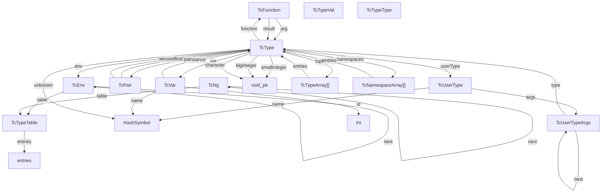

# tc

Structures to support type inference

```mermaid
flowchart TD
TcTypeTable --entries--> entries
TcEnv --table--> TcTypeTable
TcEnv --next--> TcEnv
TcNg --table--> TcTypeTable
TcNg --next--> TcNg
TcFunction --arg--> TcType
TcFunction --result--> TcType
TcPair --first--> TcType
TcPair --second--> TcType
TcUserType --name--> HashSymbol
TcUserType --args--> TcUserTypeArgs
TcUserTypeArgs --type--> TcType
TcUserTypeArgs --next--> TcUserTypeArgs
TcVar --name--> HashSymbol
TcVar --id--> int
TcVar --instance--> TcType
TcType --function--> TcFunction
TcType --pair--> TcPair
TcType --var--> TcVar
TcType --smallinteger--> void_ptr
TcType --biginteger--> void_ptr
TcType --character--> void_ptr
TcType --unknown--> HashSymbol
TcType --userType--> TcUserType
TcType --tuple--> TcTypeArray
TcType --namespaces--> TcNamespaceArray
TcType --env--> TcEnv
TcTypeArray["TcTypeArray[]"] --entries--> TcType
TcNamespaceArray["TcNamespaceArray[]"] --entries--> TcType
TcTypeVal
TcTypeType
```

> Generated from src/tc.yaml by tools/makeAST.py
